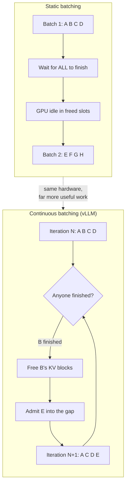

# vLLM: serving LLMs at scale with high throughput

You have an 8B model running on your laptop with [Ollama](ollama_basics.md). Great. Now you are asked to serve it to 300 concurrent users under a latency SLA. That is exactly where the desktop approach breaks down and vLLM shows up.

vLLM is not "yet another inference runtime": it is an engine designed from the ground up to **maximise the throughput of a GPU server**, not to squeeze a model onto your Mac. This guide covers the engine itself: how it works internally, how to install it, how to tune it and how to measure it.

!!! info "Where this guide fits"
    - Local single-node / desktop inference → [Ollama](ollama_basics.md), [llama.cpp](llama_cpp.md), [LM Studio](lm_studio.md)
    - Deploying vLLM on Kubernetes with auto-scaling → [Deployment at scale with Kubernetes](deployment_kubernetes.md)
    - Gateway, routing and fallback in front of vLLM → [LiteLLM](litellm.md)
    - General quantization theory → [Model optimization](model_optimization.md)

## 🎯 The problem it solves

Naive inference (one `model.generate()` per request, or static batching) wastes GPU in two ways:

**1. KV cache fragmentation.** Every sequence being generated must store the attention keys and values of all previous tokens. The classic approach reserves a contiguous block the size of `max_model_len` per request. If the model supports 32k tokens and the request uses 500, you have reserved 64 times what you need. The GPU runs out of memory with 4 in-flight requests when it could have carried 60.

**2. Static batching.** You group 8 requests, wait for **all** of them to finish, then launch the next batch. The request generating 20 tokens sits blocked behind the one generating 800. During that time those GPU slots do nothing.

vLLM attacks both: **PagedAttention** against fragmentation, **continuous batching** against wasted slots.

| | Naive inference | vLLM |
|---|---|---|
| KV cache | Contiguous pre-reserved block | Paged blocks on demand |
| Batching | Static, waits for the full batch | Continuous, in/out per iteration |
| Shared prompts | Always recomputed | Automatic prefix caching |
| Useful concurrency | Single digits | Tens or hundreds |
| Use case | One user, one model | Multi-user service |

## 🧠 PagedAttention, explained without maths

PagedAttention applies to the KV cache the same idea as **paged virtual memory** in any operating system.

Instead of one contiguous block per sequence, vLLM splits the KV cache into **fixed-size blocks** (`block_size`, typically 16 tokens). Each sequence keeps a table mapping its logical positions to physical blocks, which may be scattered across VRAM.

Practical consequences:

- **No over-reservation**: a new block is allocated only when the previous one fills up. Maximum waste is one partial block per sequence, not thousands of tokens.
- **Block sharing**: two requests with the same system prompt point at the same physical blocks. This is the basis of *automatic prefix caching* (`--enable-prefix-caching`), which avoids recomputing identical prefixes.
- **Copy-on-write**: in parallel generation (several samples of the same prompt), prompt blocks are shared and only duplicated once they diverge.
- **Preemption**: if memory runs short, vLLM can evict a sequence's blocks and recompute or restore it later, instead of failing with OOM.



The vLLM scheduler decides **at every decoding step** which requests enter the batch, based on free KV blocks. A finishing request releases its blocks immediately and another one enters in the same step.

!!! tip "The number that matters is not single-request tokens/s"
    On a single sequential request vLLM will not be dramatically faster than other runtimes: it is memory-bandwidth bound just like everyone else. The win shows up in **aggregate throughput under concurrency**. Measure with real load, not with a lone `curl`.

## 📦 Installation

### With pip (or uv)

vLLM ships prebuilt CUDA binaries. It requires Linux, Python 3.9+ and an NVIDIA GPU with compute capability 7.0 or higher (V100, T4, A100, L4, H100, RTX 30xx/40xx…).

```bash
# Isolated environment (recommended: uv resolves torch far faster)
uv venv --python 3.12 --seed
source .venv/bin/activate
uv pip install vllm

# Classic pip alternative
python -m venv .venv && source .venv/bin/activate
pip install vllm
```

Verification:

```bash
vllm --version
nvidia-smi   # confirm driver and available VRAM
```

### With Docker

The official `vllm/vllm-openai` image already bundles CUDA, PyTorch and vLLM. It is the recommended route for production because it removes the CUDA version hell.

```bash
docker run --runtime nvidia --gpus all \
    -v ~/.cache/huggingface:/root/.cache/huggingface \
    --env "HF_TOKEN=$HF_TOKEN" \
    -p 8000:8000 \
    --ipc=host \
    vllm/vllm-openai:latest \
    --model Qwen/Qwen3-0.6B
```

!!! warning "`--ipc=host` is not optional"
    vLLM uses shared memory between processes for tensor parallelism. Without `--ipc=host` (or a large enough `--shm-size`), startup fails or hangs on multi-GPU. It is the number one mistake when dockerising vLLM.

Mounting a volume over `~/.cache/huggingface` avoids re-downloading 140 GB of weights every time you restart the container. Always mount it.

## 🚀 OpenAI-compatible server

The `vllm serve` command starts an HTTP server implementing the OpenAI API. Any SDK, library or tool that speaks OpenAI works against it by changing `base_url`.

```bash
vllm serve NousResearch/Meta-Llama-3-8B-Instruct \
  --dtype auto \
  --api-key token-abc123
```

Test request:

```bash
curl http://localhost:8000/v1/chat/completions \
  -H "Content-Type: application/json" \
  -H "Authorization: Bearer token-abc123" \
  -d '{
    "model": "NousResearch/Meta-Llama-3-8B-Instruct",
    "messages": [{"role": "user", "content": "Explain PagedAttention in two sentences."}],
    "max_tokens": 200
  }'
```

From the OpenAI SDK:

```python
from openai import OpenAI

client = OpenAI(
    api_key="token-abc123",
    base_url="http://localhost:8000/v1",
)

# The server itself exposes the model id
model = client.models.list().data[0].id

resp = client.chat.completions.create(
    model=model,
    messages=[{"role": "user", "content": "What is continuous batching?"}],
    stream=True,
)
for chunk in resp:
    print(chunk.choices[0].delta.content or "", end="")
```

Main exposed endpoints:

| Endpoint | Use |
|---|---|
| `/v1/chat/completions` | Chat with the model's template applied |
| `/v1/completions` | Raw completion, no template |
| `/v1/models` | Lists the served model and its id |
| `/v1/embeddings` | If the loaded model is an embedding model |
| `/health` | Liveness probe |
| `/metrics` | Prometheus metrics |

!!! note "One process, one model"
    Each `vllm serve` instance serves **one** model. If you need several models behind a single endpoint, with routing, fallback and cost control, put [LiteLLM](litellm.md) in front of N vLLM instances. That is the standard pattern.

## 🔗 Tensor parallelism and multi-GPU

When the model does not fit on a single GPU, it gets split. vLLM implements Megatron-LM's tensor parallel algorithm.

The decision rule per the official documentation:

| Situation | Strategy |
|---|---|
| Model fits on 1 GPU | No parallelism. `tensor_parallel_size=1` |
| Does not fit on 1 GPU, fits on 1 node | Tensor parallelism: `--tensor-parallel-size = GPUs in the node` |
| Does not fit on 1 node | TP + pipeline: `--tensor-parallel-size = GPUs per node`, `--pipeline-parallel-size = number of nodes` |

```bash
# 70B model split across 4 GPUs in the same node
vllm serve meta-llama/Llama-3.3-70B-Instruct \
  --tensor-parallel-size 4 \
  --dtype auto
```

And from the Python API, combining both axes for 2 nodes of 4 GPUs:

```python
from vllm import LLM

llm = LLM(
    model="meta-llama/Llama-3.3-70B-Instruct",
    tensor_parallel_size=4,     # GPUs per node
    pipeline_parallel_size=2,   # number of nodes
)
```

Deployment notes:

- The default distributed runtime is native Python `multiprocessing` on a single node, and **Ray** across nodes.
- `tensor_parallel_size` must divide the model's attention head count exactly. A 32-head model accepts TP of 1, 2, 4, 8, 16 or 32; it does not accept 6.
- Tensor parallelism is **interconnect-sensitive**: it splits across every layer and synchronises at each one. It scales well over NVLink; over PCIe the communication cost shows. Keep adjacent ranks on the same machine.
- Pipeline parallelism communicates far less (only activations between stages), which is why it is the axis used to cross the network between nodes.

!!! danger "TP is not free"
    Doubling GPUs with TP does not double throughput. It adds collective communication per layer. Use it because the model **does not fit**, not as your first performance lever. If the model fits on one GPU, **N independent replicas outperform a single TP=N instance**.

## ⚙️ Tuning: memory, context and batching

These are the parameters that actually move the needle. All exist as CLI flags (`--kebab-case`) and as `LLM()` arguments (`snake_case`).

### `--gpu-memory-utilization`

Fraction of VRAM the executor may use, between 0 and 1. **Default: 0.92**.

vLLM boots, loads the weights, runs a *profiling run* to measure peak activations, and **everything left over up to that limit becomes KV cache blocks**. More KV cache = more concurrent requests.

```bash
# Dedicated GPU: squeeze the memory
vllm serve mistralai/Mistral-7B-Instruct-v0.3 --gpu-memory-utilization 0.95

# GPU shared with another process: leave headroom
vllm serve mistralai/Mistral-7B-Instruct-v0.3 --gpu-memory-utilization 0.70
```

!!! warning "It is a per-instance limit, not a global one"
    If you launch two vLLM instances on the same GPU with 0.9 each, both believe they can use 90% of the total. The second one dies with OOM. Split it manually: 0.45 and 0.45.

For deterministic control there is `--kv-cache-memory`, which pins the exact KV cache bytes and **skips memory profiling**, ignoring `gpu_memory_utilization`. The startup log itself suggests the concrete value to use; it is the option for environments where initial free memory varies between boots.

### `--max-model-len`

Maximum context length (prompt + generation). Defaults to the value in the model's `config.json`.

KV cache cost grows **linearly** with this figure multiplied by concurrency. A model advertising 128k context forces you to reserve KV for 128k per sequence if you leave it at the maximum. If your real prompts never exceed 8k, trim it:

```bash
vllm serve meta-llama/Llama-3.1-8B-Instruct --max-model-len 8192
```

This is usually the most effective lever against a startup OOM, and the one that buys the most concurrency. In recent versions, `--max-model-len -1` makes vLLM binary-search the largest context that fits in available memory.

### `--max-num-batched-tokens` and `--max-num-seqs`

They control per-iteration batch size and the maximum number of concurrent sequences.

With chunked prefill, `max_num_batched_tokens` sets the classic trade-off:

- **Low value** → better ITL (inter-token latency): generation is not interrupted by long prefills. Smoother streaming.
- **High value** → better TTFT (time to first token) and better aggregate throughput. The documentation recommends `> 8192` to maximise throughput, especially with small models on large GPUs.

```bash
vllm serve meta-llama/Llama-3.1-8B-Instruct --max-num-batched-tokens 16384
```

### `--enable-prefix-caching`

Reuses KV blocks of identical prefixes across requests. If your workload has a long shared system prompt, a fixed few-shot block or multi-turn conversations, the prefill saving is substantial and it **does not change model output**. Turn it on unless your prompts are entirely disjoint.

### Quantization

Lowering weight precision reduces required VRAM and usually improves throughput. vLLM loads already-quantized formats from the Hub:

| Format | Bits | When to use it |
|---|---|---|
| **AWQ** | 4 | Good quality/size balance, wide checkpoint availability |
| **GPTQ** | 3-4 | Very widespread on the Hub, quality comparable to AWQ |
| **FP8** | 8 | Hopper (H100) and Ada (L40S) with native support: minimal quality loss and real speedup |
| **BitsAndBytes** | 4-8 | On-the-fly quantization, convenient for testing; not the fastest |

```bash
# AWQ checkpoint from the Hub
vllm serve TheBloke/Mistral-7B-Instruct-v0.2-AWQ --quantization awq

# FP8 on Hopper/Ada hardware
vllm serve meta-llama/Llama-3.1-70B-Instruct --quantization fp8 --tensor-parallel-size 2
```

Independently of the weights, you can quantize the **KV cache itself** with `--kv-cache-dtype fp8`. It roughly doubles the tokens that fit in cache, at the cost of some attention precision. This is the lever to try when your bottleneck is long context rather than model size.

The fundamentals of each method live in [Model optimization](model_optimization.md).

## 📊 Benchmarking

Do not tune blind. vLLM ships its own benchmark in the CLI: `vllm bench` with subcommands `serve` (online throughput), `throughput` (offline) and `latency`.

With the server already running in another terminal:

```bash
vllm bench serve \
  --model meta-llama/Llama-3.1-8B-Instruct \
  --dataset-name random \
  --random-input-len 1024 \
  --random-output-len 256 \
  --num-prompts 500 \
  --request-rate 10 \
  | tee benchmark.log
```

To deliberately saturate and find the system ceiling, pin concurrency:

```bash
vllm bench serve \
  --base-url http://127.0.0.1:8000 \
  --model meta-llama/Llama-3.1-8B-Instruct \
  --dataset-name random --random-input-len 4000 --random-output-len 200 \
  --max-concurrency 64
```

Metrics to watch:

| Metric | What it tells you |
|---|---|
| **TTFT** (p50/p99) | Perceived startup latency. The prefill-sensitive one |
| **TPOT / ITL** | Generation speed once running |
| **Output tokens/s** | Aggregate throughput. The cost-per-token metric |
| **Request throughput** | Requests completed per second |

!!! tip "Methodology before numbers"
    Any absolute figure you read depends on GPU, model, prompt length, output length and arrival rate. Benchmarks published by the vLLM project and third parties place the throughput improvement over HuggingFace Transformers-based serving in **orders of magnitude** under high concurrency; the original reference is the [PagedAttention paper (SOSP 2023)](https://arxiv.org/abs/2309.06180) and the [project benchmark dashboard](https://blog.vllm.ai/). Do not extrapolate those numbers to your hardware: **run `vllm bench serve` with your real prompt distribution** and compare configurations against each other, not against numbers from a blog post.

Sensible procedure: fix the load, vary **one** parameter at a time (`max-num-batched-tokens`, then `max-model-len`, then quantization), and keep the configuration that meets your TTFT p99 at the lowest cost per token.

## 🏭 Production notes

- **Observability**: `/metrics` exposes Prometheus metrics ready to scrape. The key ones are `vllm:num_requests_running`, `vllm:num_requests_waiting` and `vllm:gpu_cache_usage_perc`. If the waiting queue grows steadily while cache usage sits at 100%, you need more replicas, not more tuning.
- **Health checks**: use `/health` as liveness. Be careful with readiness: loading a 70B model can take several minutes, so tune `initialDelaySeconds` or you will be using CrashLoopBackOff as a deployment method.
- **Authentication**: `--api-key` is a single shared static token. For per-user key management, quotas and budgets, that responsibility belongs to the gateway ([LiteLLM](litellm.md)).
- **Weight downloads**: preload the model onto a persistent volume. Downloading 140 GB on every pod start is the most expensive and least interesting mistake you can make.
- **Horizontal scaling**: vLLM scales by replicating instances behind a load balancer, not by making one instance bigger. HPA, probes and node affinity details are in [Deployment at scale with Kubernetes](deployment_kubernetes.md).

!!! success "Operational summary"
    1. Start with Docker, `--gpu-memory-utilization 0.90` and `--max-model-len` matched to your real case.
    2. Enable `--enable-prefix-caching` if you share system prompts.
    3. Quantize (AWQ/GPTQ, or FP8 if you have Hopper/Ada) before adding GPUs.
    4. Use tensor parallelism only when the model does not fit; if it fits, replicate.
    5. Measure with `vllm bench serve` against your real workload, not someone else's blog.

## 🔗 Related resources

- [Deployment at scale with Kubernetes](deployment_kubernetes.md) — HPA, probes and operating vLLM in a cluster
- [LiteLLM (Gateway)](litellm.md) — routing, fallback and cost control in front of vLLM
- [Model optimization](model_optimization.md) — quantization and compression fundamentals
- [Ollama](ollama_basics.md) · [llama.cpp](llama_cpp.md) · [LM Studio](lm_studio.md) — single-node local inference
- [Official vLLM documentation](https://docs.vllm.ai/en/stable/)
- [PagedAttention: Efficient Memory Management for LLM Serving (SOSP 2023)](https://arxiv.org/abs/2309.06180)
