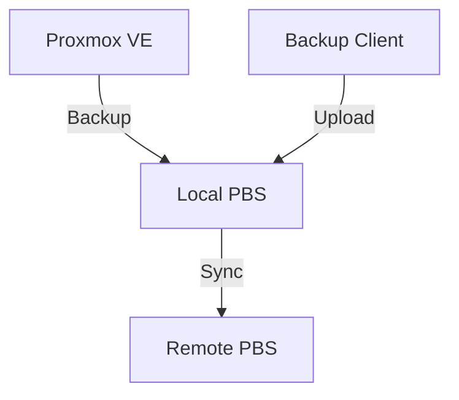

---
tags:
  - backups
  - proxmox
  - pbs
---

# Proxmox Backup Server (PBS)

The perfect companion for Proxmox VE. Enables ultra-fast deduplicated incremental backups.

## Installation

Can be installed as a standalone ISO or on top of Debian.

```bash
apt update
apt install proxmox-backup-server
```

## Key Concepts

- **Datastore:** Where data is stored (dedicated disk recommended, ZFS is ideal).
- **Remote:** Another PBS server for replication (Off-site backup).
- **Prune:** Retention policies (e.g., keep last 7 daily, 4 weekly).

## PVE Integration

In Proxmox VE: `Datacenter -> Storage -> Add -> Proxmox Backup Server`.
Enter the IP and the `Fingerprint` (copied from the PBS Dashboard).

## Example Topology


