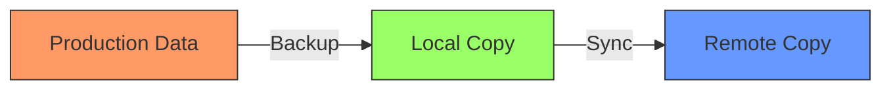

---
tags:
  - backups
  - theory
  - best-practices
---

# 3-2-1 Backup Strategy

The golden rule for data protection.

1.  Keep **3** copies of your data (1 production + 2 backups).
2.  Store them on **2** different media types (e.g., local NAS disk + tape/cloud).
3.  Keep **1** copy off-site (Cloud, friend's house, remote office).

## Practical Application

- **Copy 1 (Production):** Live data on server (NVMe).
- **Copy 2 (Local):** Daily backup on local NAS or local PBS (HDD).
- **Copy 3 (Remote):** Sync from NAS to Backblaze B2, AWS S3, or a remote PBS via VPN.

## Data Flow

