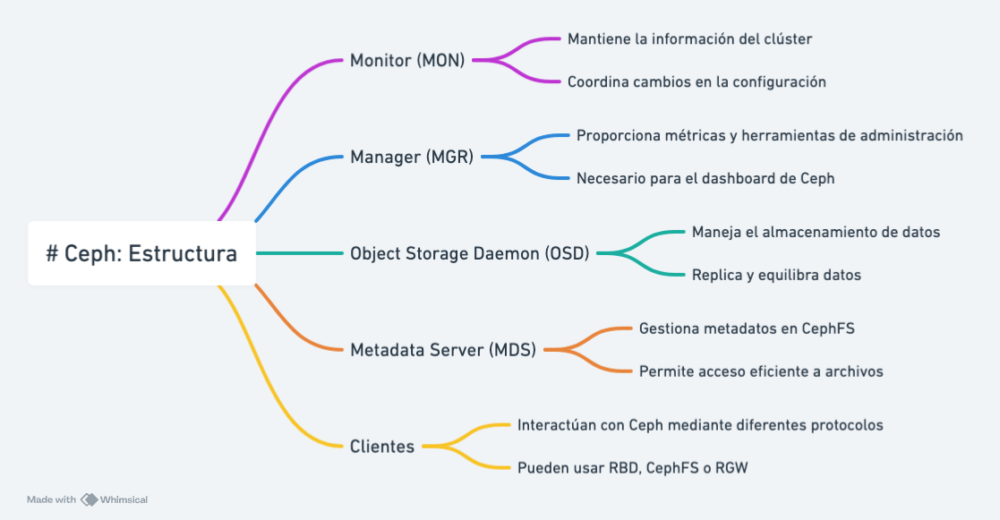

Ceph is a distributed storage system that provides highly scalable and reliable storage for large amounts of data. It is designed to be self-managing, self-healing, and self-optimizing, making it ideal for cloud storage environments and data centers.

{width=50%}

## Main Features

- **Scalability**: Ceph can scale from a few nodes to thousands of nodes, allowing for seamless growth.
- **Reliability**: It uses replication and erasure coding to ensure data integrity.
- **Self-management**: Ceph self-repairs and self-optimizes, reducing the need for manual intervention.
- **Flexibility**: Supports multiple storage interfaces, including block, object, and file systems.

## Ceph Architecture

Ceph consists of several key components:

- **Ceph Monitors (MON)**: Maintain a map of the cluster and ensure data consistency.
- **Ceph OSD Daemons (OSD)**: Store data and handle replication and recovery operations.
- **Ceph Manager Daemons (MGR)**: Provide additional functionalities such as monitoring and cluster management.
- **Ceph Metadata Servers (MDS)**: Manage metadata for the CephFS file system.

{width=80%}

## Use Cases

- **Cloud Storage**: Ceph is ideal for cloud service providers needing scalable and reliable storage.
- **Big Data**: Ceph can handle large volumes of data, making it suitable for Big Data applications.
- **Backup and Recovery**: Ceph's replication and erasure coding ensure that data is always available and protected.

## Basic Installation with cephadm (Reef Version)

To install Ceph Reef version using `cephadm`, you can follow these basic steps:

1. **Prepare the nodes**: Ensure all nodes have the necessary dependencies installed and have internet access.
2. **Install cephadm**: Download and install `cephadm` on the initial node.
    ```bash
    curl --silent --remote-name https://raw.githubusercontent.com/ceph/ceph/reef/src/cephadm/cephadm
    chmod +x cephadm
    sudo ./cephadm install
    ```
3. **Deploy the cluster**: Use `cephadm` to deploy the cluster.
    ```bash
    sudo cephadm bootstrap --mon-ip <INITIAL_NODE_IP>
    ```
4. **Add additional nodes**: Add more nodes to the cluster.
    ```bash
    sudo ceph orch host add <NODE_NAME> <NODE_IP>
    ```
5. **Configure the cluster**: Configure the monitors, OSDs, and other necessary components using `cephadm`.
    ```bash
    sudo ceph orch apply osd --all-available-devices
    ```
6. **Verify the installation**: Ensure the cluster is functioning correctly.
    ```bash
    ceph -s
    ```

For more details, you can refer to the [official Ceph documentation](https://docs.ceph.com/en/latest/).
