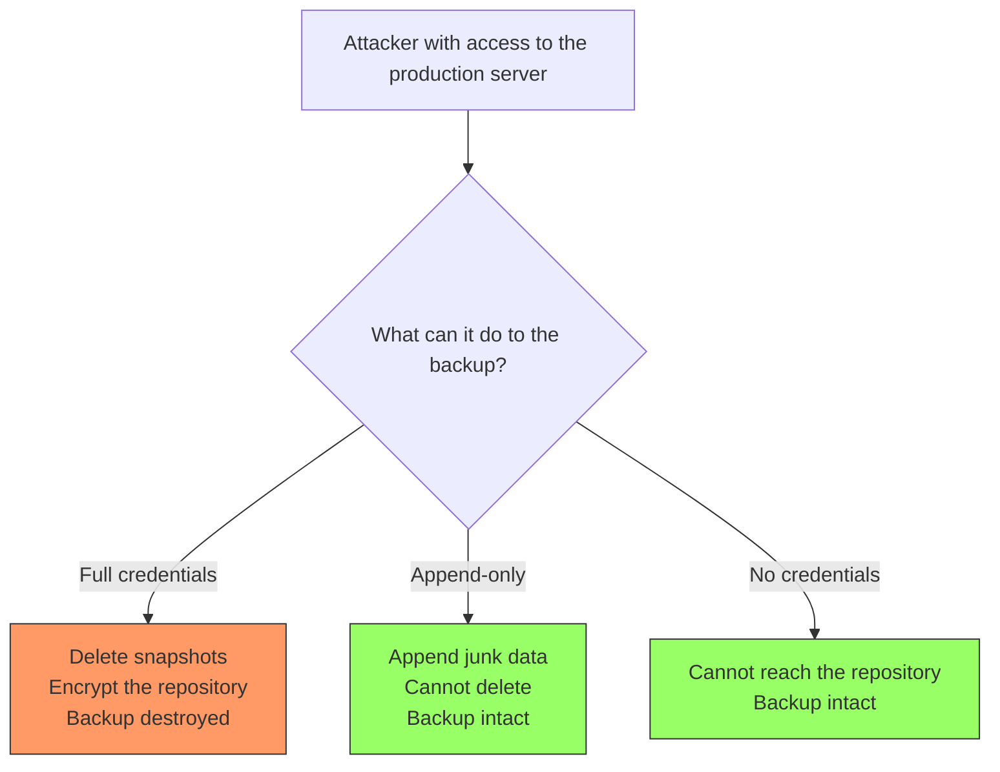
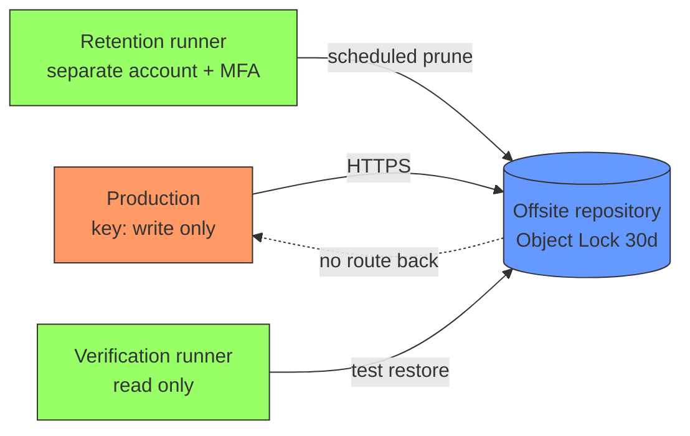

## The backup that will not save you

Almost everyone has backups. Very few people have backups that survive an attacker, and fewer still have ever verified that they can be restored. These are two different problems and both surface on the same day: the worst one.

Modern ransomware does not start by encrypting. It starts with weeks of reconnaissance, locates the backup repository, deletes or encrypts the copies, **and only then** encrypts production. A backup reachable with the credentials of the compromised server is not a backup: it is one more directory inside the blast radius.

!!! info "Scope of this guide"
    This guide does not explain how to use restic or borg —that is in [Agnostic Backups: Restic and Borg](../backups/restic_borg.md)— nor the 3-2-1 rule, which is in [3-2-1 Backup Strategy](../backups/strategy_321.md). This guide covers the layer on top: **encryption, immutability, credential separation and restore verification**.

## Backup threat model

Before configuring anything, it is worth writing down what you are defending against. The four scenarios that actually matter:



### 1. Ransomware that encrypts the backups too

The dominant scenario. The attacker gets execution on the server, reads `/root/.restic-env` or the borg cron job, and uses those same credentials against the repository. If the server can write and delete, so can the ransomware.

This is why **immutability matters more than encryption**. An encrypted but deletable backup protects you from nothing against ransomware.

### 2. Insider

A disgruntled administrator, or a compromised admin account. They hold legitimate credentials and know where everything lives. The defence here is not 100 % technical: it is immutable retention with a time window (nobody, not even the repository root, can delete before the lock expires) plus alerting on destructive operations.

### 3. Repository credential theft

An S3 API key leaked in a log, in a `docker inspect`, in a CI environment variable. Distinguish two permissions that are commonly bundled into the same key: **writing** backups and **deleting** backups. They should never live together on the host that performs the backup.

### 4. Malicious or accidental deletion

A `restic forget --prune` with a badly written filter, an `rm -rf` over the datastore, a retention script with a bug. Half of all backup disasters have no attacker: they have a human error. The same defences cover both.

!!! warning "The principle that sums it all up"
    **The production server must not be able to destroy its own backups.** If it can, your backups have exactly the same attack surface as the data they protect.

## Encryption: at rest and in transit

### What restic does

restic encrypts **always**, it is neither optional nor configurable. Every blob is encrypted with AES-256 in CTR mode and authenticated with Poly1305-AES. The encryption and MAC keys are derived from your passphrase via scrypt and stored inside the repository, encrypted with the master key.

An important practical consequence: the passphrase does not encrypt the data directly. It encrypts the master key. That is why you can **add several passphrases to the same repository** without re-encrypting anything:

```bash
# Add a second access key (e.g. the manager's recovery key)
restic -r s3:s3.eu-west-1.amazonaws.com/my-bucket key add

# List the keys that have access
restic -r s3:s3.eu-west-1.amazonaws.com/my-bucket key list

# Revoke a specific key by its ID
restic -r s3:s3.eu-west-1.amazonaws.com/my-bucket key remove <id>
```

This is the basis of sensible key custody: one key for the automated process, a different one for manual recovery, and the ability to revoke the process key if the server is compromised without losing access.

### What borg does

borg uses AES-256 in CTR mode with HMAC-SHA256 authentication, and offers a decision restic does not give you: **where the key lives**.

```bash
# The key is stored INSIDE the repository, protected by the passphrase
borg init --encryption=repokey /path/to/repo

# The key is stored in the client's ~/.config/borg/keys/, NOT in the repository
borg init --encryption=keyfile /path/to/repo
```

- `repokey`: convenient. The passphrase alone is enough to restore from any machine. If someone steals the repository, all they are missing is the passphrase.
- `keyfile`: more secure. Whoever steals the repository has nothing to brute-force, because the key material is not there. In exchange, **if you lose the key file, the repository is random noise forever**.

The `repokey-blake2` / `keyfile-blake2` variants replace HMAC-SHA256 with BLAKE2b, faster on CPUs without SHA acceleration.

Exporting the key is mandatory with `keyfile`, and strongly recommended with `repokey` too:

```bash
# Export to a file
borg key export /path/to/repo /secure/path/borg-key-backup

# Export as printable text (QR + base64), for a safe
borg key export --paper /path/to/repo
```

### In transit

The at-rest encryption of restic and borg is end-to-end: data leaves the client already encrypted, so transport only adds a layer. Even so, do not leave it in the clear:

- **SFTP/SSH**: encrypted by definition. Restrict the client key on the server (see below).
- **S3 and compatibles**: always use HTTPS endpoints. Verify the client is not accepting invalid certificates.
- **rest-server**: deploy it behind TLS, never plain HTTP even on an "internal network".

!!! danger "If you lose the key, it is over"
    There is no recovery, no support, no back door. restic and borg encryption is designed so that nobody —including you— can read the repository without the key. A 3 TB backup without its passphrase is 3 TB of random bytes.

    Minimum acceptable custody: (1) the passphrase in a secrets manager with its own backup, (2) a printed or offline copy in a different physical location, (3) at least two people with access. See [Secrets Management](gestion_secretos.md).

## Immutability: the real defence against ransomware

This is the point that separates a real backup from a directory with copies. The idea: **the process that writes backups has no permission to delete them**.

### borg: `--append-only`

borg implements this on the server side, by restricting the client's SSH key. In the backup server's `~/.ssh/authorized_keys`:

```text
command="borg serve --append-only --restrict-to-path /srv/backups/web01",restrict ssh-ed25519 AAAAC3Nza... web01-backup
```

Why each part matters:

- `--append-only`: the client can create new archives, but any delete operation is recorded in the transaction and **is not applied** to the real repository. The repository keeps the original segments.
- `--restrict-to-path`: even if the client requests another path, it cannot leave its own.
- `restrict`: an OpenSSH option that disables port forwarding, agent forwarding, X11 and pty allocation. A safe shorthand covering all the `no-*-forwarding` options.

The real `prune` operation runs **from the backup server**, with a different key, at a different time:

```bash
# On the backup SERVER, not on the client
borg prune --keep-daily=7 --keep-weekly=4 --keep-monthly=6 /srv/backups/web01
borg compact /srv/backups/web01
```

!!! warning "append-only is not magic: watch the repository"
    With `--append-only`, a compromised client can still write. It can fill the disk with junk or create fake archives. What it cannot do is destroy what came before. Monitor repository growth: an unexplained jump is a sign of compromise, not a disk anecdote.

### S3: Object Lock + versioning

In object storage, immutability is enforced by the provider, not by your software. Two complementary mechanisms:

- **Bucket versioning**: a `DELETE` does not delete, it creates a *delete marker*. The previous version is still there.
- **Object Lock in compliance mode**: during the retention window **nobody** can delete the object. Not the account root, not AWS. In `GOVERNANCE` mode it can be bypassed with a specific permission (`s3:BypassGovernanceRetention`), which makes it more flexible and considerably less useful against a privileged attacker.

```bash
# Object Lock can only be enabled at bucket CREATION time
aws s3api create-bucket \
  --bucket immutable-backups-acme \
  --region eu-west-1 \
  --create-bucket-configuration LocationConstraint=eu-west-1 \
  --object-lock-enabled-for-bucket

# Default retention: 30 days in compliance mode
aws s3api put-object-lock-configuration \
  --bucket immutable-backups-acme \
  --object-lock-configuration '{
    "ObjectLockEnabled": "Enabled",
    "Rule": {
      "DefaultRetention": {
        "Mode": "COMPLIANCE",
        "Days": 30
      }
    }
  }'
```

!!! danger "COMPLIANCE is irreversible by design"
    In compliance mode you cannot shorten retention or delete the object early, and you keep paying for the storage until it expires. Test first with `Days: 1` on a throwaway bucket. A misconfiguration with `Days: 3650` is a ten-year invoice.

### restic: restricted permissions

restic has no append-only mode of its own, so the restriction is applied at the storage layer. With S3, an IAM policy that allows writing and reading, but not deleting:

```json
{
  "Version": "2012-10-17",
  "Statement": [
    {
      "Sid": "ListRepo",
      "Effect": "Allow",
      "Action": ["s3:ListBucket", "s3:GetBucketLocation"],
      "Resource": "arn:aws:s3:::immutable-backups-acme"
    },
    {
      "Sid": "WriteAndReadOnly",
      "Effect": "Allow",
      "Action": ["s3:PutObject", "s3:GetObject"],
      "Resource": "arn:aws:s3:::immutable-backups-acme/*"
    },
    {
      "Sid": "DenyAllDeletes",
      "Effect": "Deny",
      "Action": [
        "s3:DeleteObject",
        "s3:DeleteObjectVersion",
        "s3:PutBucketVersioning",
        "s3:PutObjectLockConfiguration"
      ],
      "Resource": [
        "arn:aws:s3:::immutable-backups-acme",
        "arn:aws:s3:::immutable-backups-acme/*"
      ]
    }
  ]
}
```

The explicit `Deny` statements on `PutBucketVersioning` and `PutObjectLockConfiguration` are as important as the delete one: without them, an attacker disables the protection first and deletes afterwards.

With this policy, `restic backup` works normally and `restic forget --prune` fails. Pruning runs under another identity, with other credentials, ideally from another machine.

With an SFTP backend the equivalent is a dedicated account, `chroot` and a filesystem or ACL that prevents unlinking. And on ZFS, snapshots of the datastore itself with restricted `zfs allow` are a cheap second safety net.

## Offsite with real separation

"Offsite" does not mean "somewhere else". It means **outside the failure domain and outside the credential domain**. An S3 bucket in the same AWS account as your production is geographically far and administratively on top of it.

The minimum separation that adds value:

| Axis | Bad | Good |
| --- | --- | --- |
| Account | Same cloud account as production | Separate account/project, separate billing |
| Credentials | The same key writes and deletes | Write key on the host, delete key only on the retention runner |
| Identity | Same IdP and same admins | Different admins, mandatory MFA on the backup account |
| Provider | Everything with a single provider | At least one copy with a different provider |
| Network | The backup host can reach production | One-way flow: production writes, does not read or list |



Note the three distinct identities: whoever writes does not delete, whoever deletes does not live in production, and whoever verifies cannot modify anything. If they compromise the production server, they only get the first one.

!!! tip "Pull instead of push"
    When the topology allows it, invert the direction: let the backup server connect to production and pull the data, instead of production pushing. That way production **never** holds repository credentials. It is the model behind [PBS](../backups/pbs.md) `Remote` entries and the one that leaves the smallest surface.

## Restore testing

This is where almost everybody fails. A backup that has never been restored is a hypothesis, not a backup. The failure modes are ridiculously common and all of them silent:

- The cron job has been failing for eight months and nobody reads the `MAILTO` email.
- `/var/lib/mysql` is backed up hot: inconsistent files that will not start.
- A "temporary" directory was excluded that turned out to hold the user uploads.
- The repository has bit rot and it is only detected when the data is read.
- The passphrase is in the secrets manager that was backed up on the same server that went down.

### Integrity verification ≠ restore verification

They are two different things and you need both.

```bash
# restic: verifies structure and metadata. Fast, does not read the data.
restic -r "$RESTIC_REPOSITORY" check

# restic: reads and decrypts ALL the data. Slow and with egress cost, but it is
# the only thing that detects real corruption in the blobs.
restic -r "$RESTIC_REPOSITORY" check --read-data

# restic: a reasonable compromise to run weekly.
# Reads a subset of the repository, rotating the verified portion.
restic -r "$RESTIC_REPOSITORY" check --read-data-subset=1/10
```

```bash
# borg: verifies repository and archive consistency
borg check /path/to/repo

# borg: repository structure only, without unpacking archives
borg check --repository-only /path/to/repo

# borg: full archive verification (equivalent to --read-data)
borg check --verify-data /path/to/repo
```

`check` tells you the bytes are fine. It does not tell you that the PostgreSQL dump will restore or that the application will start with those files. That requires an actual restore.

### Partial vs full restore

Two exercises with different purposes. You need both, at different cadences.

**Partial restore (weekly, automatable).** You recover a small, known set of files and check their contents. It is cheap, fast and catches 80 % of the failures: dead cron, misconfigured exclusions, corruption in active regions.

```bash
# Recover a single specific path from the latest snapshot
restic -r "$RESTIC_REPOSITORY" restore latest \
  --target /tmp/verify \
  --include /etc/nginx/nginx.conf

# borg: extract a specific pattern without unpacking the whole archive
borg extract --strip-components 1 /path/to/repo::web01-2026-07-19 etc/nginx/nginx.conf
```

**Full restore (quarterly, with a witness).** You bring the application up from scratch on a clean machine, with the documentation in hand and without access to the original system. It is the only thing that validates the parts nobody ever tests: service startup order, dependencies that were not in the backup, whether anyone remembers the passphrase and how long it really takes.

!!! warning "Restore without access to the original"
    If during the test you can consult the production server, you are not simulating a disaster: you are copying. A valid test is with production off or unreachable. If you need to look at the original to complete the restore, you have a documented hole in your plan.

### Mount instead of restore

For quick inspection without writing anything to disk, both tools expose the repository as a FUSE filesystem:

```bash
# restic
mkdir -p /mnt/restic
restic -r "$RESTIC_REPOSITORY" mount /mnt/restic
# snapshots appear under /mnt/restic/snapshots/

# borg
borg mount /path/to/repo::web01-2026-07-19 /mnt/borg
borg umount /mnt/borg
```

It is the fastest way to answer "is this file in the backup from three weeks ago?" without downloading 500 GB.

### Automating the periodic test

A manual test is a test that stops happening in the second quarter. This script does the minimum that adds real value: it restores sentinel files, compares their hash against the live original, checks that the snapshot is not stale, and fails loudly.

```bash
#!/usr/bin/env bash
# /usr/local/bin/verify-backup.sh
# Automated restore verification. It fails loudly or it is useless.
set -euo pipefail

export RESTIC_REPOSITORY="s3:s3.eu-west-1.amazonaws.com/immutable-backups-acme"
export RESTIC_PASSWORD_FILE="/etc/restic/verify.passphrase"
export AWS_SHARED_CREDENTIALS_FILE="/etc/restic/verify-readonly.credentials"

WORKDIR="$(mktemp -d)"
MAX_AGE_HOURS=26
# Sentinel files: they change often and are critical.
SENTINELS=(
  "/etc/nginx/nginx.conf"
  "/var/backups/postgres/latest.dump"
)

verified=0

cleanup() { rm -rf "$WORKDIR"; }
trap cleanup EXIT

fail() { echo "BACKUP-VERIFY FAIL: $*" >&2; exit 1; }

# 1. Is there a snapshot and is it recent?
last_epoch="$(restic snapshots --latest 1 --json | jq -r '.[0].time' \
  | xargs -I{} date -d {} +%s)" || fail "could not read the latest snapshot"
age_hours=$(( ( $(date +%s) - last_epoch ) / 3600 ))
[ "$age_hours" -le "$MAX_AGE_HOURS" ] \
  || fail "latest snapshot is ${age_hours}h old (max ${MAX_AGE_HOURS}h)"

# 2. Structural integrity + one tenth of the data (rotates between runs).
restic check --read-data-subset=1/10 || fail "restic check detected corruption"

# 3. Restore the sentinel files and compare hashes with the live original.
for f in "${SENTINELS[@]}"; do
  restic restore latest --target "$WORKDIR" --include "$f" \
    || fail "could not restore $f"
  [ -s "${WORKDIR}${f}" ] || fail "$f restored empty or missing"

  if [ -f "$f" ]; then
    orig="$(sha256sum "$f" | cut -d' ' -f1)"
    rest="$(sha256sum "${WORKDIR}${f}" | cut -d' ' -f1)"
    [ "$orig" = "$rest" ] || echo "WARNING: $f differs from the original (changed after the backup)"
  fi
  verified=$(( verified + 1 ))
done

# 4. Semantic validation: the dump must be restorable, not merely present.
dump="${WORKDIR}/var/backups/postgres/latest.dump"
if [ -f "$dump" ]; then
  pg_restore --list "$dump" >/dev/null \
    || fail "the PostgreSQL dump is corrupt or truncated"
fi

echo "BACKUP-VERIFY OK: snapshot ${age_hours}h old, ${verified} sentinels verified"
```

Step 4 is what separates this check from a useless one: a 4 GB file can exist, have the right size and be truncated halfway through. `pg_restore --list` detects that in seconds without restoring anything.

Cron scheduling, writing to a log file that monitoring watches:

```cron
# Weekly verification, Mondays at 04:15
15 4 * * 1 root /usr/local/bin/verify-backup.sh >> /var/log/backup-verify.log 2>&1

# Full monthly verification (slow, with egress cost)
0 3 1 * * root restic check --read-data >> /var/log/backup-verify.log 2>&1
```

!!! danger "A silent cron job is a cron job that does not exist"
    The most common failure is not that verification fails: it is that it stops running and nobody notices. Use a *dead man's switch*: the script pings a monitoring endpoint on successful completion, and the system alerts when that ping **does not arrive**. Alert on absence, not on error. Under systemd, `OnFailure=` on the `.service` covers the error; the ping covers the silence. See [Security Monitoring](monitoreo_seguridad.md).

### RTO and RPO: put a number on it

Two metrics that turn "we have backups" into a verifiable commitment.

- **RPO** (*Recovery Point Objective*): how much data you can afford to lose, measured in time. Set by backup **frequency**. Daily backup at 03:00 and a disaster at 22:00 = 19 hours of lost data.
- **RTO** (*Recovery Time Objective*): how long you can be down. Set by the **actual restore time**, and that number is only known by timing a full restore.

RTO is where the surprises show up. A 2 TB repository on Glacier-class archive storage can take hours just to become **available**, before the download even starts. Time it by phase:

| Phase | Measured example |
| --- | --- |
| Incident detection | 20 min |
| Decision and approval | 30 min |
| Provision hardware/VM | 25 min |
| Repository availability (rehydration) | 3 h |
| Download and decryption | 2 h 10 min |
| Service startup and validation | 40 min |
| **Real RTO** | **6 h 45 min** |

If your SLA says 4 hours and your test says 6 h 45 min, you have data to request budget: a hot local copy in addition to the offsite one, or a storage class with immediate retrieval. Without the test, all you have is an opinion.

!!! tip "Record the result of every test"
    Date, who ran it, what was restored, time per phase and what went wrong. The third test compared with the first is what proves whether you have improved. It is also the first thing any audit asks for (ISO 27001, ENS, NIS2).

## Rotation and retention with a security rationale

Retention is usually decided on disk cost. You should also decide it on **detection window**: how long a compromise can go unnoticed.

If an attacker gets in during January and you detect it in March, a 30-day retention means **all** your snapshots already contain the backdoor. Retention must cover your mean time to detect, with margin.

```bash
# restic: tiered policy. Runs under the identity holding delete permission.
restic forget \
  --keep-daily 14 \
  --keep-weekly 8 \
  --keep-monthly 12 \
  --keep-yearly 3 \
  --prune
```

```bash
# borg: equivalent, executed on the backup SERVER
borg prune \
  --keep-daily=14 \
  --keep-weekly=8 \
  --keep-monthly=12 \
  --keep-yearly=3 \
  /srv/backups/web01
borg compact /srv/backups/web01
```

Criteria worth applying:

- **Always test with `--dry-run` first.** `restic forget --dry-run` and `borg prune --dry-run --list` show what would be removed. A badly written filter in production has no undo.
- **Separate compliance retention from operational retention.** Monthly and yearly snapshots usually carry legal requirements; daily ones do not. Give them different policies and different storage.
- **Minimum retention must exceed the detection window.** If your MTTD is 45 days, 30 days of retention does not protect you. Keep at least one restore point predating any plausible compromise.
- **`prune` is the most dangerous operation you run.** It is the only one that deletes data by design. Have a separate identity run it, with an audited log and an alert if it deletes more than expected.
- **On Object Lock repositories, pruning does not free space until the lock expires.** Budget for it: during the retention window you pay for data you have already "deleted".

## Actionable checklist

Encryption and keys:

- [ ] The repository is encrypted (restic always; borg with `repokey` or `keyfile`).
- [ ] The passphrase is in a secrets manager **and** in offline storage outside the backed-up system.
- [ ] A second access key exists (`restic key add` / `borg key export`) held by another person.
- [ ] At least two people can access the repository. A backup's bus factor is 1 far too often.
- [ ] All transport runs over TLS or SSH. No plain HTTP endpoints.

Immutability:

- [ ] The production host **cannot delete** from the repository (append-only, IAM `Deny`, or pull from the backup server).
- [ ] The bucket has versioning and Object Lock, with explicit `Deny` on `PutBucketVersioning` and `PutObjectLockConfiguration`.
- [ ] `prune`/`forget` runs under a different identity and from a different machine.
- [ ] Anomalous repository growth is monitored.

Offsite:

- [ ] The offsite copy lives in a separate account, with different administrators and mandatory MFA.
- [ ] The flow is one-way: production writes, does not list or delete.
- [ ] Offsite credentials are not present in any backup of the production system itself.

Testing (the part everybody skips):

- [ ] Automated integrity verification (`restic check --read-data-subset` weekly, full `--read-data` monthly).
- [ ] Automated weekly partial restore, with hash comparison and semantic validation of the content.
- [ ] Timed full restore, at least quarterly, **without access to the original system**.
- [ ] Dead man's switch: alert when verification **stops running**, not only when it fails.
- [ ] RTO and RPO measured with real numbers from a test, not estimated.
- [ ] Every test result recorded with date, operator and per-phase timings.

Retention:

- [ ] Minimum retention exceeds your mean time to detect incidents.
- [ ] Every new policy is tested with `--dry-run` before being applied.
- [ ] Restore documentation lives **outside** the backed-up system and someone who did not write it has followed it successfully.

## Related resources

- [Agnostic Backups: Restic and Borg](../backups/restic_borg.md) — basic usage of both tools.
- [3-2-1 Backup Strategy](../backups/strategy_321.md) — the three-copy rule.
- [Proxmox Backup Server (PBS)](../backups/pbs.md) — datastores, remotes and pruning in PBS.
- [Secrets Management](gestion_secretos.md) — where to keep the repository passphrases.
- [Threat Modeling](modelo_amenazas.md) — methodology for building the threat model.
- [Security Monitoring](monitoreo_seguridad.md) — alerting on destructive operations and absence of signal.
- [Linux Server Hardening](hardening_linux.md) — hardening the host that runs the backups.

## References

- [restic — official documentation](https://restic.readthedocs.io/)
- [BorgBackup — official documentation](https://borgbackup.readthedocs.io/)
- [AWS S3 Object Lock](https://docs.aws.amazon.com/AmazonS3/latest/userguide/object-lock.html)
