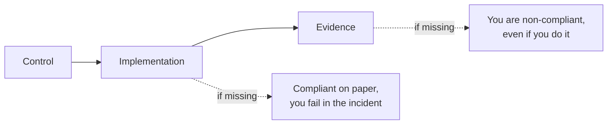

## The problem: nobody is going to ask whether you are secure

They are going to ask whether you can **prove it**. And the proof is not a slide: it is a dated file, produced by an automated process, stating what state machine X was in on day Y.

Most technical teams arrive at the audit with reasonably well-built infrastructure and no way of proving it. They have hardened systems, they scan for vulnerabilities, they rotate secrets. But when the auditor says "show me the configuration state of production in March", the answer is an awkward silence followed by a live `ssh`. This guide covers that layer: **how evidence is produced and archived**. It does not repeat what is already in:

- [Linux Server Hardening](hardening_linux.md) — applying the controls (Lynis, CIS, basic auditd)
- [Vulnerability Scanning](escaneo_vulnerabilidades.md) — Trivy, Grype, Snyk
- [Supply Chain Security](supply_chain_security.md) — SBOMs, artifact signing, SLSA
- [CI Security Scanning](ci_security_scanning.md) — pipeline integration
- [Secrets Management](gestion_secretos.md) — Vault, rotation

!!! warning "This is not legal advice"
    GDPR and ISO 27001 are legal and normative texts whose interpretation belongs to your DPO, your legal counsel and the certifying auditor. This guide translates **already-interpreted requirements** into verifiable technical controls. If your question is what the standard requires in your specific case, the answer is not here. If your question is which command to run to prove you meet it, it is.

## Control, implementation, evidence

Every regulatory requirement breaks down into three distinct things, and confusing them is the source of almost all the pain:



For "access to personal data must be restricted and logged", the implementation is RBAC, `sudo` with logging and auditd over `/var/lib/postgresql`; the evidence is a monthly `ausearch` export and a timestamped OpenSCAP report. The auditor evaluates the evidence, the attacker evaluates the implementation: you need both, and only the first can be improvised (badly) the week before.

## GDPR grounded in infrastructure

From the perspective of someone running servers, GDPR reduces to five uncomfortable questions.

### 1. Where is the personal data you did not know you had?

Personal data is anything that allows a natural person to be identified, directly or indirectly. In infrastructure that includes places nobody looks:

| Source | What it holds | Why it gets forgotten |
|---|---|---|
| Access logs (nginx, ALB, CDN) | IPs, User-Agent, session cookies | "They are technical logs" |
| APM traces | Emails and IDs in span attributes | The SDK adds them without asking |
| Backups and snapshots | All of production, frozen | Not in the application inventory |
| Queues and topics | Full payloads, days of retention | Seen as transit, not storage |
| Error logs | Function parameters, request bodies | Nobody audits what an `except` prints |
| Metrics and staging | `user_id`, a copy of production "for testing" | They retain for months unsupervised |

An IP is personal data in the usual context of a web service, which turns almost any access log into processing.

```bash
# Inventory before debating policy: emails, IPv4 and national IDs in logs
grep -rEn -e '[A-Za-z0-9._%+-]+@[A-Za-z0-9.-]+\.[A-Za-z]{2,}' \
  -e '\b([0-9]{1,3}\.){3}[0-9]{1,3}\b' -e '\b[0-9]{8}[A-HJ-NP-TV-Z]\b' \
  /var/log/ 2>/dev/null | head -50

# Untagged snapshots: the untagged ones are the dangerous ones
aws ec2 describe-snapshots --owner-ids self --output table \
  --query 'Snapshots[?!not_null(Tags)].[SnapshotId,StartTime,VolumeSize]'
```

!!! tip "Tagging as a control"
    A mandatory `data-classification: personal|internal|public` tag enforced by policy in Terraform (see [IaC Security](seguridad_iac.md)) turns the personal-data inventory into a query rather than a quarterly project.

### 2. Are you keeping more than you need, and for longer?

Minimisation and storage limitation. Translated: every persisted field justifies its existence, and every store has an expiry date that is **configured**, not documented.

```hcl
# The policy IS the code. Real deletion, not "indefinite archival".
resource "aws_s3_bucket_lifecycle_configuration" "logs" {
  bucket = aws_s3_bucket.logs.id
  rule {
    id     = "access-logs-retention"
    status = "Enabled"
    filter { prefix = "access-logs/" }
    transition { days = 30, storage_class = "GLACIER_IR" }
    expiration { days = 180 }   # justified by: fraud analysis + support
    noncurrent_version_expiration { noncurrent_days = 7 }
  }
}
```

The Terraform state and the output of `aws s3api get-bucket-lifecycle-configuration` prove the retention is applied. A document saying "we keep 180 days" does not.

### 3. Can you erase a person? Really?

The right to erasure is trivial in the database and brutal everywhere else. A `DELETE` does not touch the last N days of backups, volume snapshots, the WAL/binlog, the data warehouse, the Elasticsearch index, the cache, or the logs where the email appears 4,000 times.

**The backup problem has no elegant solution.** Restoring, deleting and re-taking the backup is operationally unworkable. What does hold up: record the erasure separately and re-apply it if a restore ever happens. The key is that this step is **tested**, not described: a DR test that does not apply the tombstones is a DR test that reintroduces deleted data.

```sql
-- Tombstone: lives outside the backup and is re-applied as a MANDATORY
-- step of the recovery runbook.
CREATE TABLE erasure_requests (
    subject_hash  TEXT PRIMARY KEY,     -- SHA-256 of the identifier, not the data
    requested_at  TIMESTAMPTZ NOT NULL DEFAULT now(),
    executed_at   TIMESTAMPTZ,
    scopes_done   TEXT[] NOT NULL DEFAULT '{}'
);

-- Control: requests still open past the internal deadline
SELECT subject_hash, requested_at, scopes_done FROM erasure_requests
WHERE executed_at IS NULL AND requested_at < now() - INTERVAL '30 days';
```

!!! danger "Encrypting is not erasing"
    *Crypto-shredding* (a key per subject, destroying the key to "erase") is technically defensible, but its legal validity depends on the jurisdiction and the regulator's view. Do not adopt it as an erasure strategy without your DPO's validation.

### 4. Is it encrypted, and can you prove it without logging into the server?

Encryption appears explicitly as an exemplary technical measure. What gets forgotten is that you have to prove it, with saved and dated output.

```bash
# At rest: LUKS and cloud volumes (this output IS the evidence)
cryptsetup luksDump /dev/sda3 | grep -E 'Cipher|Key|PBKDF'
aws ec2 describe-volumes \
  --query 'Volumes[].{ID:VolumeId,Enc:Encrypted,KMS:KmsKeyId}' --output table

# In transit: what the endpoint REALLY accepts, and the TLS to the
# database, which is what almost nobody checks
nmap --script ssl-enum-ciphers -p 443 my-service.example.com
psql "host=db.internal sslmode=verify-full" -c "SHOW ssl;"
```

### 5. If there is a breach, can you reconstruct what happened in 72 hours?

Notification to the supervisory authority has a 72-hour deadline from becoming aware of the breach. The deadline is not the problem: the problem is that it must describe the nature, the categories and approximate number of people affected, and the measures taken. Without prior telemetry you have none of the three.

| What the notification needs | What makes it possible | If missing |
|---|---|---|
| When it started | Retention > typical detection time | "Date unknown" |
| Which data was accessed | auditd over data paths, query logs | You assume worst case |
| How many subjects | Log ↔ identifier correlation | You notify "everyone" |
| How they got in, and how reliably | Auth/network/WAF logs, immutable remote shipping | No root cause, or wiped |

Practical consequence: **logging design is a GDPR control**, not an observability chore.

### The record of processing activities, in engineer format

The standard requires maintaining a documented record of processing activities. It usually lives in an out-of-date spreadsheet. It lives better in the repository, next to the code that does the processing:

```yaml
# processing/analytics-pipeline.yaml
name: Product analytics pipeline
purpose: Aggregate product usage measurement
legal_basis: legitimate-interest     # validated by DPO, ticket LEGAL-142
data_categories: [technical_identifier, usage_data, ip_address]
retention: P180D                     # ISO 8601, applied in the S3 lifecycle
systems: [s3://ft-analytics-raw, clickhouse://analytics.events]
transfers_outside_eea: false
security_measures: [encryption-at-rest, encryption-in-transit, rbac, auditd]
owner: "@rasty94"
last_reviewed: 2026-07-19
```

Being versioned YAML it has history, gets reviewed in a PR and can be validated in CI: that `retention` matches the real lifecycle, that every listed system exists in the inventory. A record that validates itself is a record that does not go stale.

## ISO 27001: Annex A translated into technical controls

The ISMS in one sentence: **a system where you declare the risks you accept and demonstrate that you execute the controls you said you would execute.** There is no fixed list of mandatory configurations; there are control domains and the obligation to justify which ones you apply and with what evidence.

The auditor is not coming to compare your `sshd_config` against a baseline of theirs. They are coming to check three things, in this order: that a documented decision exists about that control, that the implementation matches the decision, and that there is a record of **continuous** execution.

The third is where everyone falls down. A report generated the Tuesday before the audit does not prove continuous operation. Twelve monthly timestamped reports do.

### Asset management

You cannot protect what is not inventoried, and the auditor will ask for the inventory and then go looking for a machine that is not in it.

```bash
# Inventory from real state, not from the wiki
ansible all -i inventory/prod -m setup \
  -a 'filter=ansible_distribution*,ansible_default_ipv4,ansible_product_uuid' \
  --tree /tmp/facts/

# Shadow IT: what answers on the network and is not inventoried
nmap -sn 10.0.0.0/16 -oG - | awk '/Up$/{print $2}' | sort > /tmp/alive.txt
comm -23 /tmp/alive.txt <(sort inventory/prod-ips.txt)
```

### Access control

The auditor asks for: privileged accounts, when they were last reviewed, and what happened to the accounts of the last three leavers.

```bash
# Accounts with a valid shell and their last login
awk -F: '$7 !~ /(nologin|false)$/ {print $1}' /etc/passwd | \
  while read -r u; do printf "%-16s %s\n" "$u" "$(lastlog -u "$u" | tail -1)"; done

# Who can escalate to root
grep -rE '^[^#]' /etc/sudoers /etc/sudoers.d/ 2>/dev/null
getent group sudo wheel adm 2>/dev/null

# Kubernetes: who is de facto cluster-admin
kubectl get clusterrolebindings -o json | jq -r '.items[]
  | select(.roleRef.name=="cluster-admin") | .metadata.name as $n
  | .subjects[]? | "\($n)\t\(.kind)\t\(.name)"'
```

### Operations and change management

If you already use Git and CI, this evidence comes almost for free:

```bash
# Every production change came from an approved PR
gh pr list --state merged --limit 200 \
  --json number,mergedAt,author,reviews \
  --jq '.[] | select(.mergedAt >= "2026-01-01") |
        {pr:.number, when:.mergedAt, who:.author.login,
         approvals:[.reviews[]|select(.state=="APPROVED").author.login]|unique}' \
  > /var/evidence/change-management-2026H1.json

# The policy, not the habit: branch protection exported
gh api repos/:owner/:repo/branches/main/protection \
  > /var/evidence/branch-protection-$(date +%F).json
```

### Incident management

The auditor asks for the last year's incident log, **including** the ones closed as false positives. A year with no incident recorded is not a good sign: it is a sign that they are not being recorded. The defensible minimum per incident: detection with timestamp and source, classification, actions, resolution and lessons linked to the change that implemented them. If you already write post-mortems in the repo, all you are missing is the index.

!!! info "Statement of Applicability"
    The document where you declare which controls you apply and which you do not, with justification, is the axis of certification. "Not applicable" entries are legitimate if they are reasoned. What is not legitimate is declaring a control applicable and having no evidence of execution.

## OpenSCAP: the scanner that speaks the auditor's language

Lynis gives recommendations. OpenSCAP gives a **per-rule result against a named profile**, in a standard format (XCCDF/OVAL/ARF) the auditor recognises and that is comparable across dates. That difference is everything.

```bash
# RHEL / Rocky / AlmaLinux / Fedora
dnf install -y openscap-scanner scap-security-guide

# Debian / Ubuntu
apt install -y openscap-scanner ssg-base ssg-debderived ssg-applications

oscap --version
ls -1 /usr/share/xml/scap/ssg/content/
```

The relevant files are the *datastreams*, `ssg-<platform>-ds.xml`: the complete bundle (rules, OVAL checks, remediations) for a specific distribution. Using another distribution's produces meaningless results.

### Seeing which profiles are available

```bash
DS=/usr/share/xml/scap/ssg/content/ssg-rhel9-ds.xml
oscap info "$DS"    # profiles, benchmarks and datastream components

# Detailed description of a profile before applying it
oscap info --profile xccdf_org.ssgproject.content_profile_cis "$DS"
```

| Profile (ID suffix) | Origin | When it makes sense |
|---|---|---|
| `standard` | Light generic baseline | Starting point, low disruption |
| `cis` / `cis_server_l1` | CIS Benchmark level 1 | General servers, good balance |
| `cis_server_l2` | CIS level 2 | Sensitive environments, breaks things |
| `pci-dss` | Payment card requirements | If you process payments |
| `stig` | US Department of Defense | Very strict, public contracts |
| `anssi_bp28_*` | French agency, minimal→high | Well-maintained European alternative |

There is no "GDPR" profile and no "ISO 27001" profile, and be suspicious of anyone selling you one. What you do is pick a technical profile (usually CIS or ANSSI) and **map** its rules to the controls you declared. The mapping is yours; the scanning is OpenSCAP's.

### Scanning a host

```bash
DS=/usr/share/xml/scap/ssg/content/ssg-rhel9-ds.xml
PROFILE=xccdf_org.ssgproject.content_profile_cis
STAMP=$(date -u +%Y%m%dT%H%M%SZ)
HOST=$(hostname -f)
OUT=/var/evidence/openscap
mkdir -p "$OUT"

oscap xccdf eval \
  --profile "$PROFILE" \
  --results     "$OUT/${HOST}-${STAMP}-results.xml" \
  --results-arf "$OUT/${HOST}-${STAMP}-arf.xml" \
  --report      "$OUT/${HOST}-${STAMP}-report.html" \
  --oval-results \
  "$DS"
```

Details that matter:

- **Exit code**: `0` = every rule passed, `1` = execution error, `2` = at least one rule failed. In CI, `2` is a normal result, not a job failure.
- `--results-arf` produces the **Asset Reporting Format**: results plus information about the scanned asset, self-contained. That is what you want to archive.
- `--report` produces the browsable HTML with description, cause of failure and suggested remediation: what you show a human, regenerable later from the XML.

```bash
R="$OUT/${HOST}-${STAMP}-results.xml"

# Regenerate the HTML from archived results
oscap xccdf generate report "$R" > /tmp/report.html

# Extract only what failed, to open tickets
xmllint --xpath '//*[local-name()="rule-result"][*[local-name()="result"]="fail"]/@idref' \
  "$R" 2>/dev/null | tr ' ' '\n' | sed 's/idref=//;s/"//g' | grep -v '^$'
```

For remote hosts, `oscap-ssh root@app-01.internal 22 xccdf eval ...` accepts the same arguments without installing anything extra on the target, and `oscap-podman <image> xccdf eval ...` scans a container image.

!!! warning "Scanning an image is not scanning the runtime"
    `oscap-podman` inspects the image filesystem: it does not see the kernel, sysctl or systemd, because the container does not have them. Many host-profile rules come out `notapplicable` against an image, and that is correct. For runtime, see [Kubernetes Security](kubernetes_security.md) and [Trivy Operator](trivy_operator.md).

### Remediation: automatic and in Ansible

```bash
# Mode 1: remediate live during the scan.
# Applies the fix scripts IMMEDIATELY to the system.
oscap xccdf eval \
  --profile xccdf_org.ssgproject.content_profile_cis \
  --remediate \
  --results /tmp/post-remediation.xml \
  --report  /tmp/post-remediation.html \
  "$DS"
```

!!! danger "`--remediate` changes the system without asking"
    It can harden SSH and lock you out, disable services in use, change permissions or modify kernel modules. **Never in production without a rehearsal first.** Test on an identical disposable VM, review the diff, and keep out-of-band console access.

```bash
# Mode 2 (recommended): generate Ansible and review it before applying.
# From the PROFILE: remediates every rule in the profile.
oscap xccdf generate fix --fix-type ansible \
  --profile xccdf_org.ssgproject.content_profile_cis \
  --output /tmp/remediate-cis.yml "$DS"

# From RESULTS: only what failed on THIS host. Far more surgical.
oscap xccdf generate fix --fix-type ansible --result-id "" \
  --output /tmp/remediate-only-failed.yml \
  /var/evidence/openscap/app-01-20260719T101500Z-results.xml

# Also as a shell script (--fix-type bash), if you do not use Ansible
```

The generated playbook is readable and every task carries the tags of the rule that produced it. That is the point: you can filter.

```bash
# See what it would do, without doing it, and only a subset by tags
ansible-playbook -i inventory/prod /tmp/remediate-cis.yml \
  --tags "sshd,accounts" --check --diff

# Exclude what you already know breaks your environment
ansible-playbook -i inventory/prod /tmp/remediate-cis.yml \
  --skip-tags "package_rsyslog_removed,service_autofs_disabled"
```

A flow that works: scan → generate the playbook from results → review in a PR → `--check --diff` on staging → apply → **re-scan** → archive. The follow-up scan is the evidence that the remediation worked, and it is the step most often skipped.

### Tailoring: documenting exceptions without lying

There will be rules you cannot meet for legitimate business reasons. The right answer is not to ignore the failure, but to declare the exception in a tailoring file that is applied to the scan and leaves a record.

```bash
oscap xccdf eval \
  --tailoring-file /etc/scap/tailoring-frikiteam.xml \
  --profile xccdf_org.ssgproject.content_profile_cis_customized \
  --results /tmp/results-tailored.xml \
  --report  /tmp/report-tailored.html \
  "$DS"
```

An auditor accepts "this rule is disabled because X, approved by Y on date Z"; they do not accept a report with 40 failures and a shrug.

## OpenSCAP vs Lynis vs CIS-CAT

| | OpenSCAP | Lynis | CIS-CAT |
|---|---|---|---|
| Licence | Free | Free (paid Pro) | Commercial, limited Lite |
| Output | Standard XCCDF/OVAL/ARF | Text + log | Proprietary HTML/CSV/JSON |
| Profiles | CIS, STIG, PCI-DSS, ANSSI, OSPP | Own heuristics | Official CIS Benchmarks |
| Remediation | Automatic + generated Ansible/bash | Suggests only | Build Kits (Pro) |
| Comparability across dates | Excellent | Poor | Good |
| Platforms | Linux, some Windows | Linux/macOS/BSD | Very broad, includes Windows |
| Audit recognition | High (SCAP standard) | Low | High |

Use **OpenSCAP** when you need archivable, comparable evidence with a profile name the auditor recognises: it is the one that goes in the compliance pipeline and in the certification. Use **Lynis** for a quick, actionable snapshot of a machine, or to catch what the benchmarks do not cover; it is the sysadmin's day-to-day tool, already covered in [Linux Hardening](hardening_linux.md). Use **CIS-CAT** if you already pay for CIS membership, need to cover Windows with the same tool, or the contractual requirement literally says "CIS-CAT".

They are not mutually exclusive. The sensible split: Lynis weekly for operational noise, OpenSCAP monthly for the file.

## Compliance as code: making evidence generate itself

The rule that sums all of this up: **if a human has to remember to generate the evidence, it will not exist when it is asked for.**


```yaml
# .github/workflows/compliance-scan.yml
name: Compliance scan
on:
  schedule:
    - cron: '0 3 1 * *'    # 1st of each month, 03:00 UTC
  workflow_dispatch:

permissions: { contents: read, id-token: write }   # OIDC, no static keys

jobs:
  openscap:
    runs-on: ubuntu-latest
    strategy:
      fail-fast: false
      matrix: { host: [app-01, app-02, db-01] }
    steps:
      - run: sudo apt-get update && sudo apt-get install -y openscap-scanner ssg-debderived
      - name: Scan and archive ${{ matrix.host }}
        run: |
          STAMP=$(date -u +%Y%m%dT%H%M%SZ)
          set +e
          oscap-ssh ci@${{ matrix.host }}.internal 22 xccdf eval \
            --profile xccdf_org.ssgproject.content_profile_cis \
            --results-arf "arf-${{ matrix.host }}-$STAMP.xml" \
            --report      "report-${{ matrix.host }}-$STAMP.html" \
            /usr/share/xml/scap/ssg/content/ssg-debian12-ds.xml
          rc=$?
          # 0 = all pass, 2 = some rule fails (expected), 1 = real error
          [ "$rc" -eq 1 ] && exit 1
          aws s3 cp "arf-${{ matrix.host }}-$STAMP.xml" \
            "s3://ft-compliance-evidence/openscap/$(date -u +%Y/%m)/"
```


The critical piece is not the scan: it is the destination.

```hcl
# WORM evidence: neither CI nor a compromised administrator
# can rewrite the history.
resource "aws_s3_bucket" "evidence" {
  bucket              = "ft-compliance-evidence"
  object_lock_enabled = true
}

resource "aws_s3_bucket_object_lock_configuration" "evidence" {
  bucket = aws_s3_bucket.evidence.id
  rule {
    default_retention { mode = "COMPLIANCE", days = 1095 }  # 3 years
  }
}
```

`COMPLIANCE` versus `GOVERNANCE`: the latter lets a sufficiently privileged user remove the lock, which defeats the purpose. If the auditor asks "could you have modified this?", the answer must be demonstrably no.

To reinforce the date, an RFC 3161 cryptographic timestamp over the report. And with the XMLs archived, extracting a metric is trivial: it changes the conversation from "I think we are fine" to a number.

```bash
# Verifiable timestamp from a public TSA
REPORT=/var/evidence/openscap/app-01-20260719T101500Z-arf.xml
openssl ts -query -data "$REPORT" -sha256 -cert -out "$REPORT.tsq"
curl -s -H 'Content-Type: application/timestamp-query' \
  --data-binary "@$REPORT.tsq" https://freetsa.org/tsr > "$REPORT.tsr"
openssl ts -verify -data "$REPORT" -in "$REPORT.tsr" -CAfile tsa-cacert.pem

# Percentage of rules passed per host, from the archived ARFs
for f in /var/evidence/openscap/*-arf.xml; do
  pass=$(grep -c '<result>pass</result>' "$f")
  total=$((pass + $(grep -c '<result>fail</result>' "$f")))
  [ "$total" -gt 0 ] && printf '%s\t%d%%\n' "$(basename "$f")" $((pass * 100 / total))
done | sort
```

If you already use Sigstore for the supply chain, signing the reports with `cosign` reuses existing infrastructure and leaves a record in the transparency log (see [Supply Chain Security](supply_chain_security.md)). Export the metric to Prometheus via node_exporter's textfile collector: a compliance graph rising over twelve months is more convincing than any document.

## Access auditing: who touched what, and making it undeletable

Application logs tell you what the application did; auditd tells you what the person did, which is what you need to answer "who accessed this data?". The basic installation is in [Linux Hardening](hardening_linux.md); here are the rules aimed at proving data access.

```bash
# /etc/audit/rules.d/50-compliance.rules
# The keys (-k) are what makes ausearch usable afterwards.

# Access to directories holding personal data
-w /var/lib/postgresql/ -p rwa -k data-access
-w /srv/uploads/        -p rwa -k data-access
-w /var/backups/        -p rwa -k backup-access

# Identity and authorisation
-w /etc/passwd     -p wa -k identity
-w /etc/shadow     -p wa -k identity
-w /etc/sudoers    -p wa -k privilege-change
-w /etc/sudoers.d/ -p wa -k privilege-change

# Effective use of privilege, and exfiltration
-a always,exit -F arch=b64 -S execve -F euid=0 -F auid>=1000 -F auid!=4294967295 -k root-exec
-a always,exit -F arch=b64 -S mount -F auid>=1000 -F auid!=4294967295 -k mount
-w /usr/bin/scp   -p x -k data-transfer
-w /usr/bin/rsync -p x -k data-transfer

# Tampering with the log itself: the first thing a forensic analyst checks
-w /var/log/audit/ -p wa -k audit-tamper

# Immutable rules until the next reboot. MUST BE THE LAST LINE.
-e 2
```

Querying is where auditd goes from noise to evidence:

```bash
augenrules --load
auditctl -s          # 'enabled 2' confirms immutable mode

# All data access in a range, human-readable format
ausearch -k data-access -ts 2026-07-01 -te 2026-07-31 -i

# Who ran things as root, with the ORIGINAL user (auid), not the effective one
ausearch -k root-exec -ts today -i | grep -oP 'AUID="\K[^"]+' | sort | uniq -c | sort -rn

# Monthly summary for the file
aureport --start 07/01/2026 --end 07/31/2026 --summary -i \
  > /var/evidence/auditd/summary-2026-07.txt
```

!!! warning "Local auditd is not sufficient evidence on its own"
    Anyone with root can stop the daemon or delete `/var/log/audit/`. `-e 2` protects the rules, not the files already written. Solid evidence requires events to **leave the machine in real time**.

```bash
# /etc/rsyslog.d/60-audit-forward.conf
# Forwarding to a remote collector with TLS and a disk queue (no event loss)
module(load="imfile")
input(type="imfile" File="/var/log/audit/audit.log"
      Tag="auditd" Severity="info" Facility="local6")

global(DefaultNetstreamDriver="gtls"
       DefaultNetstreamDriverCAFile="/etc/ssl/certs/collector-ca.pem")

action(type="omfwd" Target="logs.internal" Port="6514" Protocol="tcp"
       StreamDriverMode="1" StreamDriverAuthMode="x509/name"
       StreamDriverPermittedPeers="logs.internal"
       queue.type="LinkedList" queue.filename="fwd-audit"
       queue.maxdiskspace="1g" queue.saveOnShutdown="on"
       action.resumeRetryCount="-1")
```

The collector must live in an account or network where the host administrators do **not** have delete permission. That separation is the real control; the rest is configuration.

## Log retention: two clocks that do not agree

There is a genuine conflict here and it is worth resolving explicitly:

- **Technical**: keeping a lot is expensive and, past a point, useless. Almost all the operational value is in the first 72 hours.
- **Legal**: logs with personal data are subject to storage limitation. Keeping them indefinitely "just in case" is the opposite of minimisation.
- **Forensic**: mean time to detect an intrusion is measured in months. A 30-day log is useless for investigating a breach detected on day 90.

The solution is not a single number, it is segmenting by log type. The specific periods depend on your legal basis and your counsel's view: the table is a decision structure, not a prescription.

| Log type | Personal data? | Typical retention | What drives it |
|---|---|---|---|
| Application debug | Often, accidentally | 7 days | Technical |
| HTTP access (with IP) | Yes | 30–90 days, IP anonymised | Legal |
| Authentication and auditd | Yes | 12–24 months | Forensic and audit |
| Changes (Git, CI) | No | Indefinite | Audit |
| Compliance reports | No | Certification cycle + margin | Audit |
| Aggregated metrics | No | 13 months | Technical |

```yaml
# Retention per log class, applied in the log manager (Loki).
# There is no "just in case" retention: there is per-stream retention.
limits_config: { retention_period: 720h }   # 30 days, global floor
overrides:
  "app-debug":   { retention_period: 168h }    # 7 days
  "http-access": { retention_period: 2160h }   # 90 days
  "auth":        { retention_period: 8760h }   # 12 months
  "auditd":      { retention_period: 17520h }  # 24 months
compactor: { retention_enabled: true, delete_request_store: s3 }
```

```bash
# Verify it is actually applied. The classic failure: policy configured,
# compactor never started, three-year-old data untouched in the bucket.
aws s3 ls s3://ft-loki-chunks/ --recursive | awk '{print $1}' | sort | head -1
journalctl --disk-usage && journalctl --vacuum-time=90d
```

## Common mistakes

**Confusing compliant with secure.** A system can pass 100% of a CIS profile and be trivially vulnerable to a SQL injection. Compliance covers platform configuration; it does not cover business logic or design, which is where most real breaches live. The report is a floor, never a ceiling.

**Generating all the evidence the week of the audit.** A competent auditor spots it in thirty seconds: every file dated the same Tuesday. And rightly so, because what is being assessed is the operation of the control across the period. Twelve imperfect monthly reports are worth more than one perfect recent one.

**Policies nobody executes.** The document says SSH keys are rotated every 90 days. Nobody has ever rotated them. This is worse than having no policy: you have documented a non-conformity and handed it to the auditor in writing. If you are not going to execute it, do not declare it; if you declare it, automate it.

**Scanning without remediating.** Twelve monthly reports with no action prove, with timestamps, that you knew about the problem and did nothing. Evidence cuts both ways. Watch out too for exceptions without an expiry date, which become permanent within weeks: every exception needs an expiry and an owner, and CI can fail when it expires. And beware the wrong datastream: the RHEL 9 profile against a Debian 12 produces a report full of `notapplicable` and `error` that looks like a disaster and means nothing.

**Not testing the restore.** An encrypted backup with impeccable retention that nobody has ever restored is not a control, it is an assumption. And if the restore does not apply the tombstones, it reintroduces data that should have been erased.

**Storing evidence where the administrator can delete it.** If whoever runs the servers can modify the reports about those servers, the evidence is worthless against an insider.

## Audit preparation checklist

Three months ahead, minimum. If you are two weeks out, prioritise generating real history starting now: it is the only thing that cannot be fabricated.

**Inventory, configuration and hardening**

- [ ] Asset inventory generated automatically, with the date of the last run
- [ ] Personal data flow diagram, including backups, queues and third parties
- [ ] Record of processing activities versioned and reviewed in the last 12 months
- [ ] OpenSCAP profile chosen, justified and applied across the whole scope
- [ ] Tailoring file with exceptions documented, approved and dated
- [ ] At least 6 monthly OpenSCAP reports archived with timestamps
- [ ] Open findings have a ticket, an owner and a target date

**Access**

- [ ] Privileged access review executed and signed off within the period
- [ ] Leaver accounts verified as disabled, with evidence of the date
- [ ] MFA active on all administrative access, with an exported listing
- [ ] auditd deployed across the scope, with immutable rules (`-e 2`)
- [ ] Audit logs shipped to a destination administrators cannot delete

**Data and retention**

- [ ] Encryption at rest and in transit verified and exported as evidence
- [ ] Retention policies applied in infrastructure, not only documented
- [ ] Verified that the oldest object in each store respects its retention
- [ ] Erasure procedure executed end-to-end at least once, with a record
- [ ] Backup restore tested, including the step that applies the tombstones

**Operations and documentation**

- [ ] Every production change traceable to an approved PR, with branch protection exported
- [ ] Continuous vulnerability scanning with history, not one-off
- [ ] Incident log for the period, including those closed as false positives
- [ ] Breach notification drill rehearsed against the 72-hour deadline
- [ ] Statement of Applicability consistent with what is actually executed, no declared policy without evidence of execution, and all evidence in a single indexed read-only location

!!! success "The acid test"
    Pick a server at random and a random date six months ago. If in under ten minutes you can show its configuration state, who accessed it, what changes it received and which PRs they came from, you are ready. If not, you now know what to build.

## References

- [OpenSCAP](https://www.open-scap.org/) and [ComplianceAsCode content](https://github.com/ComplianceAsCode/content)
- [Linux Audit (auditd) documentation](https://github.com/linux-audit/audit-documentation)
- [CIS Benchmarks](https://www.cisecurity.org/cis-benchmarks)
- [Linux Server Hardening](hardening_linux.md) and [Security Monitoring](monitoreo_seguridad.md)
- [Supply Chain Security](supply_chain_security.md) and [CI Security Scanning](ci_security_scanning.md)
