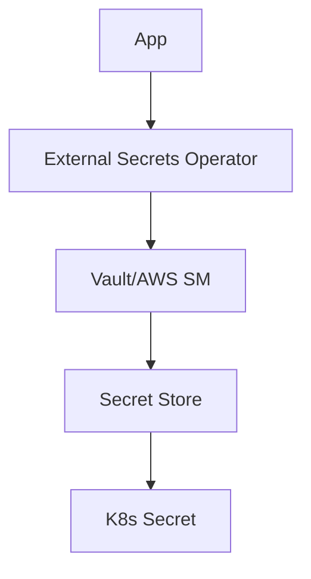

## Overview

This guide compares secrets management options in DevOps: HashiCorp Vault, AWS Secrets Manager, and Kubernetes Secrets. It explains when to use each and the main best practices.

## Prerequisites

- Basic Kubernetes and cloud (AWS/Azure/GCP) knowledge.
- Understanding of encryption and authentication fundamentals.

## Main Solutions

### HashiCorp Vault

Vault is an open-source, central secrets manager with encryption, auditing, and automatic rotation.

#### Features
- **Secret engines:** KV, databases, cloud providers.
- **Auth methods:** LDAP, JWT, certificates, cloud IAM.
- **Encryption:** In transit and at rest with rotating keys.
- **Auditing:** Detailed access logs.

#### Installation

```bash
helm repo add hashicorp https://helm.releases.hashicorp.com
helm install vault hashicorp/vault

wget https://releases.hashicorp.com/vault/1.15.0/vault_1.15.0_linux_amd64.zip
unzip vault_*.zip
sudo mv vault /usr/local/bin/
```

#### Basic Usage

```bash
vault server -dev
vault kv put secret/myapp db_password="supersecret"
vault kv get secret/myapp
```

#### K8s Integration

```yaml
apiVersion: secrets.hashicorp.com/v1beta1
kind: VaultStaticSecret
metadata:
  name: my-secret
spec:
  vaultAuthRef: vault-auth
  mount: secret
  path: myapp
  destination:
    create: true
    name: my-secret
```

### AWS Secrets Manager

Managed AWS service for storing and rotating secrets.

#### Features
- **Native integration:** Lambda, RDS, ECS.
- **Automatic rotation:** Databases and credentials.
- **Encryption:** Backed by KMS.
- **Access:** IAM policies.

#### Usage

```bash
aws secretsmanager create-secret --name my-secret --secret-string '{"username":"admin","password":"secret"}'
```

```python
import boto3
client = boto3.client('secretsmanager')
secret = client.get_secret_value(SecretId='my-secret')
```

### Kubernetes Secrets

Native K8s resource for sensitive data.

#### Types
- **Opaque:** Arbitrary data.
- **TLS:** Certificates.
- **Docker-registry:** Registry credentials.

#### Limitations
- Not encrypted at rest in etcd by default.
- Access via RBAC, but limited auditing.
- Best for low-sensitivity data or when paired with external managers.

#### Example

```yaml
apiVersion: v1
kind: Secret
metadata:
  name: my-secret
type: Opaque
data:
  username: YWRtaW4=
  password: c2VjcmV0
```

## Comparison

| Aspect | Vault | AWS Secrets Manager | K8s Secrets |
|--------|-------|---------------------|-------------|
| Cost | Free (open source) | Pay-per-use | Free |
| Scalability | High | High | Medium |
| Cloud integration | Good | Excellent (AWS) | Good |
| Auditing | Advanced | Basic | Limited |
| Complexity | High | Low | Medium |

## Best Practices

- **Least privilege:** Scope access tightly.
- **Rotation:** Automate secret rotation.
- **Monitoring:** Alert on unusual access.
- **Backup:** Have a recovery plan.
- **Avoid Git:** Never commit secrets; use External Secrets Operator or similar.

## Architecture Example (External Secrets)



## References

- [HashiCorp Vault](https://www.vaultproject.io/)
- [AWS Secrets Manager](https://docs.aws.amazon.com/secretsmanager/)
- [Kubernetes Secrets](https://kubernetes.io/docs/concepts/configuration/secret/)
- [External Secrets Operator](https://external-secrets.io/)
