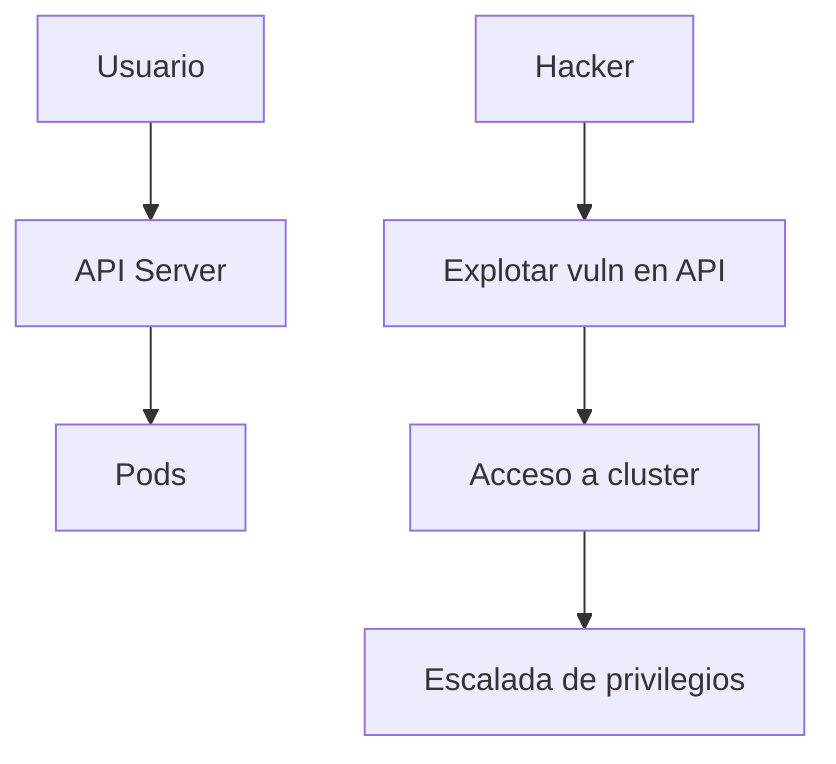

# 🚧 TRANSLATION PENDING

> Pending translation. Original:

---

---
title: "Modelo de Amenazas"
date: 2026-01-09
tags: [cybersecurity, threat-modeling, owasp, mitre]
draft: false
---

## Resumen

Esta guía explica qué es un modelo de amenazas y cómo identificar amenazas comunes en entornos de infraestructura cloud y DevOps. Se basa en frameworks como OWASP Top 10 para aplicaciones web/infra y MITRE ATT&CK para tácticas de adversarios.

## Prerrequisitos

- Conocimientos básicos de ciberseguridad (vulnerabilidades, ataques comunes).
- Entendimiento de entornos cloud (AWS, Azure, GCP) o infraestructura on-prem (Kubernetes, Docker).

## ¿Qué es un Modelo de Amenazas?

Un modelo de amenazas es un proceso estructurado para identificar, cuantificar y priorizar amenazas potenciales a un sistema. Ayuda a entender qué puede salir mal y cómo mitigarlo antes de que ocurra.

### Componentes clave

- **Activos:** Qué proteger (datos, servicios, infraestructura).
- **Amenazas:** Qué puede dañar los activos (hackers, malware, errores humanos).
- **Vulnerabilidades:** Debilidades que permiten las amenazas.
- **Mitigaciones:** Controles para reducir riesgos.

## Amenazas Comunes en Infraestructura

### OWASP Top 10 para Infraestructura

1. **Broken Access Control:** Acceso no autorizado a recursos.
2. **Cryptographic Failures:** Encriptación débil o mal configurada.
3. **Injection:** Ataques como SQL injection en APIs o configs.
4. **Insecure Design:** Arquitecturas con fallos de seguridad inherentes.
5. **Security Misconfiguration:** Configs por defecto o expuestas.
6. **Vulnerable Components:** Dependencias con CVEs conocidas.
7. **Identification and Authentication Failures:** Autenticación débil.
8. **Software and Data Integrity Failures:** Manipulación de datos o software.
9. **Security Logging and Monitoring Failures:** Falta de logs para detección.
10. **Server-Side Request Forgery (SSRF):** Ataques desde el servidor.

### MITRE ATT&CK para Infra

Tácticas comunes en entornos cloud/K8s:

- **Reconnaissance:** Escaneo de puertos, enumeración de servicios.
- **Initial Access:** Explotación de configs expuestas (ej. S3 buckets públicos).
- **Execution:** Ejecución de código remoto en contenedores.
- **Persistence:** Backdoors en imágenes Docker o configs K8s.
- **Privilege Escalation:** De user a root en pods.
- **Defense Evasion:** Ocultar malware en contenedores efímeros.

## Cómo Crear un Modelo de Amenazas

### Pasos

1. **Definir alcance:** Diagramar la arquitectura (usar draw.io o Mermaid).
2. **Identificar activos:** Datos sensibles, APIs, bases de datos.
3. **Enumerar amenazas:** Usar STRIDE (Spoofing, Tampering, Repudiation, Information Disclosure, Denial of Service, Elevation of Privilege).
4. **Evaluar riesgos:** Probabilidad vs impacto.
5. **Definir mitigaciones:** Controles técnicos y procesos.

### Herramientas

- **Microsoft Threat Modeling Tool:** Gratuito, guiado.
- **OWASP Threat Dragon:** Open-source, basado en web.
- **Mermaid para diagramas:** Integrado en esta documentación.

## Ejemplos

### Diagrama simple de amenazas en K8s

Mitigaciones: RBAC estricto, Network Policies, admission controllers.

## Referencias

- [OWASP Threat Modeling](https://owasp.org/www-community/Application_Threat_Modeling)
- [MITRE ATT&CK](https://attack.mitre.org/)
- [NIST SP 800-30: Risk Management](https://csrc.nist.gov/publications/detail/sp/800-30/rev-1/final)