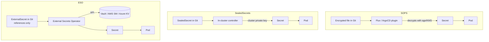

## The problem

GitOps starts from an uncomfortable premise: **the repository is the source of truth for the whole cluster**. Everything, except one thing. Kubernetes `Secret` objects are not secret: they are base64, which is encoding, not encryption. If you `git add` one, you have just published your production password complete with history, blame and backups scattered across every clone on the team.

Deleting it afterwards does not help: the commit is still there. There are three serious ways to solve this, and they make different trade-offs about who holds the key and what happens when it is lost.

!!! info "Scope of this guide"
    This guide is about **secrets versioned in Git**. If you are looking for a comparison of storage backends (Vault vs AWS Secrets Manager vs Kubernetes Secrets), see [Secrets Management](gestion_secretos.md).

## The three strategies at a glance



The key difference: with SOPS and Sealed Secrets **the encrypted material lives in Git**; with ESO, Git only holds a pointer.

## SOPS: encrypt the file, not the repository

[SOPS](https://getsops.io/) encrypts only the *values* of a YAML/JSON file, leaving the keys in plaintext. The result is still a readable diff: you can see which field changed even if you cannot read it.

### Setup with age

```bash
# Generate an age identity
age-keygen -o ~/.config/sops/age/keys.txt
```

Encryption rules live in a `.sops.yaml` file at the repo root, and **the first matching rule wins**:

```yaml
creation_rules:
  - path_regex: \.dev\.yaml$
    age: age1s3cqcks5genc6ru8chl0hkkd04zmxvczsvdxq99ekffe4gmvjpzsedk23c
  - path_regex: \.prod\.yaml$
    kms: 'arn:aws:kms:eu-west-1:123456789012:key/cb1fab90-8d17-42a1-a9d8-334968904f94'
    age:
      - age1s3cqcks5genc6ru8chl0hkkd04zmxvczsvdxq99ekffe4gmvjpzsedk23c
      - age1qe5lxzzeppw5k79vxn3872272sgy224g2nzqlzy3uljs84say3yqgvd0sw
```

For a Kubernetes `Secret` you usually want to encrypt only `data`/`stringData` and keep `metadata` readable:

```bash
sops encrypt --encrypted-regex '^(data|stringData)$' k8s-secrets.yaml
```

Editing in place, without decrypting to disk:

```bash
sops secrets.prod.yaml
```

### Key rotation

Two distinct operations that are frequently confused:

```bash
# Add or remove recipients from an already-encrypted file
sops updatekeys secrets.prod.yaml

# Renew the data key and re-encrypt
sops rotate --in-place secrets.prod.yaml
```

!!! warning "Order matters when a key is compromised"
    First **remove the compromised key from `.sops.yaml`**, then run `sops updatekeys`, and finally `sops rotate --in-place` on every affected file. Doing it the other way round would leave the new data key accessible to the very key you meant to revoke. Rotating the data key periodically is recommended even without an incident.

### GitOps integration

- **Flux**: native support. The `Kustomization` references a Secret holding the age key and decrypts during reconciliation.
- **ArgoCD**: does not decrypt SOPS on its own. You need a plugin, typically **KSOPS** (a Kustomize generator) or a Config Management Plugin sidecar. That means building an `argocd-repo-server` image containing `sops` and `ksops` and mounting the private key as a Secret in the ArgoCD namespace.

!!! danger "The repo-server becomes a critical target"
    With SOPS + ArgoCD, the private key lives inside `argocd-repo-server`. Anyone who gets execution in that pod can decrypt **every** secret in the repository. Apply the same protections you would give a control-plane node: strict RBAC, NetworkPolicies and no `exec` access. See [Kubernetes Security](kubernetes_security.md).

## Sealed Secrets: asymmetric encryption against the cluster

[Sealed Secrets](https://github.com/bitnami/sealed-secrets) flips the model: a controller in the cluster generates a key pair and publishes the public half. Anyone can encrypt; only the controller can decrypt.

```bash
helm repo add sealed-secrets https://bitnami.github.io/sealed-secrets
helm install sealed-secrets-controller sealed-secrets/sealed-secrets \
  --set namespace=kube-system
```

Installing the CLI:

```bash
wget https://github.com/bitnami/sealed-secrets/releases/download/<release-tag>/kubeseal-<version>-linux-amd64.tar.gz
tar -xvzf kubeseal-<version>-linux-amd64.tar.gz kubeseal
sudo install -m 755 kubeseal /usr/local/bin/kubeseal
```

### Sealing a secret

```bash
kubectl create secret generic db-credentials \
  --dry-run=client --from-literal=password=s3cr3t -o yaml | \
  kubeseal \
    --controller-name=sealed-secrets-controller \
    --controller-namespace=kube-system \
    --format yaml > sealedsecret.yaml
```

The resulting `SealedSecret` is the file that **does** go into Git. The controller watches it and materialises the real `Secret`.

### Scopes

By default a `SealedSecret` is bound to its name **and** its namespace: moving it breaks it, by design. If you need to relax that:

```bash
echo -n foo | kubeseal --raw --scope cluster-wide
```

This requires the `sealedsecrets.bitnami.com/cluster-wide` annotation on the resource. Use it carefully: a `cluster-wide` scope lets anyone with create permissions in any namespace reuse that encrypted value.

!!! danger "Back up the master key. Today."
    This is the number one operational failure with Sealed Secrets. If you lose the cluster and do not have the controller's private key, **every `SealedSecret` in your repository is unrecoverable garbage** and you will have to regenerate each credential by hand.

```bash
kubectl get secret -n kube-system \
  -l sealedsecrets.bitnami.com/sealed-secrets-key \
  -o yaml > sealed-secrets-master.key
```

Store that file **outside Git**, encrypted, in a secrets manager or offline storage. Restoring it means applying the Secret to the new cluster and restarting the controller.

The controller rotates its key periodically (every 30 days by default) and **keeps the old ones** so it can still decrypt. To re-encrypt a `SealedSecret` with the latest key:

```bash
kubeseal --re-encrypt <my_sealed_secret.json >tmp.json \
  && mv tmp.json my_sealed_secret.json
```

Every rotation produces a new key that also needs backing up. Automate it; do not leave it in a runbook.

## External Secrets Operator: only the reference lives in Git

[ESO](https://external-secrets.io/) stores nothing encrypted in Git. It stores *where* the secret is and lets the operator sync it from Vault, AWS Secrets Manager, Azure Key Vault, GCP Secret Manager and a long list of others.

Two main CRDs. The `SecretStore` describes the backend and how to authenticate:

```yaml
apiVersion: external-secrets.io/v1
kind: SecretStore
metadata:
  name: vault-backend
  namespace: example
spec:
  provider:
    vault:
      server: "https://vault.acme.org"
      path: "secret"
      version: "v2"
      auth:
        kubernetes:
          mountPath: "kubernetes"
          role: "demo"
          serviceAccountRef:
            name: "my-sa"
```

For AWS Secrets Manager:

```yaml
apiVersion: external-secrets.io/v1
kind: SecretStore
metadata:
  name: secretstore-sample
spec:
  provider:
    aws:
      service: SecretsManager
      region: eu-west-1
      auth:
        secretRef:
          accessKeyIDSecretRef:
            name: awssm-secret
            key: access-key
          secretAccessKeySecretRef:
            name: awssm-secret
            key: secret-access-key
```

The `ExternalSecret` describes what to fetch and which `Secret` to put it in:

```yaml
apiVersion: external-secrets.io/v1
kind: ExternalSecret
metadata:
  name: external-secret-vault
  namespace: default
spec:
  secretStoreRef:
    name: vault-backend
    kind: SecretStore
  refreshPolicy: Periodic
  refreshInterval: "1h"
  target:
    name: creds-secret-vault
    creationPolicy: Owner
  dataFrom:
    - extract:
        key: database-credentials
```

!!! tip "Use ClusterSecretStore to avoid repetition"
    There is a `ClusterSecretStore` variant, identical but cluster-scoped: define the Vault connection once and have every namespace reference it with `kind: ClusterSecretStore`. Less duplication and a single place to audit authentication.

`dataFrom` also supports `find` with regex, handy for syncing whole families of secrets without listing them one by one:

```yaml
  dataFrom:
    - find:
        name:
          regexp: "^prod-"
```

With ArgoCD, ESO is the lowest-friction option: an `ExternalSecret` is just an ordinary manifest, no plugins or custom images required. The only caveat is marking the generated `Secret` objects so ArgoCD does not report them as *OutOfSync* (`argocd.argoproj.io/compare-options: IgnoreExtraneous`). See [ArgoCD](../cicd/argocd.md).

## An honest comparison

| Criterion | SOPS | Sealed Secrets | ESO |
| --- | --- | --- | --- |
| What is in Git? | Encrypted values | Encrypted values | References only |
| If the repo leaks | Safe as long as the private key does not leak | Safe: only the controller decrypts | Nothing to leak |
| Threat model | Whoever holds the age/KMS key reads everything | Whoever compromises the cluster reads everything | Whoever compromises the store credentials |
| Local decryption | Yes (useful for debugging) | No (one-way by design) | No |
| Extra infrastructure | None in-cluster | One controller | An operator + external backend |
| Cost | Zero (age) or KMS | Zero | Vault/cloud bill |
| Rotation | Manual: `updatekeys` + `rotate` | Key automatic, secrets manual | In the backend, propagation automatic |
| Disaster recovery | Restore the age/KMS key | **Restore the master key or lose everything** | Reinstall the operator, the backend is the truth |
| Access auditing | Git log + KMS logs | None natively | Full (backend audit log) |
| ArgoCD | Requires a plugin (KSOPS/CMP) | Native | Native |
| Multi-cluster | Easy: share the key | Painful: one key per cluster | Trivial |

### What the table does not say

- **SOPS with age is the only one that works with nothing running.** You can decrypt on your laptop, in a pipeline, or on a brand-new cluster. That is a huge operational advantage and, at the same time, exactly its risk: one leaked key compromises the entire repository history, including secrets you already rotated.
- **Sealed Secrets has the best threat model against a repo leak** and the worst against cluster loss. Without a master key backup, an infrastructure disaster turns into a credentials incident.
- **ESO does not encrypt anything**: it moves the problem to the backend, which is where it belongs. In exchange it introduces a runtime dependency: if Vault goes down, existing `Secret` objects survive but nothing refreshes and nothing new is created.
- **None of them protect against an attacker with `get secrets` in the cluster.** All three end up as a standard Kubernetes `Secret`. RBAC is still the last line of defence, and etcd encryption at rest is still mandatory.

## Recommendations by scenario

### Homelab / personal project

**SOPS + age.** Zero infrastructure, zero cost, works on any cluster including k3s on a Raspberry Pi. Keep the private key in your password manager and on a USB stick. If you use Flux, the integration is native and there is nothing else to do.

### Small team (3-15 people)

**Sealed Secrets.** Developers encrypt with the public key without needing access to any credential, which scales socially far better than handing out age keys. The price is a master key backup runbook that someone must actually execute, with a restore verification at least once a quarter.

!!! warning "Test the restore"
    An unverified backup is not a backup. Spin up an ephemeral cluster, restore the key and confirm that a real `SealedSecret` decrypts. If you have never done it, you do not know whether it works.

### Enterprise with Vault or cloud

**ESO, without hesitation.** If you are already paying for a secrets manager, duplicating encrypted material in Git hands out attack surface for nothing in return. ESO gives you real rotation, an audit log, identity-based access policies and a clean separation between who deploys and who can read credentials.

### Mixed situations

Combining is perfectly reasonable: ESO for application credentials and SOPS for the handful of *bootstrap* secrets needed before the operator exists (the Vault access token itself, for example). ESO does not solve that chicken-and-egg problem on its own.

## Common mistakes

- **Encrypting the whole file with SOPS.** You lose diff readability and any PR review becomes useless. Always use `--encrypted-regex`.
- **Forgetting a `.gitignore` entry for temporary decrypted files.** One leftover `secrets.dec.yaml` undoes everything above. Add a pre-commit hook or a secret scanner in CI.
- **Assuming that rotating the key rotates the secrets.** They are not the same: rotating the age key re-encrypts the same value. If a credential leaked, you must change it in the source system.
- **Giving ArgoCD read access to every Secret in the cluster** when it only needs to manage its own.

## Related resources

- [Secrets Management](gestion_secretos.md) — backend comparison: Vault, AWS SM and Kubernetes Secrets.
- [ArgoCD](../cicd/argocd.md) — GitOps deployment and application configuration.
- [Kubernetes Security (RBAC)](kubernetes_security.md) — RBAC, policies and cluster hardening.

## References

- [SOPS — official documentation](https://getsops.io/docs/)
- [Sealed Secrets — repository](https://github.com/bitnami/sealed-secrets)
- [External Secrets Operator](https://external-secrets.io/)
- [KSOPS](https://github.com/viaduct-ai/kustomize-sops)
