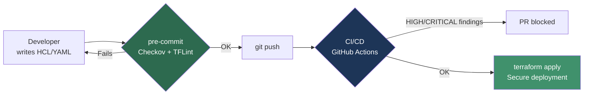

## Overview

Writing infrastructure as code (IaC) is convenient, repeatable and versionable. The catch is that a misconfiguration becomes repeatable too: a public S3 bucket, a Security Group open to `0.0.0.0/0`, or a container running as `root` gets deployed as many times as you run the pipeline. This guide shows how to scan your IaC with **Checkov** and **TFLint** to catch those *misconfigurations* **before** they reach production, applying the *shift-left* principle of the [DevSecOps](introduccion_devsecops.md) approach.

## Prerequisites

- Terraform and/or Ansible installed and a repository with IaC code.
- Python 3.8+ (for Checkov) and `pip`.
- Familiarity with CI/CD pipelines (GitHub Actions).

## What is IaC scanning and why it matters

IaC scanning **statically** analyzes definition files (Terraform HCL, Ansible playbooks, Kubernetes manifests, Dockerfiles) looking for insecure patterns: disabled encryption, missing logging, excessive permissions, plaintext secrets, and so on. Unlike [vulnerability scanning](escaneo_vulnerabilidades.md), which inspects already-built images and dependencies, here we work on the **definition plane**, well before deployment.

!!! info "Shift-left in one sentence"
    The later you find a security flaw, the more expensive it is to fix. Catching an open Security Group in the editor or at `git commit` takes seconds; catching it after a production incident costs far more.



## Checkov

[Checkov](https://www.checkov.io/) (by Prisma Cloud / Bridgecrew) is a static-analysis scanner that covers Terraform, Ansible, Kubernetes, Dockerfile, CloudFormation, Helm, ARM and Serverless. It ships with over a thousand predefined *policies* mapped to CIS Benchmarks, PCI-DSS, HIPAA, and more.

### Installation

```bash
# With pip (recommended)
pip install checkov

# With Homebrew (macOS)
brew install checkov

# Verify
checkov --version
```

### Basic usage

```bash
# Scan the whole current directory (auto-detects the IaC type)
checkov -d .

# Scan a single file
checkov -f main.tf

# Limit to a specific framework
checkov -d . --framework terraform
checkov -d . --framework ansible
checkov -d . --framework kubernetes
checkov -d . --framework dockerfile

# Machine-readable output for CI
checkov -d . -o json --output-file-path results/

# Compact, quiet output (only failures)
checkov -d . --compact --quiet
```

!!! tip "Silencing false positives"
    You can skip a specific check without disabling it globally by adding an inline comment on the Terraform resource:
    ```hcl
    resource "aws_s3_bucket" "logs" {
      # checkov:skip=CKV_AWS_18:Logging is handled in the central account
      bucket = "my-logs-bucket"
    }
    ```

### Real example: a Terraform finding and its fix

Insecure code:

```hcl
resource "aws_s3_bucket" "data" {
  bucket = "frikiteam-data"
}
```

Checkov will report, among others:

```text
Check: CKV_AWS_18: "Ensure the S3 bucket has access logging enabled"
        FAILED for resource: aws_s3_bucket.data
Check: CKV_AWS_21: "Ensure all data stored in the S3 bucket have versioning enabled"
        FAILED for resource: aws_s3_bucket.data
Check: CKV2_AWS_6: "Ensure that S3 bucket has a Public Access block"
        FAILED for resource: aws_s3_bucket.data
```

Fixed version:

```hcl
resource "aws_s3_bucket" "data" {
  bucket = "frikiteam-data"
}

resource "aws_s3_bucket_versioning" "data" {
  bucket = aws_s3_bucket.data.id
  versioning_configuration {
    status = "Enabled"
  }
}

resource "aws_s3_bucket_public_access_block" "data" {
  bucket                  = aws_s3_bucket.data.id
  block_public_acls       = true
  block_public_policy     = true
  ignore_public_acls      = true
  restrict_public_buckets = true
}

resource "aws_s3_bucket_logging" "data" {
  bucket        = aws_s3_bucket.data.id
  target_bucket = aws_s3_bucket.logs.id
  target_prefix = "log/"
}
```

### Ansible example

Insecure playbook:

```yaml
- name: Download binary
  ansible.builtin.get_url:
    url: http://example.com/app.tar.gz   # Unencrypted HTTP
    dest: /opt/app.tar.gz
    validate_certs: no                    # TLS verification disabled
```

Checkov will flag `CKV2_ANSIBLE_1` (HTTP instead of HTTPS) and the disabled certificate verification. The fix is to use `https://` and `validate_certs: yes`.

## TFLint

[TFLint](https://github.com/terraform-linters/tflint) is a Terraform-specific *linter*. It doesn't fully overlap with Checkov: while Checkov focuses on security, TFLint detects **Terraform errors** (deprecated syntax, dead code, conventions) and, through *provider plugins* (AWS, Azure, GCP), validates **invalid arguments and instance types** that Terraform won't catch until `apply`.

### Installation

```bash
# Official script
curl -s https://raw.githubusercontent.com/terraform-linters/tflint/master/install_linux.sh | bash

# Homebrew (macOS)
brew install tflint

# Verify
tflint --version
```

### Configuration with provider rules

Create a `.tflint.hcl` file at the project root:

```hcl
plugin "aws" {
  enabled = true
  version = "0.34.0"
  source  = "github.com/terraform-linters/tflint-ruleset-aws"
}

plugin "azurerm" {
  enabled = true
  version = "0.27.0"
  source  = "github.com/terraform-linters/tflint-ruleset-azurerm"
}

config {
  call_module_type = "local"
}

rule "terraform_naming_convention" {
  enabled = true
}
```

### Basic usage

```bash
# Download the plugins declared in .tflint.hcl
tflint --init

# Run linting on the current directory
tflint

# Recurse through modules
tflint --recursive

# CI-friendly output
tflint --format compact
```

Typical finding from the AWS ruleset:

```text
Error: "t9.micro" is an invalid value as instance_type (aws_instance_invalid_type)

  on main.tf line 12:
  12:   instance_type = "t9.micro"
```

A nonexistent instance type that Terraform wouldn't catch until it fails at `apply`; TFLint catches it in seconds.

## Pre-commit hook integration

Install [pre-commit](https://pre-commit.com/) (`pip install pre-commit`) and create `.pre-commit-config.yaml`:

```yaml
repos:
  - repo: https://github.com/bridgecrewio/checkov
    rev: 3.2.0
    hooks:
      - id: checkov
        args: ["--framework", "terraform", "--framework", "ansible", "--quiet"]

  - repo: https://github.com/terraform-linters/tflint
    rev: v0.53.0
    hooks:
      - id: tflint
```

```bash
pre-commit install       # enables the hook on git commit
pre-commit run --all-files
```

!!! warning "The hook does not replace the pipeline"
    A developer can bypass hooks with `git commit --no-verify`. Hooks are the first layer (convenient and fast), but the **blocking** gate must live in CI/CD, where no one can skip it.

## CI/CD integration (GitHub Actions)

`.github/workflows/iac-security.yml`:

```yaml
name: IaC Security Scan

on:
  pull_request:
    paths:
      - "**/*.tf"
      - "**/*.yml"
      - "**/*.yaml"

jobs:
  scan:
    runs-on: ubuntu-latest
    steps:
      - uses: actions/checkout@v4

      - name: Checkov
        uses: bridgecrewio/checkov-action@v12
        with:
          directory: .
          framework: terraform,ansible,dockerfile
          output_format: cli,sarif
          output_file_path: console,results.sarif
          soft_fail: false        # fail the job on findings

      - name: Upload SARIF to Code Scanning
        uses: github/codeql-action/upload-sarif@v3
        if: always()
        with:
          sarif_file: results.sarif

      - name: TFLint
        uses: terraform-linters/setup-tflint@v4
        with:
          tflint_version: v0.53.0
      - run: |
          tflint --init
          tflint --recursive --format compact
```

!!! tip "SARIF and the Security tab"
    Exporting in SARIF format makes findings show up directly in the repository's **Security → Code scanning** tab on GitHub, with inline annotations on the PR.

## Tool comparison

| Feature                  | Checkov            | TFLint                 | tfsec                  | Terrascan          |
|--------------------------|--------------------|------------------------|------------------------|--------------------|
| Primary focus            | Security/compliance | Linting + TF errors   | Security               | Security/compliance |
| Terraform                | Yes                | Yes (native)           | Yes                    | Yes                |
| Ansible                  | Yes                | No                     | No                     | No                 |
| Kubernetes / Helm        | Yes                | No                     | Yes (limited)          | Yes                |
| Dockerfile               | Yes                | No                     | No                     | Yes                |
| Provider rules (AWS/Azure) | Via policies     | Yes (plugins)          | Via rules              | Via policies       |
| Custom policy            | Python / YAML      | TFLint rules           | Rego (custom)          | Rego (OPA)         |
| Project status           | Active             | Active                 | Merged into Trivy      | Active             |
| Policy language          | YAML / Python      | HCL                    | JSON / Rego            | Rego               |

!!! note "Which one should I pick?"
    They are not mutually exclusive. The common combo is **Checkov + TFLint**: Checkov covers multi-framework security and TFLint adds Terraform-specific linting with provider validation. Note that **tfsec** was absorbed into Trivy (`trivy config`), so if you already use Trivy for [vulnerability scanning](escaneo_vulnerabilidades.md) you can reuse it for IaC too.

## Best practices

- Run the scan in **pre-commit** (fast) and as a **blocking gate in CI** (guarantee).
- Version-control `.tflint.hcl` and `.pre-commit-config.yaml` alongside the IaC code.
- Document every `checkov:skip` with a justification; skips without a reason are security debt.
- Export SARIF to centralize findings in the Security tab.
- Periodically review new policies when you bump versions.

## Related links

- [Introduction to DevSecOps](introduccion_devsecops.md)
- [Vulnerability Scanning](escaneo_vulnerabilidades.md)
- [Terraform Base](../terraform/terraform_base.md)
- [Ansible Base](../ansible/ansible_base.md)
