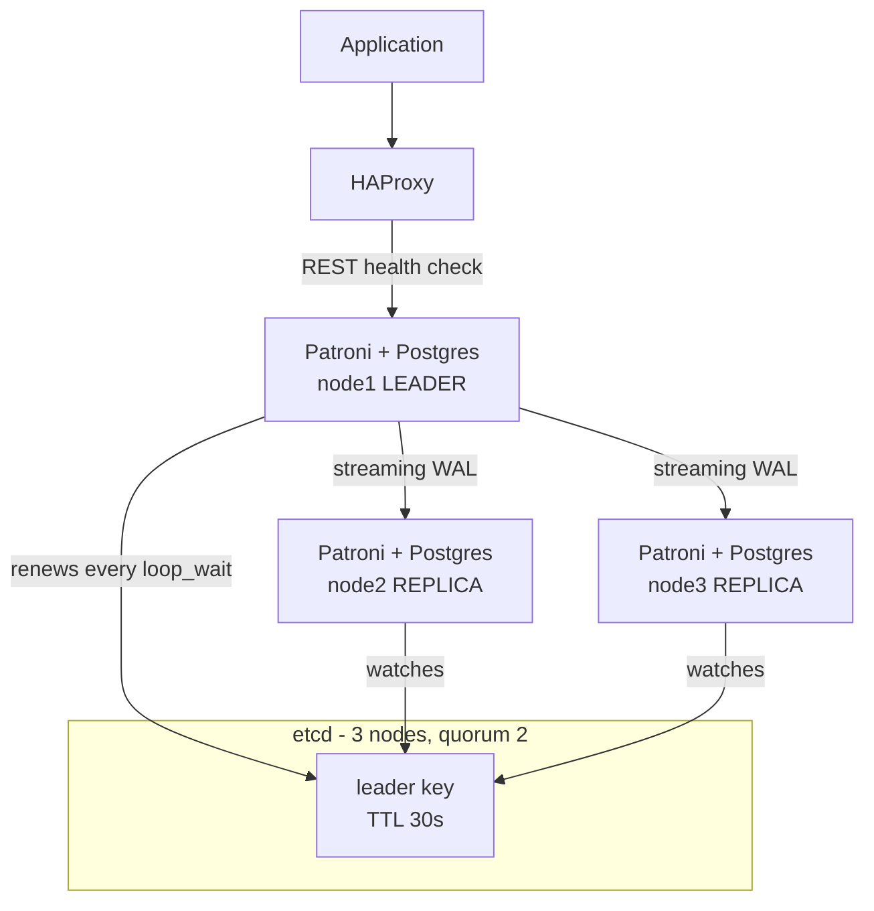
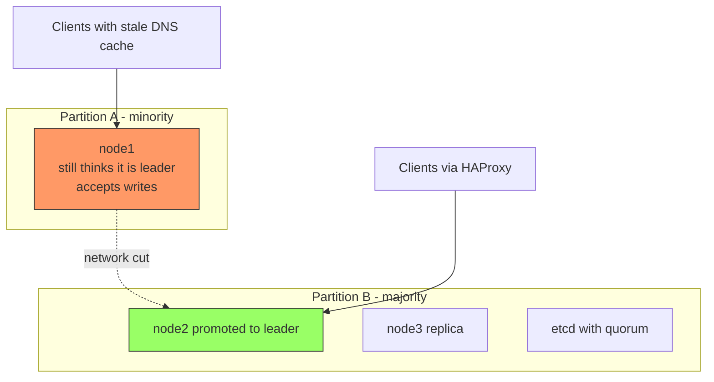

## What "high availability" really means

A PostgreSQL cluster in HA is not "I have a replica". It is a distributed system that must answer three questions with no human intervention: who is the primary, how do clients learn it has changed, and what happens to the old node when it comes back. Almost every HA disaster comes from the third one.

This guide covers operations: what to configure, what to monitor and how to test it. It assumes you already know what a WAL is and how to bring up an instance.

!!! info "Scope"
    This does not cover basic PostgreSQL deployment —that is in [PostgreSQL on Docker](postgres.md)— nor the replicated storage layer, which is in [Storage for databases: PostgreSQL + Ceph](../storage/postgresql_ceph.md). Ceph gives you a disk that survives a node dying; **it does not give you database failover**. They are complementary layers, not alternatives.

## Streaming replication: the trade-off that decides everything

PostgreSQL replicates by shipping the primary's WAL to the replicas over a streaming connection. The only important decision is **when the primary confirms a COMMIT to the client**, and it is controlled by `synchronous_commit`.

### Asynchronous: the primary waits for no one

```ini
# primary's postgresql.conf
wal_level = replica
max_wal_senders = 10
max_replication_slots = 10
synchronous_commit = on          # local fsync, does not wait for the replica
synchronous_standby_names = ''   # empty = all replication is asynchronous
```

`synchronous_commit = on` with `synchronous_standby_names` empty means: the COMMIT is confirmed once the WAL is on **local** disk. The replica will receive it whenever it receives it.

- **Write latency**: that of your local disk. Nothing more.
- **RPO**: not zero. If the primary dies, you lose everything the replica had not yet received. The exact amount is the *replication lag* at that instant, which is why monitoring it is not optional (see below).

### Synchronous: the primary waits for confirmation

```ini
# primary's postgresql.conf
synchronous_commit = remote_apply
synchronous_standby_names = 'ANY 1 (node2, node3)'
```

`synchronous_standby_names` accepts two forms: `FIRST n (...)` uses the list order as priority; `ANY n (...)` accepts confirmation from any *n* of the listed nodes. `ANY` is almost always what you want: it does not tie you to a specific node.

The `synchronous_commit` levels, from least to most guarantee and from least to most latency:

| Value | The COMMIT returns when… | What you lose on a failure |
| --- | --- | --- |
| `off` | The WAL is in the local buffer, no fsync | Confirmed transactions, even with the primary alive |
| `local` | Local fsync done, replicas ignored | Whatever the replica has not received |
| `remote_write` | The replica has it in memory (not on disk) | Lost if the replica falls at the same time |
| `on` | The replica has fsynced it to disk | Nothing confirmed, if a replica survives |
| `remote_apply` | The replica has applied it and it is visible to queries | Nothing, and replica reads are consistent too |

The real cost of sync is not "a bit slower". It is that **every COMMIT pays a full network round-trip plus the remote fsync**. The approximate formula for the latency floor per transaction:

```text
commit_latency ≈ local_fsync + net_RTT + remote_fsync  (+ replay time if remote_apply)
```

That floor is not optimized away with more CPU or more RAM. In the same machine room it may be negligible next to the fsync; across regions the RTT dominates and multiplies write latency by a factor you **must measure on your network**, not read off a table. Measure with `pgbench` against your real topology before committing.

!!! danger "The single-standby synchronous trap"
    If `synchronous_standby_names = 'FIRST 1 (node2)'` and `node2` falls, **the primary blocks all COMMITs indefinitely**. It is not a bug: it is exactly what you asked for. Postgres prefers to hang rather than break the durability guarantee.

    The ways out are: list at least two candidates (`ANY 1 (node2, node3)`), or let Patroni manage the list dynamically with `synchronous_mode`, which degrades to async in a controlled way when no healthy candidate is left.

### Replication slots and the risk of filling the disk

A replication slot guarantees the primary **does not delete WAL** that a replica has not yet consumed. It solves the problem of a replica falling behind to the point it can no longer catch up. And it creates a new one: a downed replica with an active slot grows `pg_wal` until it fills the primary's disk, which then stops dead.

```ini
# Hard cap on WAL retained by slots (PostgreSQL 13+).
# If a slot exceeds this size it is invalidated: the primary is saved,
# the replica is sacrificed (it will have to be rebuilt).
max_slot_wal_keep_size = 64GB
```

Always set it. A replica that must be rebuilt is an incident; a primary with a full disk is a total outage.

## Automatic failover: Patroni + etcd

Patroni is the de facto standard. The idea is simple and that is why it works: Patroni **does not decide** who the primary is, it uses a distributed store with consensus (etcd, Consul or ZooKeeper) as the arbiter. The leader holds a key with a TTL; if it does not renew it, the key expires, and the rest compete to take it.



The detail people overlook: **etcd's quorum is what prevents split-brain**. A Patroni node that loses contact with etcd cannot renew its key, so it demotes itself. That is why etcd runs on an odd number of nodes (3 or 5) and, where possible, **not on the same machines** as Postgres: a network fault that isolates a node should also isolate its vote.

### Commented Patroni configuration

One node's `patroni.yml`. The `bootstrap.dcs` values are read only **the first time** the cluster is initialized; after that they live in the DCS and are changed with `patronictl edit-config`.

```yaml
scope: pg-production            # cluster name; the 3 nodes share the scope
name: node1                     # unique per node
namespace: /service/            # prefix of the keys in etcd

restapi:
  listen: 0.0.0.0:8008
  connect_address: 10.0.0.11:8008   # how the OTHER nodes and HAProxy see it

etcd3:
  hosts:
    - 10.0.0.21:2379
    - 10.0.0.22:2379
    - 10.0.0.23:2379

bootstrap:
  dcs:
    # TTL of the leadership key. If the leader does not renew it within this
    # time, it expires and an election is called. It is the lower bound of your RTO.
    ttl: 30
    # How often Patroni's loop runs (heartbeat).
    loop_wait: 10
    # Timeout of operations against the DCS and Postgres.
    retry_timeout: 10
    # A candidate with more than this lag in bytes CANNOT be promoted.
    # It is your maximum tolerated RPO, expressed in bytes of WAL.
    maximum_lag_on_failover: 1048576   # 1 MiB
    # Synchronous replication managed by Patroni: it keeps
    # synchronous_standby_names current and only degrades if no candidate is left.
    synchronous_mode: true
    # If true, Patroni will NEVER promote a node that was not synchronous.
    # Zero data loss in exchange for possibly ending up with no cluster.
    synchronous_mode_strict: false
    postgresql:
      use_pg_rewind: true       # rejoins the ex-primary without cloning it whole
      use_slots: true
      parameters:
        wal_level: replica
        hot_standby: "on"
        max_wal_senders: 10
        max_replication_slots: 10
        max_slot_wal_keep_size: 64GB
        wal_log_hints: "on"     # REQUIRED by pg_rewind (or data checksums)

  initdb:
    - encoding: UTF8
    - data-checksums              # detects silent corruption; initdb only

postgresql:
  listen: 0.0.0.0:5432
  connect_address: 10.0.0.11:5432
  data_dir: /var/lib/postgresql/16/main
  bin_dir: /usr/lib/postgresql/16/bin
  authentication:
    replication:
      username: replicator
      password: CHANGEME
    superuser:
      username: postgres
      password: CHANGEME
    rewind:                       # user for pg_rewind (no superuser needed on PG11+)
      username: rewind_user
      password: CHANGEME

watchdog:
  mode: required                  # 'required' = Patroni will NOT start without a watchdog
  device: /dev/watchdog
  safety_margin: 5

tags:
  nofailover: false
  noloadbalance: false
  clonefrom: false
  nosync: false
```

The three decisions that really matter in that file:

- **`ttl` and `loop_wait`**: detection time is bounded by `ttl`, and `loop_wait` must be well below it (the usual relationship is `ttl` ≥ 2·`loop_wait` + `retry_timeout`). Lowering it speeds up failover and raises the risk of a spurious failover from a network hiccup. There is no universally correct number: it depends on your network's stability.
- **`maximum_lag_on_failover`**: it is your RPO written in bytes. If no candidate meets it, Patroni **promotes no one** and the cluster is left with no primary. It is deliberate: it prefers an outage to silent data loss.
- **`watchdog: required`**: the safety net for the worst case. If the leader's Patroni process hangs and stops renewing the key but Postgres stays alive accepting writes, the hardware watchdog reboots the machine. Without it, that scenario **is** split-brain.

### Daily operation

```bash
# Cluster state: who is leader, each replica's lag, timeline
patronictl -c /etc/patroni/patroni.yml list pg-production

# Change configuration live (opens $EDITOR, propagates via the DCS)
patronictl -c /etc/patroni/patroni.yml edit-config pg-production

# PLANNED switchover: no data loss, you pick the moment
patronictl -c /etc/patroni/patroni.yml switchover pg-production

# FORCED failover: only when the primary no longer responds
patronictl -c /etc/patroni/patroni.yml failover pg-production

# Freeze automation (maintenance). Patroni watches but does not act.
patronictl -c /etc/patroni/patroni.yml pause pg-production
patronictl -c /etc/patroni/patroni.yml resume pg-production

# Rejoin a node that ended up divergent
patronictl -c /etc/patroni/patroni.yml reinit pg-production node2
```

!!! warning "`pause` before touching anything"
    Any maintenance that stops Postgres —a `systemctl restart`, a minor-version update, a parameter change that needs a restart— triggers a failover if Patroni is active. `patronictl pause` first, always. And remember the `resume`: a paused cluster is a cluster **without** high availability, and it does not shout that anywhere.

## Alternatives and when they make sense

Patroni is the default answer, not the only one.

| Tool | Arbiter | Use it when |
| --- | --- | --- |
| **Patroni** | External DCS (etcd/Consul/ZooKeeper) | General case on VMs or bare metal; you want fine control and a mature ecosystem |
| **repmgr** | `repmgrd` + witness node | You already have repmgr, or want something simpler with no DCS to deploy |
| **pg_auto_failover** | Dedicated monitor node | Small topologies (2 nodes + monitor) and you want zero consensus configuration |
| **CloudNativePG** | Kubernetes API (k8s etcd) | You are already on Kubernetes; you do not want a second control plane |

- **repmgr** is lighter but its consensus is weaker: the witness avoids the obvious partition case, it does not replace a real quorum. It is a reasonable option if your split-brain tolerance is covered by external fencing.
- **pg_auto_failover** simplifies a lot (`pg_autoctl create monitor`, `pg_autoctl create postgres`) in exchange for **the monitor being a single point**: if you lose it, you lose the automation. Make it HA on its own, or take the risk knowingly.
- **CloudNativePG** is an operator that uses the Kubernetes API itself as the DCS, so you do not deploy a separate etcd. It notably reduces moving parts if you already run a k8s cluster.

```yaml
# CloudNativePG: minimal 3-instance cluster
apiVersion: postgresql.cnpg.io/v1
kind: Cluster
metadata:
  name: pg-production
spec:
  instances: 3
  postgresql:
    parameters:
      max_slot_wal_keep_size: "64GB"
      wal_log_hints: "on"
  # Zero loss: requires confirmation from at least 1 replica.
  # Check the exact syntax in the operator version you deploy.
  storage:
    size: 100Gi
    storageClass: ceph-rbd
```

The operator creates three Services per cluster: `<name>-rw` always points to the primary, `<name>-ro` to the replicas and `<name>-r` to any instance. The application uses `-rw` and forgets who the leader is: failover is an endpoint change, not a configuration change.

!!! note "Verify the operator's syntax"
    CloudNativePG's configuration keys have changed across major operator versions (especially around synchronous replication and backups). Check the manifest against the documentation of **the specific version** you deploy before applying it.

## Routing: why the application does not connect directly

Even if failover works perfectly, if the application has `host=10.0.0.11` in its connection string, failover does it no good. You need a layer that knows who the primary is **right now**.

### HAProxy with Patroni's health checks

Patroni's REST API returns HTTP codes based on the node's role: `200` on `/primary` only if that node is the leader, `200` on `/replica` only if it is a healthy replica. That is all HAProxy needs.

```haproxy
listen postgres_write
    bind *:5432
    mode tcp
    option httpchk GET /primary
    http-check expect status 200
    default-server inter 3s fall 3 rise 2 on-marked-down shutdown-sessions
    server node1 10.0.0.11:5432 check port 8008
    server node2 10.0.0.12:5432 check port 8008
    server node3 10.0.0.13:5432 check port 8008

listen postgres_read
    bind *:5433
    mode tcp
    balance roundrobin
    option httpchk GET /replica
    http-check expect status 200
    default-server inter 3s fall 3 rise 2
    server node1 10.0.0.11:5432 check port 8008
    server node2 10.0.0.12:5432 check port 8008
    server node3 10.0.0.13:5432 check port 8008
```

Notice `on-marked-down shutdown-sessions`: without that option, TCP connections already established to the ex-primary **stay open** after failover, and the application keeps writing to a node that is no longer leader until something cuts them. It is the number one cause of "failover worked but the app stayed broken". General HAProxy configuration in [HAProxy: base configuration](../haproxy/haproxy_base.md).

HAProxy itself must not be a single point: two instances with a virtual IP (keepalived/VRRP), or your provider's load balancer.

### PgBouncer: pooling, and also cushioning the failover

PostgreSQL assigns one process per connection. A few hundred idle connections from self-scaling pods take down a perfectly healthy primary. PgBouncer multiplexes: thousands of clients over dozens of real connections.

```ini
[databases]
mydb = host=127.0.0.1 port=5432 dbname=mydb

[pgbouncer]
listen_addr = 0.0.0.0
listen_port = 6432
auth_type = scram-sha-256
auth_file = /etc/pgbouncer/userlist.txt

# transaction: the server connection is returned to the pool at the end of each
# transaction. It is the mode useful in practice. Incompatible with session
# prepared statements, LISTEN/NOTIFY and temp tables across transactions.
pool_mode = transaction

max_client_conn = 2000
default_pool_size = 25
reserve_pool_size = 5
server_lifetime = 3600
server_idle_timeout = 600
```

Order matters: **application → PgBouncer → HAProxy → Postgres**. With PgBouncer next to each application node you reduce connection latency and avoid another single point.

During a failover, `PAUSE` in PgBouncer's admin console queues new queries instead of returning errors, and `RESUME` releases them when the new primary is ready. It turns a failover from "500 errors for 30 seconds" into "high latency for 30 seconds".

```bash
psql -h 127.0.0.1 -p 6432 -U pgbouncer pgbouncer -c "PAUSE;"
psql -h 127.0.0.1 -p 6432 -U pgbouncer pgbouncer -c "RESUME;"
psql -h 127.0.0.1 -p 6432 -U pgbouncer pgbouncer -c "SHOW POOLS;"
```

!!! warning "`pool_mode = transaction` changes the semantics"
    In transaction mode, two consecutive queries from the same client can go over different connections. Anything that depends on session state —`SET` outside a transaction, temp tables, sequences with `currval`, session advisory locks, `LISTEN`— stops behaving as the application expects. Review it before enabling, not after.

## Split-brain: why it happens and how it is cut off

Split-brain is **two nodes accepting writes at the same time**. The result is not an outage: it is two divergent databases, both with legitimate customer data, and no tool that merges them automatically. It is the worst possible failure of an HA cluster because it goes undetected until someone asks about an order that is not there.

It happens when the system **believes** the primary has died when it was actually just cut off:



The three defenses, in order of importance:

**1. Quorum.** Only the partition with a strict majority of DCS nodes can elect a leader. With a 3-node etcd, the 1-node partition cannot write to etcd, so it cannot renew leadership. This requires the number of DCS nodes to be **odd**: a cluster of 2 has no possible majority, and one of 4 tolerates the same failures as one of 3 with more surface.

**2. Fencing.** Isolate the suspect node so it cannot write even if it wants to. In Patroni the primary mechanism is the **watchdog**: the leader must "feed" the device within `ttl - safety_margin`; if Patroni hangs, the watchdog reboots the node by hardware. Common complements: Patroni `callbacks` that drop the IP or cut the firewall rule on losing the role, and in virtualized environments, powering off the VM via the hypervisor API (STONITH).

```bash
# Requirement for the watchdog: the module must be loaded and the device accessible
sudo modprobe softdog          # only if there is no hardware watchdog
sudo chown postgres /dev/watchdog
```

**3. `use_pg_rewind`.** It does not prevent split-brain, it cleans up its aftermath. When the ex-primary comes back, its timeline diverges from the new leader: it has WAL no one else has. `pg_rewind` rewinds its data directory to the divergence point and reattaches it as a replica, without cloning terabytes. It requires `wal_log_hints = on` or data checksums enabled at `initdb`.

!!! danger "Divergent writes are lost"
    `pg_rewind` **discards** the transactions the ex-primary confirmed after the divergence. If there was real split-brain and those writes reached clients, reconciliation is manual and archaeological: WAL from the divergent node, application logs and a lot of patience.

    The operational takeaway: `softdog` is software, and a locked-up kernel does not run it. If the data is truly critical, use a **hardware** watchdog or hypervisor-level STONITH.

## What to monitor

Three things break silently: the lag, the slots and consensus itself.

### Replication lag from the primary

```sql
SELECT
  client_addr,
  application_name,
  state,                  -- streaming, catchup, backup, startup
  sync_state,             -- sync, async, quorum, potential
  -- Bytes the replica has yet to apply
  pg_wal_lsn_diff(pg_current_wal_lsn(), replay_lsn) AS lag_bytes,
  -- Time delays: write, fsync and apply
  write_lag,
  flush_lag,
  replay_lag
FROM pg_stat_replication
ORDER BY lag_bytes DESC;
```

Alert on `lag_bytes`, not on `replay_lag`. Time lag is misleading: on an idle system it grows with no problem at all, because there is no new WAL to ship. **Lag in bytes is what Patroni compares against `maximum_lag_on_failover`**, so it is the metric that decides whether you have a candidate to promote. Sensible threshold: alert well below your `maximum_lag_on_failover`, to leave reaction margin before you are left with no possible failover.

Watch `state` too: a replica permanently in `catchup` is reading archived WAL instead of streaming, and it probably will never catch up to the primary.

### From the replica

```sql
-- Is this node a replica? (t = yes)
SELECT pg_is_in_recovery();

-- Real apply delay. NULL or 0 if there is no new activity.
SELECT
  CASE
    WHEN pg_last_wal_receive_lsn() = pg_last_wal_replay_lsn() THEN 0
    ELSE EXTRACT(EPOCH FROM now() - pg_last_xact_replay_timestamp())
  END AS lag_seconds;
```

### Slots and WAL accumulation

This is the one that fills your disk on a Sunday night.

```sql
SELECT
  slot_name,
  slot_type,
  active,             -- false = no one consumes it and it keeps retaining WAL
  wal_status,         -- reserved | extended | unreserved | lost
  safe_wal_size,      -- bytes left before it is invalidated
  pg_size_pretty(pg_wal_lsn_diff(pg_current_wal_lsn(), restart_lsn)) AS retained
FROM pg_replication_slots
ORDER BY pg_wal_lsn_diff(pg_current_wal_lsn(), restart_lsn) DESC;
```

Alert when `active = false` on a slot that should be in use, and when `wal_status` stops being `reserved`. A `wal_status = lost` means that replica can no longer recover by streaming: it has to be rebuilt.

Also watch the size of `pg_wal` on disk directly. It is the simplest signal and the hardest to misread:

```bash
du -sh /var/lib/postgresql/16/main/pg_wal
ls -1 /var/lib/postgresql/16/main/pg_wal | wc -l
```

### The control plane

Monitoring only Postgres leaves 50% of the system blind. Add:

- **etcd health**: `etcdctl endpoint health --cluster` and `etcdctl endpoint status -w table`. An etcd without quorum is a cluster without failover, even if Postgres looks perfect.
- **Patroni API**: `curl -s http://10.0.0.11:8008/patroni` returns role, state, timeline and lag as JSON. It is the authoritative source for the dashboard.
- **Timeline changes**: every promotion increments the timeline number. A timeline going up with no one declaring an incident means you are having automatic failovers and did not notice.
- **`pause` state**: alert if the cluster has been paused longer than one maintenance window. See [Observability stack](../monitoring/observability_stack.md).

## Testing the failover

An untested HA is not HA: it is a configuration we **assume** works. The difference between the two is always discovered at the worst possible moment.

What fails in practice, and no configuration review catches:

- The application connects directly to the primary, bypassing HAProxy, because someone set it that way "temporarily" to debug.
- The connection pool does not reconnect and keeps throwing errors ten minutes after the cluster is healthy.
- `pg_rewind` fails because `wal_log_hints` was off, and rejoining the node requires cloning 2 TB.
- The watchdog was not loaded and Patroni started anyway because of `mode: automatic` instead of `required`.
- Nobody has `patronictl` permissions at 4 in the morning.

### Testing ladder

From least to most aggressive. Each rung is done in staging before production.

**1. Controlled switchover.** The cheapest and the one that should be run most often. It is planned and lossless.

```bash
patronictl -c /etc/patroni/patroni.yml switchover pg-production \
  --leader node1 --candidate node2 --force
```

**2. Kill the Postgres process.** Patroni should detect it and restart it locally, **without** a failover.

```bash
sudo pkill -9 -f "postgres: pg-production"
```

**3. Kill Patroni with Postgres alive.** The watchdog scenario. If the node does not reboot itself, your split-brain protection does not work and you just found out in a lab instead of in production.

```bash
sudo systemctl kill -s SIGKILL patroni
```

**4. Hard power-off of the primary node.** The real failover. Cut the VM's power, not an orderly `shutdown`.

**5. Network partition.** The most revealing and the one almost nobody does: isolate the primary from the DCS and from the rest of the nodes, but leave it alive and reachable from some client.

```bash
# On the primary node: cut egress towards etcd and towards the other nodes
sudo iptables -A OUTPUT -d 10.0.0.21,10.0.0.22,10.0.0.23 -j DROP
sudo iptables -A OUTPUT -d 10.0.0.12,10.0.0.13 -j DROP

# Undo with:
sudo iptables -F OUTPUT
```

The correct result: the isolated node demotes itself (or the watchdog reboots it) before the majority promotes another. If at any point two nodes answer `200` on `/primary`, you have reproducible split-brain and a design problem, not a configuration one.

### What to measure during the test

Time it and write it down. Estimates are worthless; the numbers from your test are not.

| Phase | What determines it |
| --- | --- |
| Detection | Patroni's `ttl` and DCS health |
| Leader election | `loop_wait` + latency against etcd |
| Promotion | Replay time of the pending WAL on the candidate |
| Routing convergence | HAProxy's `inter` × `fall`, DNS TTL, pool timeout |
| Application reconnection | The driver's and the pool's retry policy |
| **Downtime observed by the client** | **The sum of all of the above** |

That last number is the only one anyone outside the infrastructure team cares about, and it is almost always much larger than the "technical" failover because of the last two rows. A 15-second Postgres failover with a pool that retries every 60 is a one-minute incident.

!!! tip "Leave a trail of every test"
    Date, who ran it, which rung, time per phase and what went wrong. Comparing the first test to the third is the only evidence that you have improved anything, and it is the first thing an audit asks for. Same criterion as in [Secure Backup](../cybersecurity/backup_seguro.md).

!!! danger "HA is not backup"
    Replication replicates **everything**, including the `DELETE` with no `WHERE` and the migration that left the table empty. It propagates to every replica in milliseconds, with the same reliability with which it replicates the good data. A three-node HA cluster does not protect you from a human error, from logical corruption or from ransomware.

    HA covers **infrastructure** failures. Backups cover **data** failures. You need both, and the backup needs its own restore test.

## Actionable checklist

Replication:

- [ ] `synchronous_commit` chosen consciously, with latency measured on your network and not assumed.
- [ ] If synchronous, there are **at least two** candidates in `synchronous_standby_names` or Patroni manages it.
- [ ] `max_slot_wal_keep_size` set. Without it, a downed replica takes down the primary.
- [ ] `wal_log_hints = on` or data checksums, so `pg_rewind` is an option.

Failover:

- [ ] DCS with an odd number of nodes (3 or 5), on machines separate from Postgres.
- [ ] `maximum_lag_on_failover` reflects your real RPO and is documented.
- [ ] `watchdog: required`, with the device loaded and verified. `softdog` only if you accept its limit.
- [ ] A written `pause`/`resume` procedure exists for maintenance, and an alert if the cluster stays paused.

Routing:

- [ ] The application knows **no** Postgres node IP. Verified with `pg_stat_activity`, not from memory.
- [ ] HAProxy uses Patroni's REST health checks, with `on-marked-down shutdown-sessions`.
- [ ] The load balancer has its own redundancy (VIP, keepalived or the provider's LB).
- [ ] The application pool retries and reconnects; its timeout is measured against the real failover downtime.

Monitoring:

- [ ] Alert on lag **in bytes**, with a threshold below `maximum_lag_on_failover`.
- [ ] Alert on inactive slots and on `wal_status` other than `reserved`.
- [ ] Alert on the size of `pg_wal` on disk.
- [ ] DCS health and quorum monitored separately from Postgres.
- [ ] Timeline changes alerted: they reveal failovers no one saw.

Testing:

- [ ] Switchover run periodically in production, not only in the lab.
- [ ] Network partition test done at least once, with the result documented.
- [ ] Downtime **observed by the client** measured, not the technical failover.
- [ ] An independent backup of the HA cluster exists, with its own restore test.

## Related links

- [PostgreSQL on Docker](postgres.md) — basic deployment and backups with `pg_dump`.
- [Storage for databases: PostgreSQL + Ceph](../storage/postgresql_ceph.md) — the replicated storage layer under the cluster.
- [HAProxy: base configuration](../haproxy/haproxy_base.md) — fundamentals of the load balancer that routes to the primary.
- [Advanced HAProxy](../haproxy/haproxy_advanced.md) — health checks, high availability of the load balancer itself.
- [Observability stack](../monitoring/observability_stack.md) — where to send lag and DCS metrics.
- [Secure Backup](../cybersecurity/backup_seguro.md) — what HA does not cover: encryption, immutability and restore testing.
- [Kubernetes: probes](../kubernetes/probes.md) — health probes if you operate Postgres with an operator.

## References

- [PostgreSQL — High Availability, Load Balancing and Replication](https://www.postgresql.org/docs/current/high-availability.html)
- [Patroni — official documentation](https://patroni.readthedocs.io/)
- [etcd — official documentation](https://etcd.io/docs/)
- [PgBouncer — official documentation](https://www.pgbouncer.org/config.html)
- [CloudNativePG — official documentation](https://cloudnative-pg.io/documentation/)
- [repmgr — official documentation](https://www.repmgr.org/docs/current/index.html)
- [pg_auto_failover — official documentation](https://pg-auto-failover.readthedocs.io/)
