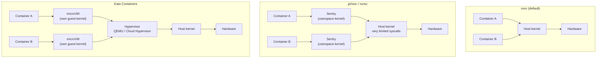

# Docker — Runtime Security (gVisor and Kata Containers)

## 🎯 Introduction

Hardening an image is not enough if the container shares the host kernel directly. With the default runtime (`runc`), a container is just another host process isolated by namespaces, cgroups, and seccomp: any kernel isolation failure (a privilege-escalation CVE, a poorly filtered syscall) can turn into an escape to the host and its neighbors.

**Runtime isolation** (sandboxing) tackles that problem by placing a layer between the container and the real kernel. Here we cover the two mature solutions: **gVisor** (a userspace kernel) and **Kata Containers** (containers inside microVMs). We do not repeat image hardening, secrets, or scanning; for that see [Docker — Security and Scanning](docker_security.md), the natural companion to this guide.

!!! note "What this doc does NOT cover"
    `Dockerfile` hardening, non-root users, secret management, and vulnerability scanning. All of that lives in [docker_security.md](docker_security.md). Here we talk only about **kernel isolation at runtime**.

## 🧠 The shared-kernel problem

With `runc`, every container on the host shares a single Linux kernel. The attack surface is huge: hundreds of syscalls, drivers, filesystems, and networking subsystems. seccomp shrinks that surface, but it is still the same kernel for everyone.



- **gVisor** intercepts the container's syscalls and serves them from a kernel reimplemented in Go (the **Sentry**), which only makes a handful of real syscalls to the host.
- **Kata** boots each container (or pod) inside a lightweight **microVM** with its own guest kernel, isolated by hardware virtualization.

## 🔍 gVisor (runsc)

gVisor implements an application kernel in userspace. The **Sentry** process intercepts the container's syscalls (via `ptrace` or, by default, the `systrap`/KVM platform) and handles them without passing them to the real kernel. Filesystem access goes through a separate process, the **Gofer**, over the 9P protocol.

### Installation

```bash
# Download runsc and its containerd shim
(
  set -e
  ARCH=$(uname -m)
  URL=https://storage.googleapis.com/gvisor/releases/release/latest/${ARCH}
  wget ${URL}/runsc ${URL}/runsc.sha512 \
       ${URL}/containerd-shim-runsc-v1 ${URL}/containerd-shim-runsc-v1.sha512
  sha512sum -c runsc.sha512 -c containerd-shim-runsc-v1.sha512
  rm -f *.sha512
  chmod a+rx runsc containerd-shim-runsc-v1
  sudo mv runsc containerd-shim-runsc-v1 /usr/local/bin
)
```

### Configuration with Docker

```bash
# Register runsc as a Docker runtime
sudo runsc install
sudo systemctl reload docker
```

This adds the runtime to `/etc/docker/daemon.json`:

```json
{
  "runtimes": {
    "runsc": {
      "path": "/usr/local/bin/runsc"
    }
  }
}
```

Run a container with gVisor:

```bash
docker run --rm --runtime=runsc hello-world

# Check the kernel is the Sentry's, not the host's
docker run --rm --runtime=runsc alpine dmesg | head
# -> shows "Starting gVisor..." instead of the real kernel
```

### Configuration with containerd

In `/etc/containerd/config.toml`:

```toml
version = 2

[plugins."io.containerd.grpc.v1.cri".containerd.runtimes.runsc]
  runtime_type = "io.containerd.runsc.v1"
```

```bash
sudo systemctl restart containerd
```

!!! tip "Debugging gVisor"
    Enable per-sandbox logs with `runsc --debug --debug-log=/tmp/runsc/`. It is the fastest way to spot an unsupported syscall that breaks an application.

## 🔍 Kata Containers (microVMs)

Kata boots each pod inside a lightweight VM using a hypervisor (QEMU by default, or Cloud Hypervisor / Firecracker). The container sees a full guest kernel, so isolation is guaranteed by hardware virtualization (VT-x/AMD-V), not just by software.

### Requirements

```bash
# Verify hardware virtualization support
kata-runtime check
# or, manually:
egrep -c '(vmx|svm)' /proc/cpuinfo   # > 0 = supported
```

!!! warning "Nested virtualization"
    On cloud VMs, Kata with QEMU needs **nested virtualization** enabled by the provider. Without it, it boots via software emulation (much slower) or fails. Firecracker and Cloud Hypervisor have the same KVM requirements.

### Installation

```bash
# Via kata-manager (official script: installs binaries + config)
bash -c "$(curl -fsSL https://raw.githubusercontent.com/kata-containers/kata-containers/main/utils/kata-manager.sh)"
```

Binaries land in `/opt/kata/bin/` and the config in `/opt/kata/share/defaults/kata-containers/configuration.toml`.

### Configuration with containerd

```toml
version = 2

[plugins."io.containerd.grpc.v1.cri".containerd.runtimes.kata]
  runtime_type = "io.containerd.kata.v2"
  [plugins."io.containerd.grpc.v1.cri".containerd.runtimes.kata.options]
    ConfigPath = "/opt/kata/share/defaults/kata-containers/configuration.toml"
```

```bash
sudo systemctl restart containerd
```

Direct test with `ctr`:

```bash
sudo ctr images pull docker.io/library/alpine:latest
sudo ctr run --runtime io.containerd.kata.v2 --rm \
  docker.io/library/alpine:latest kata-test uname -r
# The kernel shown is Kata's guest kernel, different from the host's
```

!!! tip "Lighter hypervisor"
    For faster boots and lower footprint, switch to Cloud Hypervisor or Firecracker in `configuration.toml` (`[hypervisor.clh]` / `[hypervisor.fc]`). Firecracker prioritizes density and boot time; QEMU prioritizes device compatibility.

## ☸️ Kubernetes integration (RuntimeClass)

Both runtimes are exposed to Kubernetes through the **RuntimeClass** resource. The `handler` must match the runtime name configured in containerd.

```yaml
apiVersion: node.k8s.io/v1
kind: RuntimeClass
metadata:
  name: gvisor
handler: runsc          # matches [...runtimes.runsc]
---
apiVersion: node.k8s.io/v1
kind: RuntimeClass
metadata:
  name: kata
handler: kata           # matches [...runtimes.kata]
```

Assign a pod to a sandboxed runtime:

```yaml
apiVersion: v1
kind: Pod
metadata:
  name: untrusted-workload
spec:
  runtimeClassName: gvisor      # or "kata"
  containers:
    - name: app
      image: nginx:1.27-alpine
```

!!! note "Dedicated nodes"
    It is common to label/taint nodes that have the runtime installed and let the `RuntimeClass` select them via `scheduling.nodeSelector`/`tolerations`, so you don't require gVisor or Kata on every node in the cluster.

```yaml
# RuntimeClass fragment scheduling onto labeled nodes
apiVersion: node.k8s.io/v1
kind: RuntimeClass
metadata:
  name: kata
handler: kata
scheduling:
  nodeSelector:
    katacontainers.io/kata-runtime: "true"
  tolerations:
    - key: "kata"
      operator: "Exists"
      effect: "NoSchedule"
```

## ⚖️ Comparison: runc vs gVisor vs Kata

| Criterion                   | runc (default)              | gVisor (runsc)                  | Kata Containers                    |
|-----------------------------|-----------------------------|---------------------------------|------------------------------------|
| Isolation mechanism         | Namespaces + cgroups + seccomp | Userspace kernel (Sentry)    | microVM with its own guest kernel  |
| Syscall surface to host     | Wide (mitigable with seccomp)| Very small                     | Only the hypervisor's              |
| Kernel                      | Shared with the host        | Reimplemented (Go)              | Independent Linux guest kernel     |
| Boot overhead               | Minimal                     | Low                             | Medium (VM boot)                   |
| I/O / syscall overhead      | Native                      | Noticeable on I/O-heavy loads   | Low-medium (virtio)                |
| Syscall compatibility       | Full                        | Partial (implemented subset)    | Full (real kernel)                 |
| Requires HW virtualization  | No                          | No                              | Yes (VT-x/AMD-V or nested)         |
| GPU / device access         | Direct                      | Limited                         | Via passthrough (more complex)     |
| Ideal use case              | Trusted workloads           | Multi-tenant, untrusted code    | Strong VM-grade isolation          |

## 🧭 When to use each

!!! tip "Rule of thumb"
    - **runc**: your own trusted workloads where performance is king.
    - **gVisor**: running untrusted or multi-tenant code (serverless functions, CI sandboxes, user code execution) with fast boot, accepting some I/O overhead and partial syscall compatibility.
    - **Kata**: you need VM-grade isolation, full syscall compatibility, or strict compliance, and you can pay the hypervisor cost and require hardware virtualization.

## ⚠️ Limitations

!!! warning "gVisor"
    - Does not implement 100% of syscalls: apps using exotic kernel interfaces may fail or degrade.
    - Noticeable overhead on network- or disk-heavy I/O due to the Sentry/Gofer indirection.
    - Limited support for GPUs and special devices.

!!! warning "Kata Containers"
    - Requires hardware virtualization; in the cloud, `nested virtualization` enabled.
    - Higher memory usage per microVM and slower boot than runc/gVisor.
    - Device passthrough (GPU, SR-IOV networking) is more complex to configure.

## 🔗 Related links

- [Docker — Security and Scanning](docker_security.md) — image hardening, secrets, and scanning (companion to this guide).
- [Docker — Base](docker_base.md)
- [Docker — Optimizations](docker_optimizations.md)
- [gVisor — Official documentation](https://gvisor.dev/docs/)
- [Kata Containers — Official documentation](https://katacontainers.io/docs/)
- [Kubernetes — RuntimeClass](https://kubernetes.io/docs/concepts/containers/runtime-class/)
