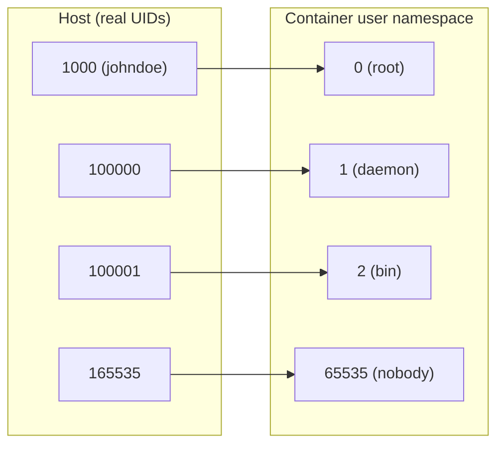
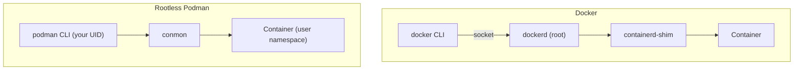

# Rootless Podman — Containers without a daemon or root

## 🎯 Why this document

This document does not explain how to install Podman: your distribution's official documentation does that better. What matters here is **why rootless mode changes your host's threat model**, what guarantees it really gives you and which ones it does not.

If you are coming from [Docker — Base](docker_base.md), the mental reflex is "a container is an isolated process". With the Docker daemon running as root, that process is launched by root on your behalf. With rootless Podman, you launch it yourself, with your privileges and no others.

!!! note "What this doc does NOT cover"
    Image hardening, secrets management and scanning: that lives in [Docker — Security and Scanning](docker_security.md). Kernel isolation with gVisor or Kata: that lives in [Docker — Runtime Security](docker_runtime_security.md). Here we only talk about the **privilege model of the container engine**.

## 🧠 What "rootless" really means

Rootless does not mean "the process inside the container is not root". That is `USER` in the `Dockerfile`, and it is a different thing. Rootless means that **the whole stack** —engine, runtime and container— runs under your unprivileged UID on the host.

The mechanism is the Linux **user namespace**. Inside the namespace your user shows up as UID 0; outside, it is still your ordinary UID.

```bash
# Inside the user namespace you are "root", but only there
podman unshare id
# uid=0(root) gid=0(root) groups=0(root),65534(nobody)
```

### subuid / subgid: where the other UIDs come from

A container rarely uses a single UID. It needs a whole range to map the image's internal users. That range is declared in `/etc/subuid` and `/etc/subgid`, with the format `USERNAME:START_UID:RANGE`:

```bash
cat /etc/subuid
# johndoe:100000:65536

cat /etc/subgid
# johndoe:100000:65536
```

The resulting mapping is: **your host UID maps to UID 0 inside the namespace**, and then the ranges from `/etc/subuid` are appended sequentially. That is, container UID 1 is host UID 100000, UID 2 is 100001, and so on.



The practical consequence: a process that gains root **inside** the container has UID 0 in the namespace, but on the host it is simply your unprivileged user. Escaping the container leaves you where you already were: not root.

!!! warning "This is not a sandbox"
    Rootless reduces the impact of a breakout, it does not prevent it. You still share the host kernel: a privilege-escalation CVE in the kernel bypasses the user namespace all the same. If you run untrusted code, rootless is a complement to [gVisor or Kata](docker_runtime_security.md), not a replacement.

### Storage and files with odd UIDs

Files created by the container show up on the host with UIDs from the subuid range, not with yours. That is why `ls` on a rootless volume shows numbers instead of names. To manipulate them, enter the namespace:

```bash
# Without this, chown fails: those UIDs are not "directly" yours
podman unshare chown -R 1000:1000 ~/.local/share/containers/storage/volumes/mydata/_data
```

Rootless storage lives under `~/.local/share/containers/storage` (and configuration in `~/.config/containers`), not in `/var/lib/containers`. Each user has their own set of images and containers, invisible to everyone else.

## 🔌 Daemonless: why it matters for the attack surface

Docker is client/server: the CLI talks over a socket to `dockerd`, which runs as root and is the parent of every container. Podman has no daemon: the CLI does `fork/exec` on the OCI runtime (`crun` or `runc`) and containers are direct children of your shell or of systemd.



What changes in the threat model:

- **`/var/run/docker.sock` is root equivalent.** Anyone with access to that socket can launch a privileged container with `/` mounted and become root on the host. Adding a user to the `docker` group is, effectively, granting passwordless sudo. With rootless Podman that privileged socket does not exist.
- **There is no long-lived process running as root.** A memory or parsing bug in the daemon stops being an escalation vector, because there is no daemon.
- **There is no single point of failure.** Restarting the engine does not kill every container, because there is no engine to restart.
- **Per-user auditing.** Containers appear in the process tree under the UID that launched them, not all under root. `auditd` and cgroup accounting attribute them correctly.

!!! note "Podman has a socket too"
    There is `podman.socket` for Docker API compatibility (tools such as `docker-compose` or Testcontainers). In rootless mode it is enabled with `systemctl --user enable --now podman.socket` and lives in the user's runtime dir, with your privileges. It is a user socket, not a root socket: that difference is exactly the point of this section.

## 🔄 Migrating from Docker: what breaks and what does not

Podman's CLI is deliberately compatible with Docker's. The classic trick works:

```bash
alias docker=podman
# Or, system-wide, the podman-docker package installs a
# /usr/bin/docker that points to podman (check the package name
# in your distribution).
```

**What works unchanged**: `run`, `build`, `ps`, `images`, `exec`, `logs`, `pull`, `push`, `volume`, `network`, `Dockerfile`s as they are, and `podman-compose` or `docker compose` pointed at the Podman socket.

**What really breaks or changes**:

| Friction point | What happens | Workaround |
|----------------|--------------|------------|
| Ports `<1024` | `bind: permission denied` | See [networking](#rootless-networking-pasta-and-slirp4netns) |
| `--privileged` | Grants you nothing beyond what you already have | No workaround: it is by design |
| Mounting `/var/run/docker.sock` | It does not exist | Use the user's `podman.socket` |
| Images without a registry prefix | Podman prompts or fails; it does not assume Docker Hub | Set `unqualified-search-registries` in `registries.conf` or write `docker.io/library/nginx` |
| `--net=host` with low ports | Still cannot bind `<1024` | `ip_unprivileged_port_start` |
| `--cpus`, memory limits | Require cgroups v2 with delegation | Modern distro with cgroups v2 (standard today) |
| Switching from rootful to rootless | The storage is not the same | `podman system migrate` |
| Image filesystems | Needs `fuse-overlayfs` on old kernels; native overlayfs on modern ones | Install `fuse-overlayfs` if `podman info` complains |

!!! tip "Check which mode you are in"
    `podman info` tells you the mode, the storage driver and the network backend. It is the first command to run whenever something behaves differently from Docker.

## 📦 Pods: the concept Docker does not have

A Podman **pod** is a group of containers sharing namespaces (network and, optionally, IPC and PID). It is the same concept as in Kubernetes, and it is native here without needing a cluster.

```bash
# Create a pod publishing the port on the pod, not on the container
podman pod create --name web --publish 8080:80

# Containers in the pod reach each other over localhost
podman run -d --pod web --name app mydomain/app:latest
podman run -d --pod web --name proxy nginx:alpine

podman pod ps
podman pod stop web
```

Inside the pod, `app` reaches `proxy` at `localhost` because they share the network namespace. No bridge network and no DNS resolution between containers is needed.

## ⚙️ User services: Quadlet and systemd

This is where rootless stops being a development toy. A rootless container can be a **user** systemd service, without touching `/etc` or asking for sudo.

### Quadlet (recommended)

Quadlet turns declarative `.container` files into systemd units generated on the fly. For rootless they go in `~/.config/containers/systemd/`:

```ini
# ~/.config/containers/systemd/myapp.container
[Unit]
Description=My application
After=network-online.target

[Container]
Image=docker.io/library/nginx:alpine
PublishPort=8080:80
Volume=%h/data:/usr/share/nginx/html:ro,Z

[Service]
Restart=always

[Install]
WantedBy=default.target
```

```bash
systemctl --user daemon-reload
systemctl --user start myapp.service
systemctl --user status myapp.service
```

!!! warning "Quadlet services are not enabled with enable"
    The unit is produced by the systemd generator on `daemon-reload`; it does not exist as a file that `systemctl enable` could link. Automatic startup is declared with `[Install] WantedBy=` inside the `.container` file itself.

### Linger: surviving logout

By default, systemd tears down the user session on logout, and your containers with it. On a server that will not do:

```bash
loginctl enable-linger $USER
loginctl show-user $USER --property=Linger
```

### `podman generate systemd` (legacy)

The `podman generate systemd` command generates units from an existing container. It still works in many versions but is **deprecated in favour of Quadlet**. Use it only to migrate old deployments, and check in your version whether it is still available.

## 🌐 Rootless networking: pasta and slirp4netns

An unprivileged user cannot create `veth` interfaces on the host nor manipulate `iptables` in the root network namespace. That is why rootless networking is implemented **in user space**.

- **pasta** (from the passt project): the default backend in current rootless Podman versions. By default it copies the host's IPv4/IPv6 addresses and routes, and **preserves the source IP** in port forwarding.
- **slirp4netns**: the classic backend, predating pasta. It is still available with `--network=slirp4netns`.

```bash
podman info -f '{{.Host.RootlessNetworkCmd}}'
# pasta

# Force a specific backend
podman run --network=pasta ...
podman run --network=slirp4netns ...
```

Both translate traffic in user space, which has a cost: the data path goes through an extra process instead of straight through the kernel stack. We give no figures here; measure it on your own workload if it is critical.

### Why you cannot bind ports `<1024`

This is not a Podman limitation: it is Linux. Ports below 1024 are privileged and require `CAP_NET_BIND_SERVICE` in the **host's** network namespace, which your user does not have. Three honest ways out:

**1. Lower the privileged port threshold** (affects the whole host):

```bash
# Temporary
sudo sysctl net.ipv4.ip_unprivileged_port_start=80

# Persistent
echo 'net.ipv4.ip_unprivileged_port_start=80' | sudo tee /etc/sysctl.d/99-rootless-ports.conf
sudo sysctl --system
```

**2. Redirect with the host firewall**: publish on `8080` and DNAT `80` to `8080`. It needs sudo once, at setup time, not on every container start.

**3. Put a system reverse proxy in front**: nginx or Caddy as a root service listening on `80/443` and doing `proxy_pass` to rootless containers on high ports. This is the usual production option and fits with [host hardening](../cybersecurity/hardening_linux.md).

!!! danger "Think before lowering ip_unprivileged_port_start"
    It is a global setting: **any** process from **any** user will be able to bind from that port upwards. A compromised user could bring up a fake service on port 80 after a reboot. If the host has several users, prefer options 2 or 3.

## ⚠️ Real limitations of rootless

No sugar coating, this is what you will not be able to do:

- **Privileged ports**, except through the workarounds above.
- **Mounting filesystems** that require real `CAP_SYS_ADMIN` (NFS, CIFS, arbitrary `mount -t` inside the container).
- **Device access** that needs privileges: most `--device` cases with raw hardware, and many GPU scenarios require extra host configuration.
- **`--privileged` grants no new powers.** It only lifts the restrictions Podman adds *inside* your namespace; the ceiling is still your UID.
- **Ping and ICMP sockets** depend on `net.ipv4.ping_group_range` on the host.
- **Network and I/O performance**: user-space networking and `fuse-overlayfs` (on kernels that need it) add overhead compared to the rootful path.
- **Tuning host sysctls** from the container: impossible, by design.
- **Workloads that assume real root**: monitoring agents reading all of `/proc`, network tools manipulating host `iptables`, some privileged CI runners.

!!! tip "Rule of thumb"
    If the workload needs real root on the host, rootless is not the problem: the workload's design is. If it does not —which covers most web services, databases and workers— rootless is the reasonable default.

## ⚖️ Docker vs rootless Podman

| Criterion | Docker (default) | Rootless Podman |
|-----------|------------------|-----------------|
| Architecture | `dockerd` daemon as root | Daemonless, `fork/exec` under your UID |
| Engine privileges | root on the host | Unprivileged UID |
| Control socket | `/var/run/docker.sock` (root equivalent) | User `podman.socket`, optional |
| Group-based access | `docker` group ≈ passwordless sudo | Not applicable: each user, their own stack |
| UID isolation | Container root = host root (unless userns-remap) | User namespace with subuid/subgid |
| Storage | `/var/lib/docker`, shared | `~/.local/share/containers`, per user |
| systemd integration | Daemon unit | Quadlet / user units, with linger |
| Native pods | No | Yes |
| Networking | Kernel bridge, `iptables` | pasta / slirp4netns in user space |
| Ports `<1024` | Yes, the daemon is root | Not without host tweaks |
| Files in volumes | Direct UIDs | UIDs shifted by the mapping |
| CLI compatibility | Reference | Nearly complete (`alias docker=podman`) |
| Impact of a breakout | Potentially root on the host | Your unprivileged user |

## ✅ Adoption checklist

- [ ] `/etc/subuid` and `/etc/subgid` with a sufficient range per user (65536 is typical).
- [ ] cgroups v2 with delegation enabled (modern distro).
- [ ] `podman info` with no storage or network warnings.
- [ ] Port strategy decided: reverse proxy, DNAT or sysctl.
- [ ] Services defined as Quadlet files in `~/.config/containers/systemd/`.
- [ ] `loginctl enable-linger` on service users.
- [ ] Qualified registries or `unqualified-search-registries` configured.
- [ ] Backups of user storage, not of `/var/lib/containers`.
- [ ] Untrusted workloads additionally run under a sandboxed runtime.

## 🔗 Related links

- [Docker — Base](docker_base.md) — container and image concepts.
- [Docker — Security and Scanning](docker_security.md) — image hardening, secrets and scanning.
- [Docker — Runtime Security (gVisor/Kata)](docker_runtime_security.md) — kernel isolation, complementary to rootless.
- [Linux Server Hardening](../cybersecurity/hardening_linux.md) — the host where your containers live.
- [Podman — Official documentation](https://docs.podman.io/)
- [Podman — GitHub repository](https://github.com/containers/podman)
