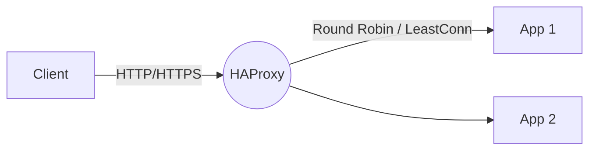
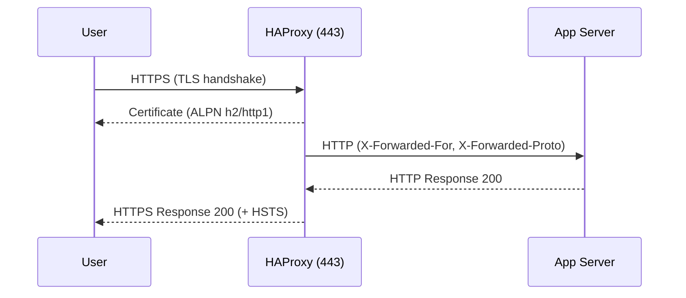

# HAProxy

Complete guide to HAProxy: high-performance load balancer and proxy for TCP/HTTP.

## 📋 Table of Contents

- [Introduction](#introduction)
- [Installation](#installation)
- [Basic Configuration](#basic-configuration)
- [Advanced Configuration](#advanced-configuration)
- [Security](#security)
- [Monitoring and Logging](#monitoring-and-logging)
- [Use Cases](#use-cases)
- [Diagrams](#diagrams)
- [Best Practices](#best-practices)
- [References](#references)

## Introduction

HAProxy is a high-performance load balancer and TCP/HTTP proxy that provides:

- **High Performance**: Optimized to handle thousands of simultaneous connections
- **Flexibility**: Support for HTTP/HTTPS and generic TCP
- **Reliability**: Automatic health checks and failover
- **Security**: TLS termination, rate limiting, and security headers

## 🚀 Start with HAProxy in 10 minutes

New to HAProxy? Start here:

- **[Official tutorial: Get started](https://www.haproxy.com/documentation/hapee/latest/getting-started/)** - Step-by-step basic configuration
- **[HAProxy Wizard](https://www.haproxy.com/blog/haproxy-configuration-basics-load-balancing/)** - Online configuration generator
- **[Load Balancing 101](https://www.haproxy.com/blog/load-balancing-101/)** - Fundamental concepts

## Installation

### Basic Installation

```bash
# Debian/Ubuntu
apt install haproxy

# RHEL/CentOS/Rocky
dnf install haproxy
```

### Advanced Installation

```bash
# Enable and start
sudo systemctl enable --now haproxy
sudo systemctl status haproxy

# Zero-downtime reload
sudo haproxy -c -f /etc/haproxy/haproxy.cfg && sudo systemctl reload haproxy
```

## Basic Configuration

### Minimal Configuration

Main file: `/etc/haproxy/haproxy.cfg`

```cfg
global
  log /dev/log local0
  maxconn 2048

defaults
  mode http
  timeout connect 5s
  timeout client  50s
  timeout server  50s

frontend http-in
  bind *:80
  default_backend app

backend app
  balance roundrobin
  server app1 10.0.0.11:8080 check
  server app2 10.0.0.12:8080 check
```

### Configuration Check

```bash
haproxy -c -f /etc/haproxy/haproxy.cfg
```

## Advanced Configuration

### TLS Termination (HTTPS)

1. **Generate combined certificate**:
```bash
cat /etc/letsencrypt/live/your-domain/fullchain.pem \
    /etc/letsencrypt/live/your-domain/privkey.pem \
    | sudo tee /etc/haproxy/certs/your-domain.pem
```

2. **Configure HTTPS frontend**:
```cfg
frontend https-in
  bind *:443 ssl crt /etc/haproxy/certs/your-domain.pem alpn h2,http/1.1
  http-response set-header Strict-Transport-Security "max-age=31536000; includeSubDomains; preload"
  redirect scheme https code 301 if !{ ssl_fc }
  default_backend app
```

3. **HTTP → HTTPS redirect** (optional):
```cfg
frontend http-in
  bind *:80
  redirect scheme https code 301 if !{ ssl_fc }
```

### Advanced Health Checks

```cfg
backend app
  option httpchk GET /healthz
  http-check expect status 200
  server app1 10.0.0.11:8080 check inter 3s fall 3 rise 2
  server app2 10.0.0.12:8080 check inter 3s fall 3 rise 2
```

### Sticky Sessions (Affinity)

**By cookie** (inserted by load balancer):
```cfg
backend app
  cookie SRV insert indirect nocache
  balance roundrobin
  server app1 10.0.0.11:8080 check cookie app1
  server app2 10.0.0.12:8080 check cookie app2
```

**By IP hash** (no cookies):
```cfg
backend app
  balance hdr_ip(X-Forwarded-For)
```

### Least Connections Balancing

```cfg
backend app
  balance leastconn
  server app1 10.0.0.11:8080 check
  server app2 10.0.0.12:8080 check
```

### ACLs and Routing

```cfg
frontend https-in
  bind *:443 ssl crt /etc/haproxy/certs/your-domain.pem alpn h2,http/1.1
  acl is_api path_beg /api/
  acl is_admin hdr_beg(host) -i admin.
  use_backend api if is_api
  use_backend admin if is_admin
  default_backend app

backend api
  balance leastconn
  server api1 10.0.0.31:8080 check
  server api2 10.0.0.32:8080 check

backend admin
  balance roundrobin
  server adm1 10.0.0.41:8080 check
```

### Dynamic Discovery

Useful with DNS SRV/round‑robin (consul, kubernetes headless services, etc.):

```cfg
backend app
  balance roundrobin
  resolvers dns
    nameserver google 8.8.8.8:53
  server-template srv 5 _app._tcp.example.local resolvers dns resolve-prefer ipv4 check
```

## Security

### X-Forwarded-* Headers and Security

```cfg
frontend https-in
  bind *:443 ssl crt /etc/haproxy/certs/your-domain.pem alpn h2,http/1.1
  http-response set-header Strict-Transport-Security "max-age=31536000; includeSubDomains; preload"
  http-response set-header X-Content-Type-Options "nosniff"
  http-response set-header X-Frame-Options "SAMEORIGIN"
  http-response set-header Referrer-Policy "no-referrer-when-downgrade"
  http-response set-header Permissions-Policy "geolocation=(), microphone=()"
  default_backend app

backend app
  http-request set-header X-Forwarded-Proto https if { ssl_fc }
  http-request add-header X-Forwarded-Proto http if !{ ssl_fc }
  http-request set-header X-Forwarded-For %[src]
  http-request set-header X-Forwarded-Host %[req.hdr(Host)]
```

### Rate Limiting

```cfg
frontend https-in
  stick-table type ip size 1m expire 10m store gpc0,http_req_rate(10s)
  http-request track-sc0 src
  acl abuse sc0_http_req_rate gt 50
  http-request deny if abuse
  default_backend app
```

## Monitoring and Logging

### Status Panel

```cfg
listen stats
  bind *:8404
  stats enable
  stats uri /
  stats refresh 10s
  stats auth admin:admin
```

### Log Configuration

**In HAProxy**:
```cfg
global
  log /dev/log local0
  log /dev/log local1 notice
```

**In rsyslog** (`/etc/rsyslog.d/49-haproxy.conf`):
```conf
if ($programname == 'haproxy') then /var/log/haproxy.log
& stop
```

## Use Cases

### HTTP/HTTPS Load Balancing

Standard configuration for web applications with TLS termination.

### TCP Load Balancing (Layer 4)

For non-HTTP services (databases, generic TCP):

```cfg
defaults
  mode tcp
  timeout connect 5s
  timeout client  50s
  timeout server  50s

frontend tcp-in
  bind *:5432
  default_backend db

backend db
  balance roundrobin
  server db1 10.0.0.21:5432 check
  server db2 10.0.0.22:5432 check
```

## Diagrams

### Basic HTTP Load Balancing Flow



### TLS Termination and Headers



## Best Practices

- ✅ **Validate configuration** before reloading: `haproxy -c -f ...`
- ✅ **Use ALPN** for better HTTPS performance: `alpn h2,http/1.1`
- ✅ **Adjust timeouts** according to your services and clients
- ✅ **Configure health checks** appropriate for each service
- ✅ **Implement rate limiting** to protect against abuse
- ✅ **Use sticky sessions** only when necessary
- ✅ **Monitor logs** and metrics regularly

## References

- **Official documentation**: https://www.haproxy.org/
- **Configuration guide**: https://www.haproxy.org/download/2.8/doc/configuration.txt
- **Community**: https://www.haproxy.org/community/
