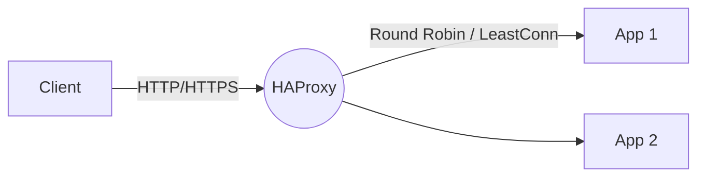
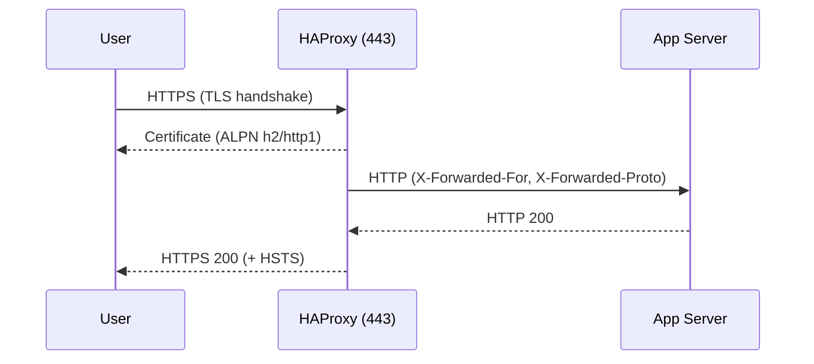

# HAProxy

Basic guide to HAProxy: introduction, installation and minimal configuration.

## Introduction

HAProxy is a high‑performance load balancer and TCP/HTTP proxy.

## Installation

- Debian/Ubuntu: `apt install haproxy`
- RHEL/CentOS/Rocky: `dnf install haproxy`

## Minimal configuration

Main file: `/etc/haproxy/haproxy.cfg`.

```cfg
global
  log /dev/log local0
  maxconn 2048

defaults
  mode http
  timeout connect 5s
  timeout client  50s
  timeout server  50s

frontend http-in
  bind *:80
  default_backend app

backend app
  balance roundrobin
  server app1 10.0.0.11:8080 check
  server app2 10.0.0.12:8080 check
```

## Check

```bash
haproxy -c -f /etc/haproxy/haproxy.cfg
```

## References

- Official docs: https://www.haproxy.org/

## Advanced installation

- Enable and start:

```bash
sudo systemctl enable --now haproxy
sudo systemctl status haproxy
```

- Zero‑downtime reload:

```bash
sudo haproxy -c -f /etc/haproxy/haproxy.cfg && sudo systemctl reload haproxy
```

## TLS termination (HTTPS)

Create/install `fullchain.pem` and `privkey.pem` (e.g. Let’s Encrypt) and generate a combined `pem`:

```bash
cat /etc/letsencrypt/live/your-domain/fullchain.pem \
    /etc/letsencrypt/live/your-domain/privkey.pem \
    | sudo tee /etc/haproxy/certs/your-domain.pem
```

Config in `frontend`:

```cfg
frontend https-in
  bind *:443 ssl crt /etc/haproxy/certs/your-domain.pem alpn h2,http/1.1
  http-response set-header Strict-Transport-Security "max-age=31536000; includeSubDomains; preload"
  redirect scheme https code 301 if !{ ssl_fc }
  default_backend app
```

Optional: redirect 80→443

```cfg
frontend http-in
  bind *:80
  redirect scheme https code 301 if !{ ssl_fc }
```

## Health checks

Improve detection with `check` and HTTP paths:

```cfg
backend app
  option httpchk GET /healthz
  http-check expect status 200
  server app1 10.0.0.11:8080 check inter 3s fall 3 rise 2
  server app2 10.0.0.12:8080 check inter 3s fall 3 rise 2
```

## Sticky sessions (affinity)

Cookie‑based stickiness inserted by the balancer:

```cfg
backend app
  cookie SRV insert indirect nocache
  balance roundrobin
  server app1 10.0.0.11:8080 check cookie app1
  server app2 10.0.0.12:8080 check cookie app2
```

Client IP hash (no cookies):

```cfg
backend app
  balance hdr_ip(X-Forwarded-For)
```

## Metrics and stats page

```cfg
listen stats
  bind *:8404
  stats enable
  stats uri /
  stats refresh 10s
  stats auth admin:admin
```

## Logging

Enable logs in `global` and configure rsyslog:

```cfg
global
  log /dev/log local0
  log /dev/log local1 notice
```

In `/etc/rsyslog.d/49-haproxy.conf`:

```conf
if ($programname == 'haproxy') then /var/log/haproxy.log
& stop
```

## Best practices

- Validate config before reload: `haproxy -c -f ...`
- Use `alpn h2,http/1.1` for better HTTPS performance.
- Tune timeouts according to your services and clients.

## TCP example (Layer 4)

For non‑HTTP services (e.g., databases or generic TCP):

```cfg
defaults
  mode tcp
  timeout connect 5s
  timeout client  50s
  timeout server  50s

frontend tcp-in
  bind *:5432
  default_backend db

backend db
  balance roundrobin
  server db1 10.0.0.21:5432 check
  server db2 10.0.0.22:5432 check
```

## `leastconn` balancing

Send traffic to the server with the fewest active connections (good for long‑lived sessions):

```cfg
backend app
  balance leastconn
  server app1 10.0.0.11:8080 check
  server app2 10.0.0.12:8080 check
```

## `X-Forwarded-*` and security headers

Insert client headers and harden responses:

```cfg
frontend https-in
  bind *:443 ssl crt /etc/haproxy/certs/your-domain.pem alpn h2,http/1.1
  http-response set-header Strict-Transport-Security "max-age=31536000; includeSubDomains; preload"
  http-response set-header X-Content-Type-Options "nosniff"
  http-response set-header X-Frame-Options "SAMEORIGIN"
  http-response set-header Referrer-Policy "no-referrer-when-downgrade"
  http-response set-header Permissions-Policy "geolocation=(), microphone=()"
  default_backend app

backend app
  http-request set-header X-Forwarded-Proto https if { ssl_fc }
  http-request add-header X-Forwarded-Proto http if !{ ssl_fc }
  http-request set-header X-Forwarded-For %[src]
  http-request set-header X-Forwarded-Host %[req.hdr(Host)]
```

## Diagrams

### Basic HTTP load balancing flow



### TLS termination and headers



## ACLs (paths/hosts) and routing

Routing by path and host:

```cfg
frontend https-in
  bind *:443 ssl crt /etc/haproxy/certs/your-domain.pem alpn h2,http/1.1
  acl is_api path_beg /api/
  acl is_admin hdr_beg(host) -i admin.
  use_backend api if is_api
  use_backend admin if is_admin
  default_backend app

backend api
  balance leastconn
  server api1 10.0.0.31:8080 check
  server api2 10.0.0.32:8080 check

backend admin
  balance roundrobin
  server adm1 10.0.0.41:8080 check
```

## Basic rate limiting

Limit per IP using a stick-table:

```cfg
frontend https-in
  stick-table type ip size 1m expire 10m store gpc0,http_req_rate(10s)
  http-request track-sc0 src
  acl abuse sc0_http_req_rate gt 50
  http-request deny if abuse
  default_backend app
```

## Dynamic discovery with `server-template`

Useful with DNS SRV/round‑robin (consul, kubernetes headless services, etc.):

```cfg
backend app
  balance roundrobin
  resolvers dns
    nameserver google 8.8.8.8:53
  server-template srv 5 _app._tcp.example.local resolvers dns resolve-prefer ipv4 check
```
