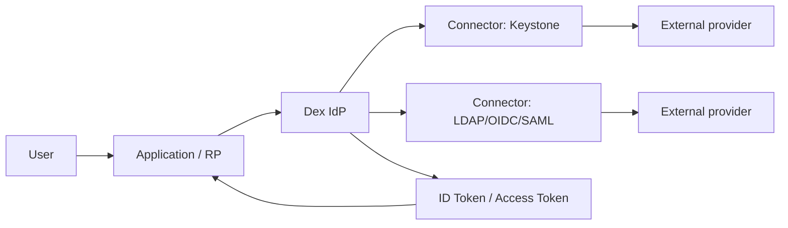
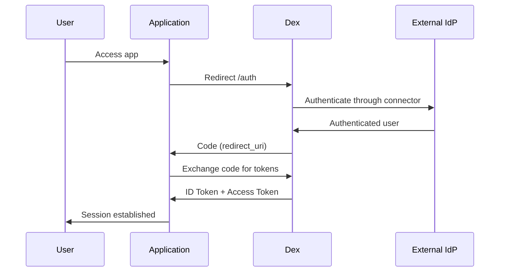

---
tags:
  - identity
  - security
  - oidc
  - dex
---

# Dex IdP (Federated OIDC)

Dex is an **OIDC Identity Provider (IdP)** focused on cloud-native and self-hosted environments.
In Frikiteam, it can be used as a federation layer so multiple external identity backends expose a single OIDC interface to applications.

- Reference fork: [rasty94/dex](https://github.com/rasty94/dex)
- Image used in examples: `ghcr.io/rasty94/dex:latest`

## Authentication architecture



## OIDC flow (Authorization Code)



## Quick Docker Compose example

```yaml
services:
  dex:
    image: ghcr.io/rasty94/dex:latest
    command: ["dex", "serve", "/etc/dex/config.yaml"]
    ports:
      - "5556:5556"
      - "5557:5557"
    volumes:
      - ./config.yaml:/etc/dex/config.yaml:ro
```

## Example `config.yaml`

```yaml
issuer: http://127.0.0.1:5556/dex

storage:
  type: sqlite3
  config:
    file: /var/dex/dex.db

web:
  http: 0.0.0.0:5556

staticClients:
  - id: grafana
    name: "Grafana"
    secret: "<client-secret>"
    redirectURIs:
      - "https://grafana.example.com/login/generic_oauth"

connectors:
  - type: keystone
    id: keystone
    name: "OpenStack Keystone"
    config:
      keystoneHost: https://keystone.example.com:5000
      domain: default
      keystoneUsername: dex-service
      keystonePassword: <keystone-password>
```
