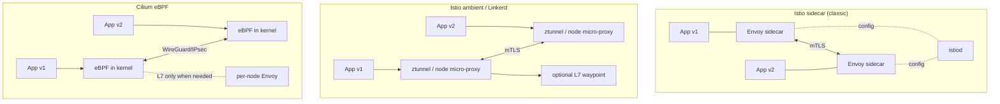

# Service Mesh on Kubernetes: Istio vs Linkerd vs Cilium

You have 40 microservices talking to each other in plaintext. One team wants a 5% canary, another is asking why checkout takes 300 ms, and security is demanding encryption in transit inside the cluster. You can solve this with libraries in every service (and then do it again in Go, Python and Java), or you can push that logic down into the network layer.

That is a service mesh. It is also the piece of infrastructure I have most often seen installed without anyone being able to name the problem it was solving. This guide compares the three serious options left standing in 2026 — and devotes an entire section to the most profitable question of all: **when not to install one**.

## 🎯 What problem it actually solves

A service mesh intercepts traffic between pods and applies policy without touching application code. Four capabilities justify its existence:

### **Automatic mTLS**
Encryption and mutual authentication between all pods, with managed certificate rotation. Without a mesh, every service needs its own TLS and its own certificate management. It complements — does not replace — [NetworkPolicies and RBAC](../cybersecurity/index.md).

### **L7 observability**
Golden signal metrics (request rate, error rate, p50/p95/p99 latency) per source-destination pair, with no application instrumentation. A mesh sees HTTP status codes and routes; a NetworkPolicy only sees IPs and ports.

### **Traffic splitting**
Send 5% of traffic to the new version. Without a mesh you do this by juggling Deployment replicas (terrible granularity: with 3 pods your minimum is 33%).

### **Retries, timeouts and circuit breaking**
Budgeted retries, per-route timeouts and ejection of failing instances — applied consistently across every language in your stack.

!!! note "What a service mesh does NOT solve"
    It will not fix a slow application, it does not replace an [ingress load balancer](../networking/load_balancer_comparison.md), it does not remove the need for distributed traces with business context (the mesh propagates headers, but your app must forward them), and it does not compensate for badly-cut microservice boundaries.

## 🏗️ Architecture: sidecar vs sidecarless

The fundamental difference between the three options is **where the proxy lives**.



### **Istio — Envoy, two modes**

- **Sidecar**: an Envoy container injected into every pod. Maximum power (Envoy's full L7 filter chain), maximum cost: one proxy per pod.
- **Ambient mode**: no sidecars. `ztunnel` (a per-node Rust agent) handles mTLS and L4; **waypoint proxies** (Envoy, per namespace or service) are deployed **only where you need L7**. This is Istio's answer to the sidecar tax.
- Control plane: `istiod`.

### **Linkerd — Rust micro-proxy**

- Sidecar, but with a purpose-built proxy written in Rust (`linkerd2-proxy`), not Envoy. It deliberately does far less than Envoy: less surface area, less memory, less configuration to break.
- No sprawling configuration CRDs: it uses standard Gateway API (`HTTPRoute`) for routing.
- Control plane: `linkerd-destination`, `linkerd-identity`, `linkerd-proxy-injector`.

### **Cilium Service Mesh — eBPF first**

- The datapath is **eBPF in the kernel**: no proxy in the path for L3/L4. Cilium is already your CNI, so the mesh does not add a new layer.
- Encryption via **WireGuard or IPsec** at node level (not per-workload-identity mTLS in the classic sense), plus **SPIFFE/SPIRE-based mutual authentication** for identity policies.
- L7 (HTTP routing, Gateway API) is delegated to a **per-node Envoy**, activated only when policy requires it.

!!! warning "Cilium is not a complete service mesh"
    Cilium covers L3/L4, encryption, observability (Hubble) and Gateway API very well. But it **has no equivalent to budgeted retries, outlier-detection circuit breaking, or in-mesh (pod-to-pod) traffic splitting at the level of Istio/Linkerd**. Cilium's traffic splitting goes through Gateway API — that is, through the ingress gateway. If your use case is canarying between internal services, this matters.

## 🚀 Real installation

### **Istio — ambient mode (recommended for new deployments)**

```bash
# Install Istio with the ambient profile
istioctl install --set profile=ambient --skip-confirmation

# Enroll a namespace in ambient (the CNI plugin will use ztunnel
# for new and restarted pods)
kubectl label namespace my-app istio.io/dataplane-mode=ambient

# Verify workloads are enrolled
istioctl ztunnel-config workloads
```

### **Istio — sidecar mode**

```bash
istioctl install --skip-confirmation

# Enable sidecar injection per namespace
kubectl label --overwrite namespace my-app istio-injection=enabled

# Existing pods are NOT injected automatically: restart them
kubectl rollout restart deployment -n my-app
```

!!! tip "Migrating from sidecar to ambient"
    When moving a namespace to ambient you must **remove** the injection label (`istio-injection` or the revision label) in addition to adding `istio.io/dataplane-mode=ambient`. Leave both and you will get a sidecar and ztunnel at the same time.

### **Linkerd**

```bash
# Check the CLI (server version appears after the control plane is installed)
linkerd version

# 1) CRDs, 2) control plane
linkerd install --crds | kubectl apply -f -
linkerd install | kubectl apply -f -

# Validate the full installation
linkerd check
```

Namespace injection via annotation:

```yaml
apiVersion: v1
kind: Namespace
metadata:
  name: my-app
  annotations:
    linkerd.io/inject: enabled
```

### **Cilium Service Mesh**

```bash
# Gateway API (requires kube-proxy replacement)
cilium install \
    --set kubeProxyReplacement=true \
    --set gatewayAPI.enabled=true

# SPIRE-based mutual authentication
cilium install \
    --set authentication.mutual.spire.enabled=true \
    --set authentication.mutual.spire.install.enabled=true

# L7 load balancing with Envoy
cilium install \
    --set kubeProxyReplacement=true \
    --set envoyConfig.enabled=true \
    --set loadBalancer.l7.backend=envoy

# Observability
cilium hubble enable
```

## 🔐 mTLS and authorization policies

### **Istio**

Strict mTLS across a namespace:

```yaml
apiVersion: security.istio.io/v1
kind: PeerAuthentication
metadata:
  name: default
  namespace: my-app
spec:
  mtls:
    mode: STRICT
```

Namespace isolation (accept traffic only from the same namespace):

```yaml
apiVersion: security.istio.io/v1
kind: AuthorizationPolicy
metadata:
  name: my-app-isolation
  namespace: my-app
spec:
  action: ALLOW
  rules:
    - from:
        - source:
            namespaces: ["my-app"]
```

!!! danger "Migrate to STRICT via PERMISSIVE"
    Applying `STRICT` directly to a namespace that has non-meshed clients cuts traffic instantly. `PERMISSIVE` mode (the default) accepts both, lets you confirm in metrics that everything is encrypted, and only then do you tighten.

### **Linkerd**

mTLS between injected pods is **on by default**, with no configuration. Policies are expressed per route:

```yaml
apiVersion: policy.linkerd.io/v1alpha1
kind: AuthorizationPolicy
metadata:
  name: authors-get-policy
  namespace: booksapp
spec:
  targetRef:
    group: policy.linkerd.io
    kind: HTTPRoute
    name: authors-get-route
  requiredAuthenticationRefs:
    - name: authors-get-authn
      kind: MeshTLSAuthentication
      group: policy.linkerd.io
---
apiVersion: policy.linkerd.io/v1alpha1
kind: MeshTLSAuthentication
metadata:
  name: authors-get-authn
  namespace: booksapp
spec:
  identities:
    - "books.booksapp.serviceaccount.identity.linkerd.cluster.local"
    - "webapp.booksapp.serviceaccount.identity.linkerd.cluster.local"
```

### **Cilium**

Mutual authentication is enabled inside a `CiliumNetworkPolicy`, not as a separate resource:

```yaml
apiVersion: cilium.io/v2
kind: CiliumNetworkPolicy
metadata:
  name: api-requires-auth
  namespace: my-app
spec:
  endpointSelector:
    matchLabels:
      app: api
  ingress:
    - fromEndpoints:
        - matchLabels:
            app: frontend
      authentication:
        mode: "required"
      toPorts:
        - ports:
            - port: "8080"
              protocol: TCP
          rules:
            http:
              - method: "GET"
                path: "/api/v1/.*"
```

With `mode: "required"`, Cilium only allows the connection if both workloads have mutually authenticated via SPIRE.

## 🔀 Canary and traffic splitting

### **Istio — weighted VirtualService**

```yaml
apiVersion: networking.istio.io/v1
kind: VirtualService
metadata:
  name: reviews-route
spec:
  hosts:
    - reviews.prod.svc.cluster.local
  http:
    - route:
        - destination:
            host: reviews.prod.svc.cluster.local
            subset: v1
          weight: 75
        - destination:
            host: reviews.prod.svc.cluster.local
            subset: v2
          weight: 25
```

### **Linkerd — Gateway API HTTPRoute**

```yaml
apiVersion: policy.linkerd.io/v1beta2
kind: HTTPRoute
metadata:
  name: bb-route
  namespace: traffic-shift-demo
spec:
  parentRefs:
    - name: bb
      kind: Service
      group: core
      port: 8080
  rules:
    - backendRefs:
        - name: bb
          port: 8080
          weight: 90
        - name: bb-v2
          port: 8080
          weight: 10
```

### **Cilium — Gateway API at the edge**

```yaml
apiVersion: gateway.networking.k8s.io/v1beta1
kind: HTTPRoute
metadata:
  name: echo-route
spec:
  parentRefs:
    - name: cilium-gw
  hostnames:
    - "*"
  rules:
    - matches:
        - path:
            type: PathPrefix
            value: /echo
      backendRefs:
        - name: echo-1
          port: 8080
          weight: 99
        - name: echo-2
          port: 8090
          weight: 1
```

!!! tip "Do not shift traffic by hand"
    Hand-editing weights in production is how Friday-afternoon incidents happen. Both Istio and Linkerd integrate with **Flagger**, which promotes the canary automatically based on metrics (success rate, p99 latency) and rolls back on its own if they degrade.

## 📊 Comparison

| Aspect | Istio (ambient) | Istio (sidecar) | Linkerd | Cilium |
|--------|-----------------|-----------------|---------|--------|
| **Datapath** | ztunnel (Rust) + Envoy waypoint | Envoy per pod | Rust micro-proxy per pod | eBPF + per-node Envoy |
| **Per-workload mTLS** | ✅ | ✅ | ✅ (by default) | ⚠️ SPIFFE auth + WireGuard/IPsec |
| **Internal traffic split** | ✅ | ✅ | ✅ | ❌ gateway only |
| **Retries / circuit breaking** | ✅ (waypoint) | ✅ full | ✅ basic | ❌ |
| **Observability** | Prometheus + Kiali | Prometheus + Kiali | `linkerd viz` | Hubble |
| **Multi-cluster** | ⭐⭐⭐⭐⭐ | ⭐⭐⭐⭐⭐ | ⭐⭐⭐⭐ | ⭐⭐⭐⭐ Cluster Mesh |
| **Config surface** | High | Very high | Low | Medium |
| **Learning curve** | ⭐⭐ hard | ⭐ very hard | ⭐⭐⭐⭐⭐ gentle | ⭐⭐⭐ (assumes Cilium CNI) |
| **CNI requirement** | Any | Any | Any | Cilium mandatory |
| **Governance** | CNCF Graduated | CNCF Graduated | CNCF Graduated | CNCF Graduated |

## ⚡ Overhead: orders of magnitude, not promises

!!! warning "About these figures"
    The figures below are **orders of magnitude** drawn from benchmarks published by the projects themselves and from the CNCF *Service Mesh Performance* work. They are not our own measurements. Overhead depends heavily on RPS, payload size, whether L7 filters are active, and node CPU. **Measure in your own cluster before deciding.**

| Model | Added latency (p99, order) | CPU/memory per pod (order) |
|-------|----------------------------|----------------------------|
| Istio sidecar (Envoy) | Single-digit ms (~2-5 ms) | ~50-100 MB and tens of millicores **per pod** |
| Istio ambient (ztunnel only, L4) | Sub-millisecond | Cost **per node**, not per pod |
| Istio ambient + L7 waypoint | Single-digit ms on the L7 hop | Cost per namespace/service |
| Linkerd micro-proxy | Sub-millisecond to ~1 ms | ~10-20 MB per pod |
| Cilium eBPF (L4) | Practically nil (no proxy) | Cost per node (agent) |
| Cilium with L7 Envoy | Single-digit ms on L7 flows | Cost per node |

The structural conclusions (which are reliable, regardless of the exact numbers):

1. **The per-pod model scales badly.** 1,000 pods with an Envoy sidecar means 1,000 proxies with their baseline memory. Ambient and eBPF move the unit of cost from pod to node.
2. **L7 costs.** Parsing HTTP always costs more than forwarding bytes. If you only need mTLS and L4, don't pay for L7.
3. **Added latency is rarely the bottleneck.** Resource consumption and operational load usually are.

## 🔭 Observability

All three export metrics to Prometheus and fit the site's [observability stack](../monitoring/observability_stack.md).

```bash
# Istio: Kiali dashboard (topology + live traffic)
istioctl dashboard kiali

# Linkerd: viz extension, live golden signal metrics
linkerd viz install | kubectl apply -f -
linkerd viz dashboard

# Cilium: L3/L4/L7 flows with Hubble
cilium hubble enable
hubble observe --namespace my-app --protocol http
```

!!! note "Metrics != traces"
    No mesh produces complete distributed traces on its own. It propagates tracing headers, but **if your application does not forward the `traceparent` / `b3` headers from inbound to outbound requests, your traces will come out broken**. That work belongs to the app, not the mesh.

## 🛑 When you do NOT need a service mesh

The most important section of this guide. A service mesh is a distributed network-configuration database sitting in front of all your production traffic — and when it fails, it fails across every service at once.

**Do not install one if:**

- **You have fewer than ~10 services.** With 5 services you know every call from memory. The mesh adds more operational complexity than it removes.
- **Your whole stack is one language.** If it is all Go or all Java, a shared library (or Spring Cloud, or gRPC interceptors) gives you retries, timeouts and mTLS with vastly less machinery.
- **Your real problem is ingress, not east-west.** If all you need is TLS termination and host/path routing, an [Ingress Controller or Gateway API](../networking/load_balancer_comparison.md) is enough. A mesh is for traffic *between* services.
- **Your encryption requirement is "encryption in transit", without per-workload identity.** CNI-level WireGuard (Cilium, Calico) covers it at a fraction of the cost. If the auditor demands *cryptographic identity per service*, then yes, you need mesh mTLS.
- **Your segmentation is solved by NetworkPolicies.** "Frontend only talks to API" is a NetworkPolicy, not a mesh.
- **You have no platform team.** A mesh needs someone who understands its data model, tracks its upgrades and can debug it at 3am. Without that owner, a mesh is technical debt with a pretty dashboard.
- **You don't have basic metrics yet.** If you don't even have Prometheus with application metrics, a mesh is building the roof before the walls.

!!! danger "The hidden cost: debugging"
    With a mesh, a 503 can come from the app, the source proxy, the destination proxy, a policy timeout, an expired certificate, or a badly-written `AuthorizationPolicy`. The debugging surface multiplies. You pay that cost at every incident, not just on installation day.

## 🧭 Decision guide

- **You already run Cilium as your CNI and only want mTLS + L4/L7 observability and Gateway API** → **Cilium Service Mesh**. Zero new components, near-zero cost.
- **You want mTLS and golden signals tomorrow, with the fewest new concepts** → **Linkerd**. The mesh you install in an afternoon and that doesn't wake you up at night.
- **You need complex L7 routing, multi-cluster, fine-grained authorization policies, or WASM extension** → **Istio in ambient mode**. All the power without the per-pod sidecar tax.
- **You have a large investment in custom Envoy filters or EnvoyFilter resources** → **Istio sidecar**, until ambient covers your case.
- **None of the above describes you** → you probably don't need a service mesh yet. Come back when you have the problem.

## 🔗 Related links

- [Kubernetes - Container Orchestration](kubernetes_base.md)
- [Kubernetes Probes](probes.md)
- [Cybersecurity documentation](../cybersecurity/index.md)
- [Load balancer comparison](../networking/load_balancer_comparison.md)
- [Observability stack](../monitoring/observability_stack.md)
- [VPN Overlay comparison](../networking/vpn_overlay_comparison.md)

### Official documentation

- [Istio Ambient Mode](https://istio.io/latest/docs/ambient/)
- [Linkerd 2.18 Docs](https://linkerd.io/2.18/)
- [Cilium Service Mesh](https://docs.cilium.io/en/stable/network/servicemesh/)
