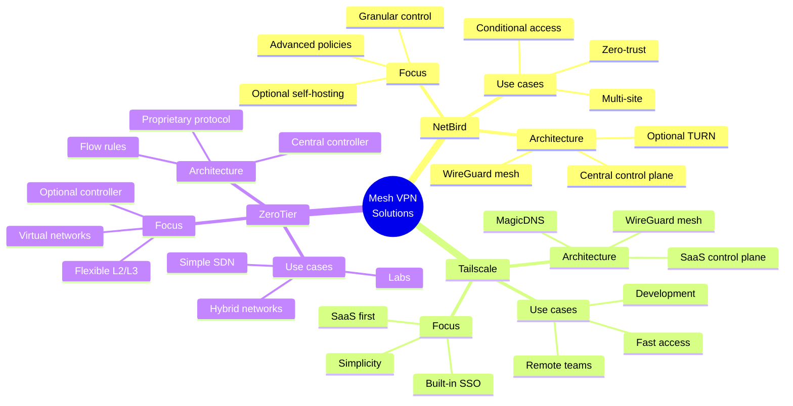
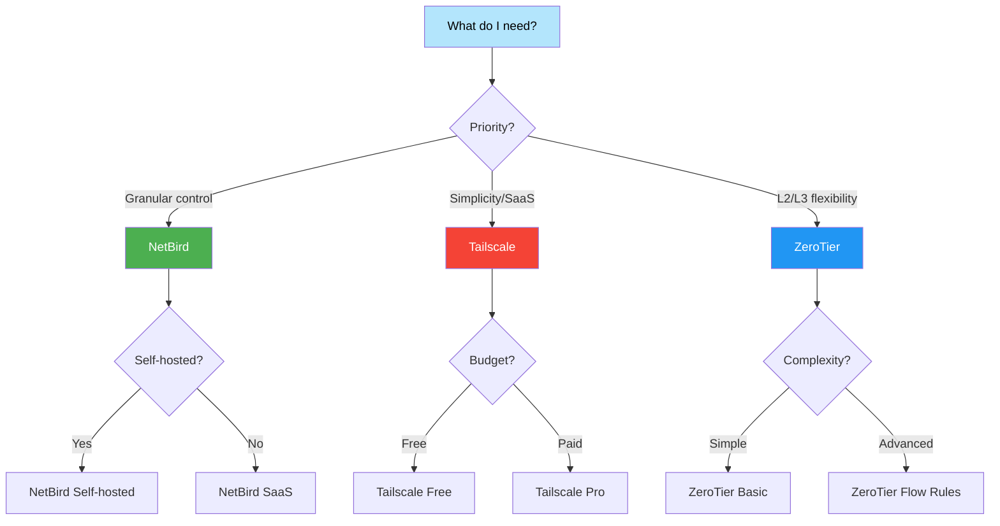
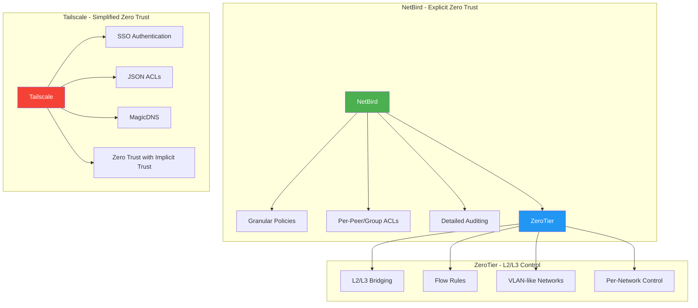

# Quick comparison: NetBird vs Tailscale vs ZeroTier

## Visual comparison diagram

## Detailed comparison table

| Aspect | NetBird | Tailscale | ZeroTier |
|---------|---------|-----------|----------|
| **Purpose** | Mesh VPN with granular access control | Mesh VPN with SSO, simplicity-first | Flexible L2/L3 virtual networks |
| **Installation** | Official script, `netbird` client | Official script, `tailscaled` service | Official script, `zerotier-one` service |
| **Dashboard** | app.netbird.io or self-hosted | admin.tailscale.com (SaaS) | my.zerotier.com or your own controller |
| **Routes and LAN** | Access policies, advertised routes | `--advertise-routes` + approval | Managed routes per network |
| **ACLs/Policies** | Policies by group/peer | Centralized JSON ACLs | Network-level Flow Rules |
| **DNS** | Per-peer/network DNS in the dashboard | MagicDNS and nameservers | Per-network DNS assignment |
| **Self-hosted** | Yes (control plane and TURN) | Limited (Headscale as an alternative) | Yes (controller) |
| **Typical scenarios** | Secure access between sites/servers | Access between devices/teams | L2/L3 overlays, labs |

## Decision flow diagram

## Architectures compared

### Security Model

