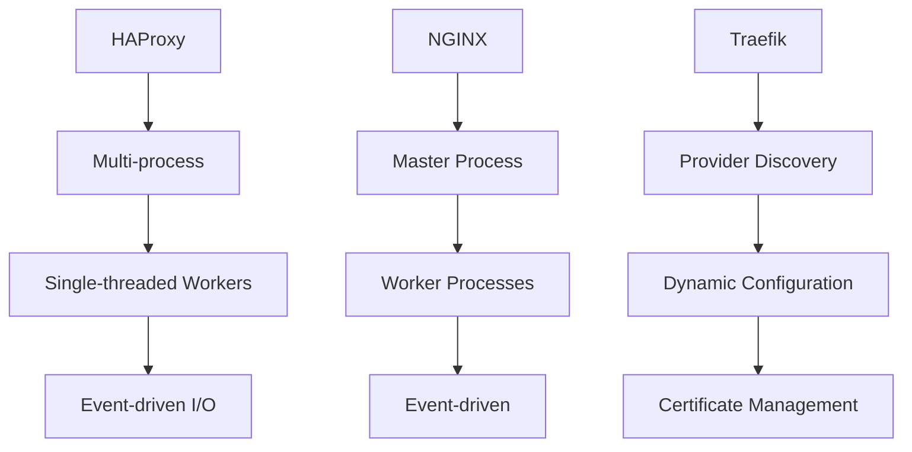
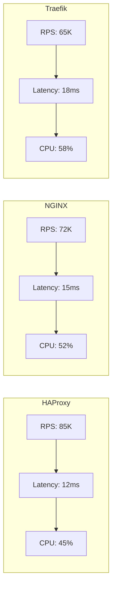
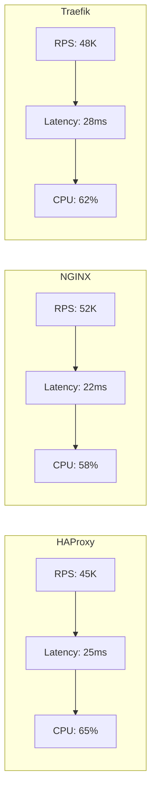
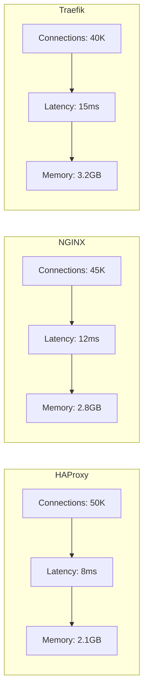

# Advanced Load Balancing: HAProxy vs NGINX vs Traefik

This guide compares the three most advanced load balancing solutions: HAProxy, NGINX, and Traefik. Includes detailed benchmarks and specific use cases for each tool.

## 🎯 Enterprise Use Cases

### **HAProxy - For High Performance**
- **Use case**: High-load applications with low latency requirements
- **Scenario**: Streaming platform with 1M+ concurrent users
- **Benefit**: Maximum performance, advanced health check configurations

### **NGINX - For Web and APIs**
- **Use case**: Modern web applications with microservices
- **Scenario**: E-commerce with REST APIs, GraphQL, and websockets
- **Benefit**: Easy configuration, integration with caching and SSL

### **Traefik - For Cloud-Native**
- **Use case**: Containerized architectures with service discovery
- **Scenario**: Kubernetes with dynamic services and auto-scaling
- **Benefit**: Automatic service discovery, native Docker/K8s integration

## 🏗️ Technical Architecture

### **Load Balancing Model**



### **HAProxy - Dedicated Load Balancer**
- **Architecture**: Multi-process with single-threaded workers
- **Protocols**: TCP/HTTP/HTTPS/WebSocket/SSL
- **Features**: Advanced health checks, stickiness, rate limiting
- **Performance**: Optimized for high throughput

### **NGINX - Web Server + LB**
- **Architecture**: Master-worker with event-driven I/O
- **Protocols**: HTTP/HTTPS/WebSocket/gRPC
- **Features**: Caching, SSL termination, API gateway
- **Performance**: Balanced for web applications

### **Traefik - Cloud-Native Edge Router**
- **Architecture**: Provider-based with dynamic configuration
- **Protocols**: HTTP/HTTPS/TCP/WebSocket
- **Features**: Service discovery, Let's Encrypt, middleware
- **Performance**: Optimized for microservices

## 📊 Detailed Comparison

| Aspect | HAProxy | NGINX | Traefik |
|--------|---------|-------|---------|
| **License** | GPL 2.0 | Proprietary* | Apache 2.0 |
| **Focus** | High performance | Web/API | Cloud-native |
| **Configuration** | File | File/Plus API | Declarative |
| **Kubernetes** | ⭐⭐⭐ | ⭐⭐⭐⭐ | ⭐⭐⭐⭐⭐ |
| **Ease of use** | ⭐⭐⭐ | ⭐⭐⭐⭐ | ⭐⭐⭐⭐⭐ |
| **Performance** | ⭐⭐⭐⭐⭐ | ⭐⭐⭐⭐ | ⭐⭐⭐⭐ |
| **Features** | ⭐⭐⭐⭐⭐ | ⭐⭐⭐⭐⭐ | ⭐⭐⭐⭐ |

*NGINX Open Source is free, NGINX Plus is commercial

### **Performance Benchmarks**

#### **Test Configuration**
- **Hardware**: Intel Xeon 16 cores, 64GB RAM, 10Gbps NIC
- **Load**: 1000 concurrent connections, 100 req/conn
- **Backend**: 3 web servers (Nginx static content)
- **Metrics**: RPS, P95 latency, CPU/Memory usage

#### **HTTP Results (no SSL)**



#### **HTTPS Results (with SSL/TLS 1.3)**



#### **WebSocket Results**



## 🚀 Implementation Guides

### **HAProxy - Advanced Configuration**

```haproxy
global
    maxconn 100000
    tune.ssl.default-dh-param 2048
    ssl-default-bind-options ssl-min-ver TLSv1.2
    ssl-default-bind-ciphersuites TLS_AES_128_GCM_SHA256:TLS_AES_256_GCM_SHA384

defaults
    mode http
    timeout connect 5s
    timeout client 50s
    timeout server 50s
    option httplog
    option dontlognull

frontend web-frontend
    bind *:80
    bind *:443 ssl crt /etc/ssl/certs/haproxy.pem alpn h2,http/1.1
    http-request redirect scheme https unless { ssl_fc }

    # Rate limiting
    stick-table type ip size 100k expire 30s store http_req_rate(10s)
    http-request track-sc0 src
    http-request deny deny_status 429 if { sc_http_req_rate(0) gt 100 }

    # Routing
    acl is_api path_beg /api/
    use_backend api-backend if is_api
    default_backend web-backend

backend web-backend
    balance roundrobin
    option httpchk GET /health
    http-check expect status 200
    server web1 10.0.1.10:80 check weight 100
    server web2 10.0.1.11:80 check weight 100
    server web3 10.0.1.12:80 check weight 100

backend api-backend
    balance leastconn
    option httpchk GET /api/health
    server api1 10.0.2.10:8080 check
    server api2 10.0.2.11:8080 check
```

**Configuration with Data Plane API:**
```bash
# Install HAProxy Data Plane API
docker run -d --name haproxy-dataplane \
  -p 5555:5555 \
  -p 80:80 -p 443:443 \
  -v /etc/haproxy:/etc/haproxy:ro \
  haproxytech/dataplaneapi:latest

# API calls for dynamic configuration
curl -X POST http://localhost:5555/v2/services/haproxy/configuration/backends \
  -H "Content-Type: application/json" \
  -d '{"name": "new-backend", "balance": {"algorithm": "roundrobin"}}'
```

### **NGINX - Load Balancing + API Gateway**

```nginx
# nginx.conf
user nginx;
worker_processes auto;
worker_rlimit_nofile 100000;

events {
    worker_connections 1024;
    use epoll;
    multi_accept on;
}

http {
    include /etc/nginx/mime.types;
    default_type application/octet-stream;

    # Logging
    log_format main '$remote_addr - $remote_user [$time_local] "$request" '
                    '$status $body_bytes_sent "$http_referer" '
                    '"$http_user_agent" "$http_x_forwarded_for"';

    access_log /var/log/nginx/access.log main;

    # Performance
    sendfile on;
    tcp_nopush on;
    tcp_nodelay on;
    keepalive_timeout 65;
    types_hash_max_size 2048;
    client_max_body_size 100M;

    # Gzip
    gzip on;
    gzip_vary on;
    gzip_min_length 1024;
    gzip_types text/plain text/css application/json application/javascript text/xml application/xml application/xml+rss text/javascript;

    # Rate limiting
    limit_req_zone $binary_remote_addr zone=api:10m rate=10r/s;
    limit_req_zone $binary_remote_addr zone=web:10m rate=100r/s;

    # Upstream groups
    upstream web_backend {
        least_conn;
        server web1.example.com:80 weight=3 max_fails=3 fail_timeout=30s;
        server web2.example.com:80 weight=2 max_fails=3 fail_timeout=30s;
        server web3.example.com:80 weight=1 max_fails=3 fail_timeout=30s;
        keepalive 32;
    }

    upstream api_backend {
        ip_hash;
        server api1.example.com:8080;
        server api2.example.com:8080;
        server api3.example.com:8080;
    }

    # Server blocks
    server {
        listen 80;
        server_name example.com;

        # Rate limiting
        limit_req zone=web burst=20 nodelay;

        # Security headers
        add_header X-Frame-Options DENY;
        add_header X-Content-Type-Options nosniff;
        add_header X-XSS-Protection "1; mode=block";

        location / {
            proxy_pass http://web_backend;
            proxy_set_header Host $host;
            proxy_set_header X-Real-IP $remote_addr;
            proxy_set_header X-Forwarded-For $proxy_add_x_forwarded_for;
            proxy_set_header X-Forwarded-Proto $scheme;
        }

        location /api/ {
            limit_req zone=api burst=10 nodelay;
            proxy_pass http://api_backend;
            proxy_set_header Host $host;
            proxy_set_header X-Real-IP $remote_addr;
        }

        # Health check endpoint
        location /health {
            access_log off;
            return 200 "healthy\n";
            add_header Content-Type text/plain;
        }
    }
}
```

### **NGINX Plus - Advanced Features**

```nginx
# Dynamic upstreams with API
upstream dynamic_backend {
    zone upstream_dynamic 64k;
    state /var/lib/nginx/state/servers.conf;
}

# App Protect WAF
location / {
    app_protect_enable on;
    app_protect_policy_file "/etc/nginx/waf/bot-signatures.json";
    app_protect_security_log_enable on;
}

# API Gateway with OIDC
location /api/ {
    auth_jwt "api_realm";
    auth_jwt_key_file /etc/nginx/jwk.json;

    api write=on;
    limit_req zone=api burst=10;
}
```

### **Traefik - Cloud-Native Configuration**

```yaml
# docker-compose.yml
version: '3.8'
services:
  traefik:
    image: traefik:v3.0
    command:
      - "--api.dashboard=true"
      - "--providers.docker=true"
      - "--providers.docker.exposedbydefault=false"
      - "--entrypoints.web.address=:80"
      - "--entrypoints.websecure.address=:443"
      - "--certificatesresolvers.letsencrypt.acme.httpchallenge=true"
      - "--certificatesresolvers.letsencrypt.acme.httpchallenge.entrypoint=web"
      - "--certificatesresolvers.letsencrypt.acme.email=admin@example.com"
      - "--certificatesresolvers.letsencrypt.acme.storage=/letsencrypt/acme.json"
    ports:
      - "80:80"
      - "443:443"
      - "8080:8080"  # Dashboard
    volumes:
      - /var/run/docker.sock:/var/run/docker.sock:ro
      - ./letsencrypt:/letsencrypt

  webapp:
    image: nginx:alpine
    labels:
      - "traefik.enable=true"
      - "traefik.http.routers.webapp.rule=Host(`app.example.com`)"
      - "traefik.http.routers.webapp.entrypoints=websecure"
      - "traefik.http.routers.webapp.tls.certresolver=letsencrypt"
      - "traefik.http.services.webapp.loadbalancer.server.port=80"
      - "traefik.http.middlewares.rate-limit.ratelimit.burst=100"
      - "traefik.http.routers.webapp.middlewares=rate-limit@docker"

  api:
    image: myapi:latest
    labels:
      - "traefik.enable=true"
      - "traefik.http.routers.api.rule=Host(`api.example.com`)"
      - "traefik.http.routers.api.entrypoints=websecure"
      - "traefik.http.routers.api.tls.certresolver=letsencrypt"
      - "traefik.http.services.api.loadbalancer.server.port=8080"
      - "traefik.http.middlewares.api-auth.basicauth.users=test:$$apr1$$H6uskkkW$$IgX/RqlwG2"
      - "traefik.http.routers.api.middlewares=api-auth@docker"
```

**Configuration with Kubernetes IngressRoute:**
```yaml
apiVersion: traefik.containo.us/v1alpha1
kind: IngressRoute
metadata:
  name: webapp-ingress
  namespace: default
spec:
  entryPoints:
    - websecure
  routes:
    - match: Host(`app.example.com`)
      kind: Rule
      services:
        - name: webapp
          port: 80
      middlewares:
        - name: rate-limit
        - name: https-redirect
  tls:
    certResolver: letsencrypt

---
apiVersion: traefik.containo.us/v1alpha1
kind: Middleware
metadata:
  name: rate-limit
spec:
  rateLimit:
    burst: 100
    average: 50

---
apiVersion: traefik.containo.us/v1alpha1
kind: Middleware
metadata:
  name: https-redirect
spec:
  redirectScheme:
    scheme: https
    permanent: true
```

## 🔒 Security and Advanced Features

### **HAProxy**
- ✅ **SSL/TLS**: SNI, OCSP stapling, custom DH params
- ✅ **WAF**: ModSecurity integration
- ✅ **Bot protection**: Advanced rate limiting
- ✅ **Compliance**: PCI DSS, HIPAA ready

### **NGINX**
- ✅ **WAF**: NGINX App Protect (Plus)
- ✅ **API Security**: JWT validation, OIDC
- ✅ **DDoS Protection**: Advanced rate limiting
- ✅ **Compliance**: FIPS 140-2 validated

### **Traefik**
- ✅ **mTLS**: Mutual TLS authentication
- ✅ **JWT**: JSON Web Token validation
- ✅ **CORS**: Cross-Origin Resource Sharing
- ✅ **Security headers**: Automatic injection

## 📈 Architecture Use Cases

### **Traditional Monolithic Application**
**Recommendation**: NGINX
- Easy configuration
- Integrated caching
- SSL termination

### **High-Performance Microservices**
**Recommendation**: HAProxy
- Maximum throughput
- Advanced health checks
- TCP load balancing

### **Kubernetes/Docker Swarm**
**Recommendation**: Traefik
- Automatic service discovery
- Dynamic configuration
- Native integration

## 🔧 Monitoring and Troubleshooting

### **HAProxy - Runtime API**
```bash
# Connect to runtime API
echo "show info" | socat stdio unix-connect:/var/run/haproxy.sock

# View statistics
echo "show stat" | socat stdio unix-connect:/var/run/haproxy.sock

# View active sessions
echo "show sess" | socat stdio unix-connect:/var/run/haproxy.sock
```

### **NGINX - Status Module**
```nginx
location /nginx_status {
    stub_status on;
    access_log off;
    allow 127.0.0.1;
    deny all;
}
```

```bash
# View metrics
curl http://localhost/nginx_status
# Active connections: 1
# server accepts handled requests
#  10 10 10
# Reading: 0 Writing: 1 Waiting: 0
```

### **Traefik - API and Metrics**
```yaml
# Enable API and metrics
command:
  - "--api.dashboard=true"
  - "--api.insecure=true"
  - "--metrics.prometheus=true"
  - "--metrics.prometheus.entrypoint=metrics"
```

```bash
# View dynamic configuration
curl http://localhost:8080/api/http/routers

# Prometheus metrics
curl http://localhost:8080/metrics
```

## 🎯 Conclusion

**Choose HAProxy if:**
- You need maximum performance and low latency
- You require advanced health check configurations
- High-load TCP/HTTP applications

**Choose NGINX if:**
- Web applications and REST APIs
- You need caching and SSL termination
- You prefer file-based configuration

**Choose Traefik if:**
- Cloud-native architecture with containers
- Automatic service discovery
- Dynamic configuration and Let's Encrypt

Each tool excels in its specific domain. The choice depends on your architecture, performance requirements, and technology stack.