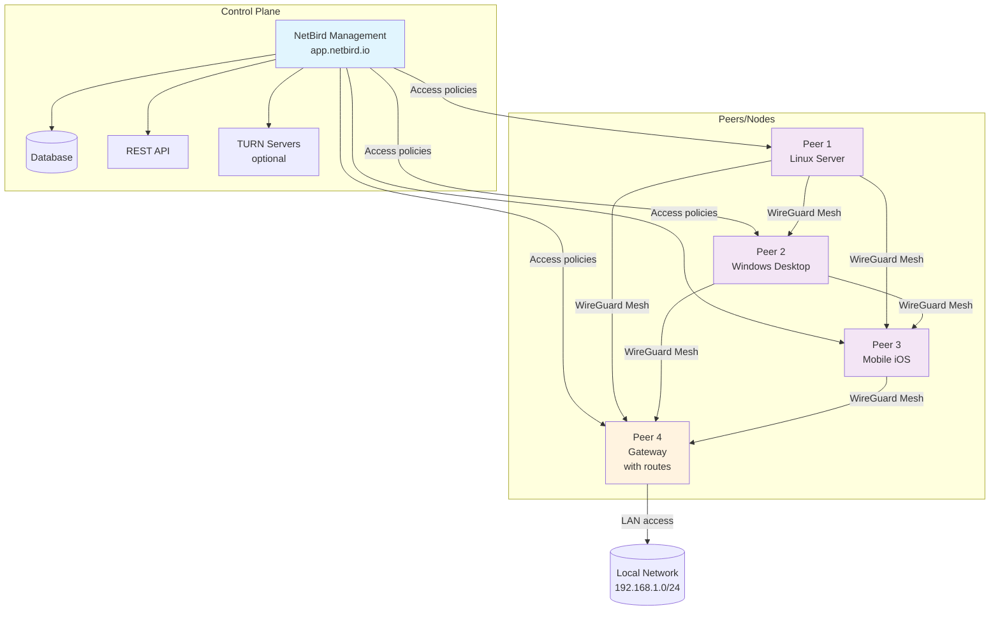
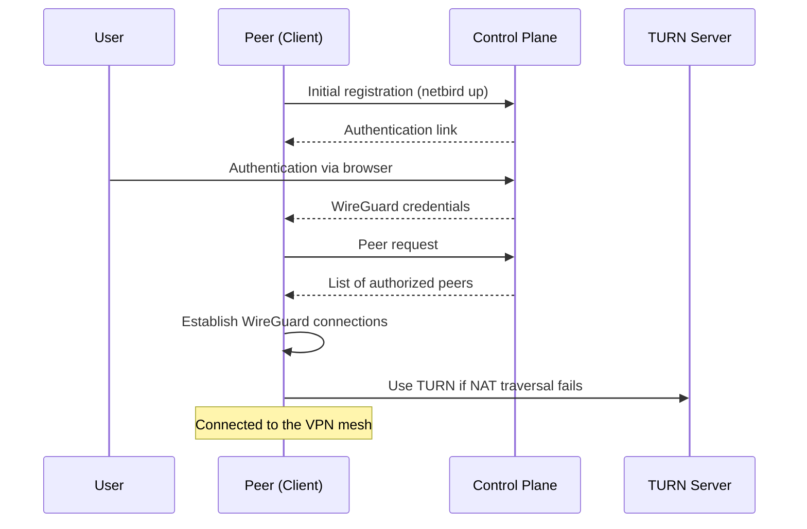

# NetBird: basic installation and configuration

> NetBird is a WireGuard-based mesh VPN solution with access control.

## NetBird architecture



## Connection flow



## Requirements

- Debian/Ubuntu or equivalent with `curl` and `sudo`
- Outbound HTTP/HTTPS ports allowed

## Quick installation (official script)

```bash
curl -fsSL https://pkgs.netbird.io/install.sh | sudo bash
```

Check the service:

```bash
sudo systemctl status netbird
netbird --version
```

## Joining the network

1. Create an account/tenant in the dashboard (`https://app.netbird.io` or your self-hosted dashboard)
2. Run the login and follow the browser flow:

```bash
netbird up
```

3. Check status and peers:

```bash
netbird status
netbird peers
```

## Startup and logs

```bash
sudo systemctl enable --now netbird
journalctl -u netbird -f
```

## Hardening and useful configuration

- Basic ACLs (dashboard):
  - Create a policy that only allows traffic between the groups you actually need (e.g. `role:admin` ↔ `role:infra`).
  - Deny by default and allow through explicit lists.
- DNS: configure per-peer or per-network DNS in the dashboard; on Linux hosts using `systemd-resolved`, make sure it is active:

```bash
sudo systemctl enable --now systemd-resolved
resolvectl status
```

- Routes: use advertised routes in the dashboard to reach subnets behind a gateway peer.

### systemd override (boot order)

```bash
sudo systemctl edit netbird
```
Drop-in content:

```ini
[Unit]
After=network-online.target
Wants=network-online.target
```

Apply the changes:

```bash
sudo systemctl daemon-reload
sudo systemctl restart netbird
```

## Notes

- NetBird relies on WireGuard; avoid conflicts with other active VPNs
- Review the access policies in the dashboard so traffic between peers is allowed

## Container examples (Docker)

### Connecting your containers to the VPN

- Option 1 (host networking): run NetBird on the host or in a container with `--network host`, so your apps use the host stack.
- Option 2 (sidecar namespace): share the network namespace with your app:

```bash
docker run -d --name netbird --cap-add NET_ADMIN --device /dev/net/tun \
  -v netbird_state:/var/lib/netbird --network container:myapp netbird:latest
```

- Option 3 (dedicated Docker network): create a Docker network and route through the NetBird container (requires iptables/masquerade inside the VPN container).
