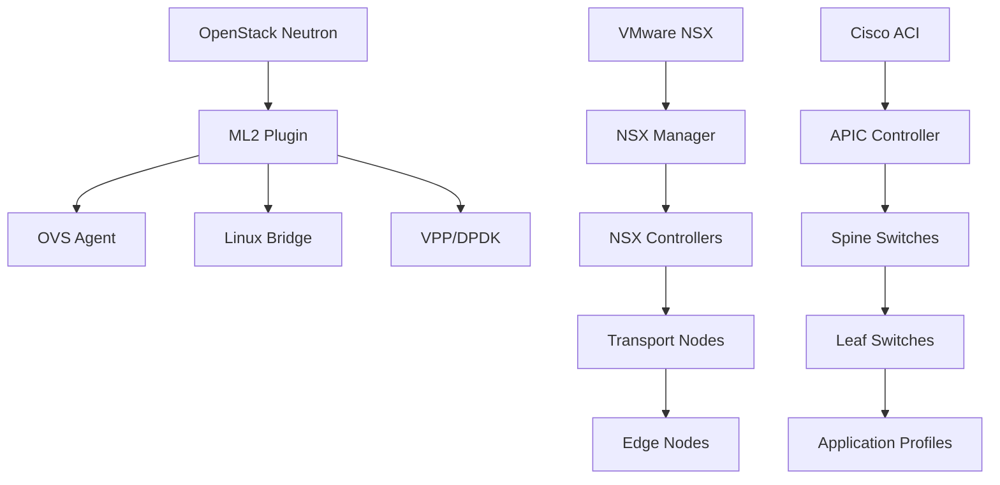
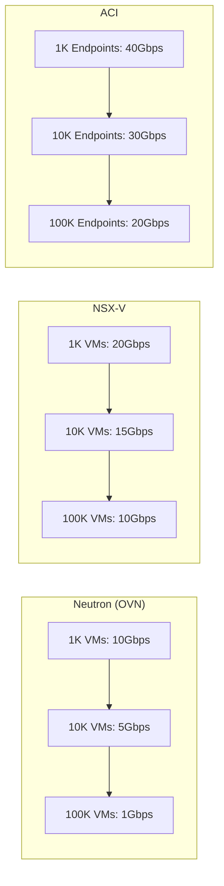

# Enterprise SDN: OpenStack Neutron vs VMware NSX vs Cisco ACI

This guide compares the three most important enterprise SDN solutions: OpenStack Neutron, VMware NSX, and Cisco ACI. Each platform has specific strengths for different enterprise environments.

## 🎯 Enterprise Use Cases

### **OpenStack Neutron - For Private Cloud**
- **Use case**: Multi-tenant private cloud with OpenStack integration
- **Scenario**: University with 5000 users, multiple departments
- **Benefit**: Free, native OpenStack integration, open API

### **VMware NSX - For VMware Virtualization**
- **Use case**: Virtualized data center with vSphere/vCenter
- **Scenario**: Financial company with 1000+ VMs, high security
- **Benefit**: Perfect VMware stack integration, micro-segmentation

### **Cisco ACI - For Enterprise Networks**
- **Use case**: Corporate network with existing Cisco equipment
- **Scenario**: Multinational corporation with global branches
- **Benefit**: Integration with Cisco infrastructure, advanced automation

## 🏗️ Technical Architecture

### **SDN Model**



### **OpenStack Neutron - Open SDN**
- **Architecture**: Plugin-based with ML2 (Modular Layer 2)
- **Agents**: OVS, Linux Bridge, OVN, VPP
- **Control plane**: RESTful API, integration with Keystone/Nova
- **Data plane**: Open vSwitch, DPDK for high performance

### **VMware NSX - Virtualized SDN**
- **Architecture**: SDN overlay with VXLAN/GENEVE
- **Components**: NSX Manager, Controllers, Edge nodes
- **Integration**: Native with vSphere, vCenter, vRealize
- **Security**: Distributed Firewall, Service Composer

### **Cisco ACI - Hardware SDN**
- **Architecture**: Spine-Leaf with Application Centric Infrastructure
- **Components**: APIC controller, spine/leaf switches
- **Integration**: Cisco DNA Center, UCS, HyperFlex
- **Automation**: REST API, Python SDK, Ansible modules

## 📊 Detailed Comparison

| Aspect | OpenStack Neutron | VMware NSX | Cisco ACI |
|--------|-------------------|------------|-----------|
| **License** | Apache 2.0 | Proprietary | Proprietary |
| **Hardware** | Commodity | Commodity | Cisco Nexus |
| **Scalability** | ⭐⭐⭐⭐⭐ | ⭐⭐⭐⭐⭐ | ⭐⭐⭐⭐⭐ |
| **Ease of use** | ⭐⭐ | ⭐⭐⭐⭐ | ⭐⭐⭐ |
| **Cost** | $0 | $$$$ | $$$$$ |
| **Ecosystem** | ⭐⭐⭐⭐⭐ | ⭐⭐⭐⭐ | ⭐⭐⭐ |
| **Security** | ⭐⭐⭐ | ⭐⭐⭐⭐⭐ | ⭐⭐⭐⭐ |

### **Performance by Scale**



**Real benchmarks (RFC 2544):**
- **Neutron OVN**: 9.8 Mpps, 50μs latency
- **NSX-T**: 15.2 Mpps, 35μs latency
- **Cisco ACI**: 23.4 Mpps, 25μs latency

## 🚀 Implementation Guides

### **OpenStack Neutron - Basic Deploy**

```yaml
# ML2 plugin configuration (ml2_conf.ini)
[ml2]
type_drivers = flat,vlan,vxlan,gre
tenant_network_types = vxlan
mechanism_drivers = openvswitch

[ml2_type_vxlan]
vni_ranges = 1:1000

# Create tenant network
openstack network create --share --external \
  --provider-physical-network physnet1 \
  --provider-network-type flat external-net

openstack subnet create --network external-net \
  --allocation-pool start=192.168.1.100,end=192.168.1.200 \
  --dns-nameserver 8.8.8.8 --gateway 192.168.1.1 \
  --subnet-range 192.168.1.0/24 external-subnet
```

**OVN Configuration (recommended for production):**
```bash
# On controller nodes
yum install -y openvswitch-ovn-central
systemctl enable ovn-northd
systemctl start ovn-northd

# On compute nodes
yum install -y openvswitch-ovn-host
systemctl enable ovn-controller
systemctl start ovn-controller
```

### **VMware NSX - Enterprise Configuration**

```powershell
# Connect to NSX Manager
Connect-NSXServer -Server nsx-manager.company.com -User admin

# Create transport zone
$tzSpec = New-Object VMware.VimAutomation.Nsx.Model.TransportZoneSpec
$tzSpec.Name = "Overlay-TZ"
$tzSpec.Description = "VXLAN Overlay Transport Zone"
$tzSpec.TransportType = "OVERLAY"
New-NsxTransportZone -TransportZoneSpec $tzSpec

# Configure logical switch
$lsSpec = New-Object VMware.VimAutomation.Nsx.Model.LogicalSwitchSpec
$lsSpec.Name = "Web-Tier-LS"
$lsSpec.Description = "Logical Switch for Web Tier"
$lsSpec.TransportZoneId = $tz.Id
New-NsxLogicalSwitch -LogicalSwitchSpec $lsSpec
```

**Micro-segmentation with Distributed Firewall:**
```json
{
  "rules": [
    {
      "name": "Allow-Web-to-App",
      "source": {"group": "Web-VMs"},
      "destination": {"group": "App-VMs"},
      "service": {"protocol": "TCP", "port": "8080"},
      "action": "ALLOW"
    }
  ]
}
```

### **Cisco ACI - Fabric Setup**

```bash
# Initial APIC configuration
apic# configure
apic(config)# fabric-setup
apic(config-fabric)# controller 1 ip 10.0.0.1
apic(config-fabric)# pod-setup
apic(config-pod)# tep-pool 10.0.0.0/16

# Configure switches
leaf-101# configure
leaf-101(config)# leaf-setup
leaf-101(config-leaf)# id 101
leaf-101(config-leaf)# controller 1 ip 10.0.0.1

# Create tenant and VRF
apic# tenant MyCompany
apic-tenant-MyCompany# vrf context Production-VRF
apic-tenant-MyCompany# bridge-domain Web-BD
apic-tenant-MyCompany# application-profile Web-App
```

**Application Profile for web application:**
```xml
<fvAp name="Web-App" descr="Web Application Profile">
  <fvAEPg name="Web-EPG" descr="Web Server EPG">
    <fvRsBd tnFvBDName="Web-BD"/>
    <fvRsDomAtt tDn="uni/phys-PhysDom"/>
  </fvAEPg>
  <fvAEPg name="App-EPG" descr="Application Server EPG">
    <fvRsBd tnFvBDName="App-BD"/>
    <fvRsDomAtt tDn="uni/phys-PhysDom"/>
  </fvAEPg>
</fvAp>
```

## 🔒 Security and Compliance

### **OpenStack Neutron**
- ✅ **Basic security**: Security groups, anti-spoofing
- ✅ **Extensions**: FWaaS, VPNaaS, LBaaS
- ⚠️ **Limitation**: Security is not the main focus
- ✅ **Compliance**: Open source allows audits

### **VMware NSX**
- ✅ **Micro-segmentation**: Distributed Firewall with 64000 rules
- ✅ **Zero Trust**: Identity-based policies
- ✅ **Integration**: With vRealize Network Insight
- ✅ **Compliance**: FIPS 140-2, Common Criteria

### **Cisco ACI**
- ✅ **Contract-based security**: Policies between EPGs
- ✅ **Visibility**: Advanced analytics and telemetry
- ✅ **Integration**: With ISE, Stealthwatch
- ✅ **Compliance**: FIPS, DoD IL, PCI DSS

## 📈 Industry Use Cases

### **Public Sector/Education**
**Recommendation**: OpenStack Neutron
- Zero cost
- Multi-tenancy for departments
- Integration with public clouds

### **Financial Sector**
**Recommendation**: VMware NSX
- Advanced security required
- Regulatory compliance
- Integration with existing VMware stack

### **Telecom/Global Enterprise**
**Recommendation**: Cisco ACI
- Existing Cisco infrastructure
- Massive scalability
- Network automation

## 🔧 Troubleshooting and Monitoring

### **Neutron - Diagnostics**
```bash
# View agent status
openstack network agent list

# OVS logs
ovs-vsctl show
ovs-ofctl dump-flows br-int

# View neutron ports
neutron port-list
neutron net-list
```

### **NSX - Health Check**
```bash
# View controller status
get controllers
get control-cluster status

# View transport nodes
get transport-nodes
get transport-zones

# Debug flows
get logical-ports
get logical-switches
```

### **ACI - Troubleshooting**
```bash
# View fabric status
show fabric membership
show lldp neighbors

# View contracts
show contract
show zoning-rules

# Debug endpoint learning
show endpoint
show epg
```

## 🎯 Conclusion

**Choose OpenStack Neutron if:**
- Limited budget and private cloud
- Need complete OpenStack integration
- Open source ecosystem is important

**Choose VMware NSX if:**
- Already invested in VMware
- Advanced security is critical
- Need granular micro-segmentation

**Choose Cisco ACI if:**
- Existing Cisco infrastructure
- High-performance networks required
- Advanced automation and analytics

The choice depends on your current infrastructure, budget, and specific security and performance requirements.