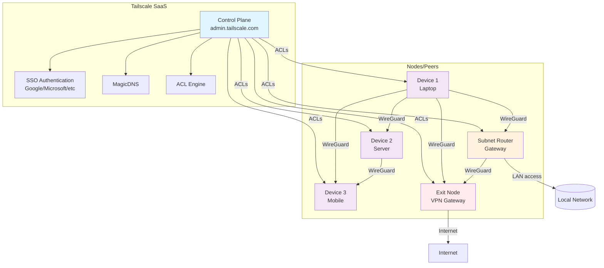
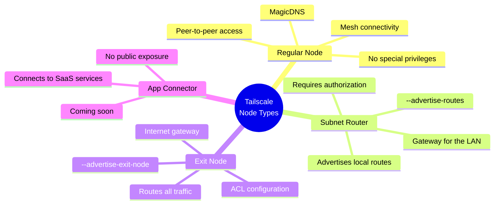

# Tailscale: installation and basic configuration

> Tailscale builds a secure mesh network on top of WireGuard with SSO authentication.

## Tailscale architecture



## Node types in Tailscale



## Requirements

- Debian/Ubuntu or equivalent with `curl` and `sudo`
- Access to `https://login.tailscale.com`

## Quick install

```bash
curl -fsSL https://tailscale.com/install.sh | sh
```

Check the service and version:

```bash
tailscale version
sudo systemctl status tailscaled
```

## Authentication and node enrollment

```bash
sudo tailscale up
```

- Open the link that appears and authenticate
- Authorize the device in `admin.tailscale.com` if required

## Useful commands

```bash
# Status and IPs
tailscale status
ip -4 addr show tailscale0

# Enable at boot
sudo systemctl enable --now tailscaled

# Leave/Disconnect
sudo tailscale down
```

## Hardening and useful options

- ACLs (admin console): define who can talk to whom. Minimal example (allow the admins group full access):

```json
{
  "acls": [
    {"action": "accept", "src": ["group:admins"], "dst": ["*"]}
  ]
}
```

- DNS: enable MagicDNS and set search domains; to enforce corporate DNS:

```bash
sudo tailscale up --accept-dns=true
```

- Subnet router (access to a LAN):

```bash
sudo tailscale up --advertise-routes=192.168.10.0/24
```
Authorize the route in the admin console.

### systemd override (make sure the network is up)

```bash
sudo systemctl edit tailscaled
```
Content:

```ini
[Unit]
After=network-online.target
Wants=network-online.target
```

Apply and restart:

```bash
sudo systemctl daemon-reload
sudo systemctl restart tailscaled
```

## Notes

- Avoid conflicts with other WireGuard VPNs
- Review the ACLs in the admin console to control access

## Containerized examples (Docker)

### Connect your containers to the VPN

- Option 1 (userspace subnet router): publish the Tailscale container ports and use `--advertise-exit-node`/`--advertise-routes` as needed.
- Option 2 (shared namespace/sidecar):

```bash
docker run -d --name tailscale \
  --cap-add NET_ADMIN --device /dev/net/tun \
  -v tailscale_state:/var/lib/tailscale \
  --network container:myapp \
  tailscale:latest
```

- Option 3 (host networking): run Tailscale on the host or in a container with `--network host`, and everything else uses the host network.
