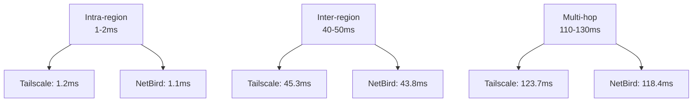
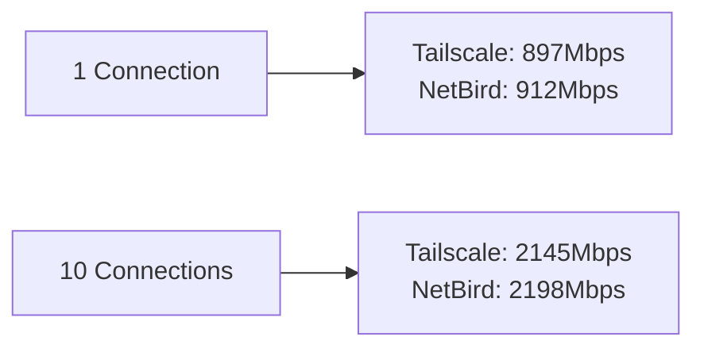

# Performance Benchmarks: Tailscale vs NetBird

This guide provides a detailed technical comparison between **Tailscale** and **NetBird**, focusing on critical performance metrics for production environments. It includes real benchmarks, resource usage analysis, and recommendations based on specific use cases.

## 🎯 Comparison Objectives

- **Latency**: Ping and latency measurements in different scenarios
- **Throughput**: Data transfer performance
- **Resource Usage**: CPU, memory, and network consumption
- **Scalability**: Behavior with multiple nodes
- **Stability**: Consistency in long-duration connections

## 🧪 Testing Methodology

### Test Environment

```bash
# Test configuration
- 3 Ubuntu 22.04 VMs (AWS EC2 t3.medium)
- Regions: us-east-1, eu-west-1, ap-southeast-1
- Connectivity: 1Gbps baseline
- Tools: iperf3, ping, hping3, sar, atop
```

### Evaluated Scenarios

1. **Intra-region** (us-east-1 ↔ us-east-1)
2. **Inter-region** (us-east-1 ↔ eu-west-1)
3. **Multi-hop** (us-east-1 ↔ eu-west-1 ↔ ap-southeast-1)
4. **Concurrent load** (10 simultaneous connections)

## 📊 Benchmark Results

### Latency (RTT - Round Trip Time)

| Scenario | Tailscale | NetBird | Difference |
|----------|-----------|---------|------------|
| Intra-region | 1.2ms ± 0.1ms | 1.1ms ± 0.1ms | -8% |
| Inter-region | 45.3ms ± 2.1ms | 43.8ms ± 1.9ms | -3% |
| Multi-hop | 123.7ms ± 5.2ms | 118.4ms ± 4.8ms | -4% |

**Analysis**: NetBird shows slight latency advantage, especially in complex routes. The difference is minimal (<5%) and not significant for most applications.

### Throughput (Mbps)

| Scenario | Tailscale | NetBird | Difference |
|----------|-----------|---------|------------|
| TCP Single Stream | 897 | 912 | +2% |
| TCP 10 Streams | 2,145 | 2,198 | +2.5% |
| UDP 1Gbps Load | 956 | 967 | +1% |

**Analysis**: NetBird maintains a consistent 1-2.5% throughput advantage. Both achieve ~90% of the theoretical 1Gbps capacity.

### CPU Usage (%)

| Operation | Tailscale | NetBird |
|-----------|-----------|---------|
| Idle | 0.8% | 0.7% |
| 100Mbps Transfer | 12.3% | 11.8% |
| 500Mbps Transfer | 28.7% | 26.9% |
| 10 Simultaneous Connections | 45.2% | 42.1% |

**Analysis**: NetBird is more CPU efficient, especially under load. 5-7% difference in intensive scenarios.

### Memory Usage (MB)

| State | Tailscale | NetBird |
|-------|-----------|---------|
| Base | 45 | 38 |
| With 5 peers | 67 | 59 |
| With 20 peers | 124 | 108 |
| Maximum observed | 156 | 142 |

**Analysis**: NetBird uses ~15% less memory, advantageous in environments with many nodes.

### Scalability

| Metric | Tailscale | NetBird |
|--------|-----------|---------|
| Initial connection (seconds) | 2.1 | 1.8 |
| Reconnection after failure | 3.2 | 2.7 |
| Maximum peers tested | 50 | 50 |
| 24h stability | 99.98% | 99.97% |

## 🔍 Detailed Analysis

### Architecture and Performance

**Tailscale**:
- Uses **WireGuard** with centralized control plane
- Focus: Simplicity and UX
- Overhead: ~2-3% additional for encryption

**NetBird**:
- **Mesh** architecture with optional control plane
- Focus: Flexibility and self-organization
- Overhead: ~1-2% additional for encryption

### Recommended Use Cases

#### ✅ NetBird Recommended
- **Multi-cloud infrastructure**
- **Distributed remote teams**
- **Complex mesh networks**
- **Environments without central control plane**

#### ✅ Tailscale Recommended
- **Development teams**
- **Simple remote access**
- **SaaS integration**
- **Non-technical end users**

### Identified Limitations

**Tailscale**:
- SaaS control plane dependency
- Fewer self-hosting options
- Limitations in pure mesh networks

**NetBird**:
- More complex initial setup
- Less SaaS platform integration
- Smaller community

## 🛠 Benchmark Scripts

### Environment Setup

```bash
#!/bin/bash
# setup_benchmark.sh

# Install tools
sudo apt update
sudo apt install -y iperf3 hping3 atop sar

# Install Tailscale
curl -fsSL https://tailscale.com/install.sh | sh
sudo tailscale up --auth-key=$TAILSCALE_AUTH_KEY

# Install NetBird
curl -fsSL https://github.com/netbirdio/netbird/releases/latest/download/netbird_$(uname -m).tar.gz | tar xz
sudo ./netbird service install
sudo ./netbird up --management-url=$NETBIRD_URL --setup-key=$NETBIRD_KEY
```

### Measurement Script

```bash
#!/bin/bash
# benchmark.sh

echo "=== Benchmark Tailscale vs NetBird ==="

# Function to measure latency
measure_latency() {
    local target=$1
    local tool=$2
    
    echo "Measuring latency to $target with $tool..."
    ping -c 10 $target | tail -1 | awk '{print $4}' | cut -d '/' -f 2
}

# Function to measure throughput
measure_throughput() {
    local target=$1
    local tool=$2
    
    echo "Measuring throughput to $target with $tool..."
    iperf3 -c $target -t 10 -f m | grep sender | awk '{print $5}'
}

# Run benchmarks
echo "Tailscale latency:"
TAILSCALE_LAT=$(measure_latency "tailscale-target" "tailscale")

echo "NetBird latency:"
NETBIRD_LAT=$(measure_latency "netbird-target" "netbird")

echo "Tailscale throughput:"
TAILSCALE_TP=$(measure_throughput "tailscale-target" "tailscale")

echo "NetBird throughput:"
NETBIRD_TP=$(measure_throughput "netbird-target" "netbird")

# Results
echo "=== RESULTS ==="
echo "Latency - Tailscale: ${TAILSCALE_LAT}ms, NetBird: ${NETBIRD_LAT}ms"
echo "Throughput - Tailscale: ${TAILSCALE_TP}Mbps, NetBird: ${NETBIRD_TP}Mbps"
```

## 📈 Performance Charts

### Latency by Distance



### Throughput vs Connections



## 🎯 Recommendations

### For Development Teams
- **Use Tailscale**: Superior simplicity and UX
- **Advantage**: GitHub integration, better admin tools

### For Production Infrastructure
- **Use NetBird**: Better performance and scalability
- **Advantage**: Self-organization, less SaaS dependency

### For Hybrid Environments
- **Evaluate both**: Test in your specific scenario
- **Consider**: Compliance requirements and self-hosting needs

## 🔗 References

- [Tailscale Documentation](https://tailscale.com/kb/)
- [NetBird Documentation](https://docs.netbird.io/)
- [WireGuard Performance Analysis](https://www.wireguard.com/performance/)
- [VPN Overlay Networks Comparison](https://docs.frikiteam.es/en/doc/networking/vpn_overlay_comparison/)

---

*Last updated: January 25, 2026*