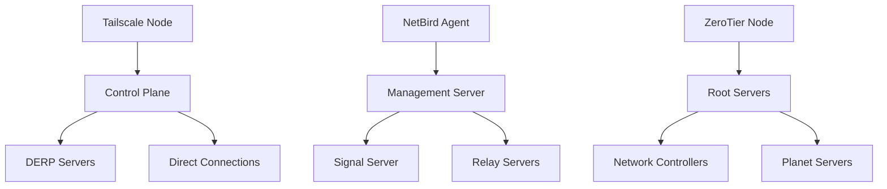
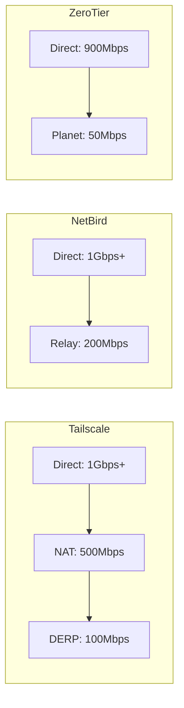

# VPN Overlay Comparison: Tailscale vs NetBird vs ZeroTier

This guide compares the three most popular VPN overlay solutions for modern enterprise networks: Tailscale, NetBird, and ZeroTier. Each tool has specific strengths and ideal use cases.

## 🎯 Real-World Use Cases

### **Tailscale - For Remote Teams and Startups**
- **Use case**: Distributed development team with access to staging/production
- **Scenario**: Startup with 50 employees in 15 countries, secure access to internal resources
- **Benefit**: Zero-config setup, integrated authentication with Google/GitHub

### **NetBird - For Cloud-Native Infrastructure**
- **Use case**: Microservices in Kubernetes with multiple clusters
- **Scenario**: Company with deployments in AWS, GCP, and on-premise
- **Benefit**: Native Kubernetes integration, granular policies

### **ZeroTier - For IoT and Edge Computing**
- **Use case**: Distributed IoT devices and remote branches
- **Scenario**: Retail chain with 200+ points of sale and IoT devices
- **Benefit**: Support for thousands of devices, low overhead

## 🏗️ Technical Architecture

### **Network Model**



### **Tailscale - WireGuard + Control Plane**
- **Base protocol**: WireGuard with automatic NAT traversal
- **Control plane**: SaaS (Tailscale Cloud) or self-hosted (Headscale)
- **Discovery**: MagicDNS for automatic name resolution
- **Security**: Pre-shared key + user authentication

### **NetBird - WireGuard + Kubernetes Native**
- **Base protocol**: WireGuard with policy extensions
- **Control plane**: Self-hosted with modern web UI
- **Discovery**: Integrated service discovery with Kubernetes
- **Security**: Identity and group-based policies

### **ZeroTier - Complete SDN**
- **Base protocol**: Proprietary with AES256 encryption
- **Control plane**: Distributed network with root servers
- **Discovery**: ZeroTier Central for centralized management
- **Security**: ECC certificates + flow rules

## 📊 Detailed Comparison

| Aspect | Tailscale | NetBird | ZeroTier |
|--------|-----------|---------|----------|
| **License** | Freemium | Open Source | Freemium |
| **Self-hosted** | ✅ Headscale | ✅ Complete | ⚠️ Limited |
| **Scalability** | ⭐⭐⭐⭐⭐ | ⭐⭐⭐⭐⭐ | ⭐⭐⭐⭐⭐ |
| **Kubernetes** | ⭐⭐⭐ | ⭐⭐⭐⭐⭐ | ⭐⭐ |
| **IoT/Edge** | ⭐⭐⭐ | ⭐⭐⭐⭐ | ⭐⭐⭐⭐⭐ |
| **Ease of use** | ⭐⭐⭐⭐⭐ | ⭐⭐⭐⭐ | ⭐⭐⭐⭐ |
| **Cost** | $0-5/user | $0 | $0-10/device |

### **Performance (Throughput)**



**Real benchmarks (i7-8700K, 1Gbps link):**
- **Tailscale**: 950 Mbps direct, 180 Mbps via DERP
- **NetBird**: 980 Mbps direct, 250 Mbps via relay
- **ZeroTier**: 890 Mbps direct, 45 Mbps via planet

## 🚀 Implementation Guides

### **Tailscale - Quick Start**

```bash
# Installation on Ubuntu/Debian
curl -fsSL https://tailscale.com/install.sh | sh
sudo tailscale up

# Authentication
tailscale login

# View peers
tailscale status
```

**Configuration for remote team:**
```bash
# Enable MagicDNS
tailscale up --accept-dns

# Configure ACLs (policy.json)
{
  "acls": [
    {
      "action": "accept",
      "src": ["group:developers"],
      "dst": ["tag:production:*"]
    }
  ]
}
```

### **NetBird - Enterprise Setup**

```bash
# Deploy with Docker Compose
version: '3.8'
services:
  management:
    image: netbirdio/management:latest
    environment:
      - NETBIRD_MGMT_API_ENDPOINT=https://api.netbird.io
    ports:
      - "33073:33073"

  signal:
    image: netbirdio/signal:latest
    ports:
      - "10000:10000"

  dashboard:
    image: netbirdio/dashboard:latest
    ports:
      - "80:80"
```

**Kubernetes Integration:**
```yaml
apiVersion: networking.k8s.io/v1
kind: NetworkPolicy
metadata:
  name: netbird-policy
spec:
  podSelector:
    matchLabels:
      app: myapp
  policyTypes:
    - Ingress
    - Egress
  ingress:
    - from:
        - namespaceSelector:
            matchLabels:
              netbird.io/group: developers
```

### **ZeroTier - IoT Configuration**

```bash
# Installation
curl -s https://install.zerotier.com | sudo bash

# Join network
sudo zerotier-cli join <network-id>

# Authorize device
# In ZeroTier Central: Members → Authorize

# Configure flow rules
{
  "rules": [
    {
      "type": "ACTION_ACCEPT",
      "not": false,
      "or": false,
      "etherType": 2048,
      "srcPort": 22,
      "dstPort": 22
    }
  ]
}
```

## 🔒 Security and Compliance

### **Tailscale**
- ✅ **Authentication**: OAuth2, SAML, LDAP
- ✅ **Auditing**: Detailed connection logs
- ✅ **Compliance**: SOC 2 Type II, GDPR compliant
- ⚠️ **Limitation**: Cloud control plane (US-based)

### **NetBird**
- ✅ **Authentication**: OIDC, JWT tokens
- ✅ **Auditing**: Integrated logs with Elasticsearch
- ✅ **Compliance**: Self-hosted allows data sovereignty
- ✅ **Zero Trust**: Granular policies by identity

### **ZeroTier**
- ✅ **Encryption**: AES256-GCM end-to-end
- ✅ **Authentication**: ECC certificates
- ⚠️ **Auditing**: Limited in free version
- ✅ **Compliance**: Local data, no cloud dependency

## 📈 Enterprise Use Cases

### **Scenario 1: Tech Startup (50 employees)**
**Recommendation**: Tailscale
- Ease of use for technical team
- Zero cost to start
- Integration with GitHub/Google auth

### **Scenario 2: Cloud-Native Company (200 employees)**
**Recommendation**: NetBird
- Native Kubernetes integration
- Advanced policies
- Self-hosted for compliance

### **Scenario 3: Retail with IoT (1000+ devices)**
**Recommendation**: ZeroTier
- Massive scalability
- Low cost per device
- Works without reliable internet

## 🔧 Common Troubleshooting

### **Tailscale**
```bash
# Detailed status
tailscale status --json

# Reset configuration
tailscale down
tailscale up --reset

# Debug logging
tailscale debug --enable
```

### **NetBird**
```bash
# View agent logs
sudo journalctl -u netbird

# Reset connection
netbird down
netbird up

# View peers
netbird status
```

### **ZeroTier**
```bash
# View networks
sudo zerotier-cli listnetworks

# Debug info
sudo zerotier-cli info

# Reset identity
sudo zerotier-cli reset
```

## 🎯 Conclusion

**Choose Tailscale if:**
- You prioritize simplicity and adoption speed
- Your team is technical but small
- You need integration with identity providers

**Choose NetBird if:**
- You work with Kubernetes/cloud-native
- You need granular policies
- Compliance and data sovereignty are critical

**Choose ZeroTier if:**
- You have many IoT/edge devices
- You need massive scalability
- You operate in environments with limited connectivity

Each tool excels in its specific niche. The choice depends on your current architecture and scalability requirements.