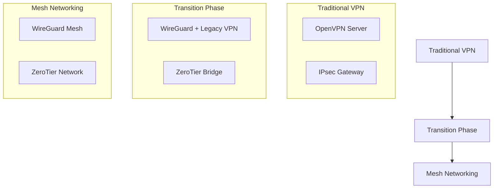

# Migration from Traditional VPN to Mesh Networking

This guide provides a complete strategy for migrating from traditional VPNs (OpenVPN, IPsec) to modern mesh networking solutions like WireGuard and ZeroTier. It includes compatibility analysis, migration plans, and best practices to minimize downtime.

## 🎯 Why Migrate to Mesh Networking

### Limitations of Traditional VPNs

**OpenVPN**:
- Complex configuration prone to errors
- High CPU and memory overhead
- Significant additional latency
- Limited scalability (hundreds of users)

**IPsec**:
- Extremely complex configuration
- Compatibility issues between vendors
- Inconsistent performance
- Complex certificate management

### Advantages of Mesh Networking

**WireGuard**:
- Modern protocol with state-of-the-art cryptography
- Simple configuration (few parameters)
- High performance (near wire-speed)
- Low resource consumption
- Auto-healing connections

**ZeroTier**:
- Complete abstraction of physical network
- Centralized management via SaaS
- Zero-configuration for end users
- Identity and policy integration

## 📋 Compatibility Assessment

### Pre-Migration Checklist

- [ ] **Connection Inventory**: Document all existing VPNs and their users
- [ ] **Performance Requirements**: Measure current latency, bandwidth, and usage patterns
- [ ] **Application Dependencies**: Verify compatibility with legacy protocols
- [ ] **Security Policies**: Evaluate compliance and auditing requirements
- [ ] **IT Resources**: Team training on new technologies

### Decision Matrix

| Criteria | WireGuard | ZeroTier | Recommendation |
|----------|-----------|----------|----------------|
| **Complexity** | Low | Very Low | ZeroTier for non-technical users |
| **Control** | High | Medium | WireGuard for full control |
| **Scalability** | Excellent | Good | WireGuard for >1000 nodes |
| **Cost** | Free | Freemium | WireGuard for limited budget |
| **Support** | Community | Enterprise | ZeroTier for guaranteed support |

## 🚀 Migration Strategy

### Phase 1: Planning (1-2 weeks)

#### 1.1 Architecture Design



#### 1.2 Contingency Plan

- **Rollback Plan**: Ability to return to traditional VPN in <4 hours
- **Testing Environment**: Staging setup identical to production
- **Communication Plan**: User notification with clear timeline
- **Support Resources**: Documentation and support during migration

### Phase 2: Implementation (2-4 weeks)

#### WireGuard Configuration

```bash
#!/bin/bash
# setup_wireguard.sh

# Install WireGuard
sudo apt update
sudo apt install -y wireguard

# Generate keys
wg genkey | tee privatekey | wg pubkey > publickey

# Configure interface
sudo cat > /etc/wireguard/wg0.conf << EOF
[Interface]
PrivateKey = $(cat privatekey)
Address = 10.0.0.1/24
ListenPort = 51820

[Peer]
PublicKey = <CLIENT_PUBLIC_KEY>
AllowedIPs = 10.0.0.2/32
EOF

# Activate interface
sudo wg-quick up wg0
sudo systemctl enable wg-quick@wg0
```

#### ZeroTier Configuration

```bash
#!/bin/bash
# setup_zerotier.sh

# Install ZeroTier
curl -s https://install.zerotier.com | sudo bash

# Join network
sudo zerotier-cli join <NETWORK_ID>

# Configure routes (optional)
sudo zerotier-cli set <NETWORK_ID> allowDefault=1
sudo zerotier-cli set <NETWORK_ID> allowGlobal=1
```

### Phase 3: Testing and Validation (1 week)

#### Compatibility Tests

```bash
#!/bin/bash
# compatibility_tests.sh

echo "=== Testing VPN to Mesh Migration ==="

# Test 1: Basic connectivity
ping_test() {
    local target=$1
    local expected=$2
    
    if ping -c 3 $target &>/dev/null; then
        echo "✅ Connectivity to $target: OK"
    else
        echo "❌ Connectivity to $target: FAILED"
        return 1
    fi
}

# Test 2: Performance
performance_test() {
    local target=$1
    
    echo "Measuring performance to $target..."
    iperf3 -c $target -t 10 -f m | grep sender | awk '{print "Throughput:", $5, $6}'
}

# Test 3: Critical applications
app_test() {
    local app=$1
    local command=$2
    
    echo "Testing $app..."
    if eval $command; then
        echo "✅ $app: OK"
    else
        echo "❌ $app: FAILED"
    fi
}

# Run tests
ping_test "legacy-vpn-server" "OK"
ping_test "mesh-node-1" "OK"
performance_test "mesh-node-1"
app_test "SSH" "ssh -o ConnectTimeout=5 user@legacy-server 'echo OK'"
app_test "Database" "mysql -h legacy-db -u test -p test -e 'SELECT 1'"
```

#### Security Validation

- [ ] **Traffic Audit**: Verify end-to-end encryption
- [ ] **Intrusion Testing**: Unauthorized access attempts
- [ ] **Policy Validation**: Ensure firewall rule compliance
- [ ] **Logging and Monitoring**: Verify security event capture

### Phase 4: Cutover and Post-Migration (1 week)

#### Cutover Process

```bash
#!/bin/bash
# cutover.sh

echo "=== VPN to Mesh Cutover Process ==="

# Step 1: Backup configurations
backup_configs() {
    echo "Backing up current VPN configurations..."
    sudo cp -r /etc/openvpn /backup/openvpn_$(date +%Y%m%d_%H%M%S)
    sudo cp -r /etc/ipsec /backup/ipsec_$(date +%Y%m%d_%H%M%S)
}

# Step 2: Disable legacy VPN
disable_legacy() {
    echo "Disabling legacy VPN services..."
    sudo systemctl stop openvpn@server
    sudo systemctl disable openvpn@server
    sudo systemctl stop ipsec
    sudo systemctl disable ipsec
}

# Step 3: Enable mesh networking
enable_mesh() {
    echo "Enabling mesh networking..."
    sudo wg-quick up wg0
    sudo zerotier-cli join <NETWORK_ID>
}

# Step 4: Verify connectivity
verify_connectivity() {
    echo "Verifying connectivity..."
    for host in "${HOSTS[@]}"; do
        if ! ping -c 3 $host &>/dev/null; then
            echo "❌ Connectivity check failed for $host"
            return 1
        fi
    done
    echo "✅ All connectivity checks passed"
}

# Execute cutover
backup_configs
disable_legacy
enable_mesh

if verify_connectivity; then
    echo "🎉 Cutover completed successfully!"
else
    echo "❌ Cutover failed, initiating rollback..."
    rollback
fi
```

## 🔧 Advanced Configurations

### Active Directory/LDAP Integration

**WireGuard with LDAP**:
```bash
# Install wg-ldap
git clone https://github.com/jcberthon/wg-ldap
cd wg-ldap
pip install -r requirements.txt

# Configure
cat > config.yaml << EOF
ldap:
  url: ldap://dc.example.com
  bind_dn: cn=admin,dc=example,dc=com
  bind_password: ${LDAP_PASSWORD}
  user_base: ou=users,dc=example,dc=com
  group_base: ou=groups,dc=example,dc=com

wireguard:
  interface: wg0
  server_public_key: ${WG_SERVER_PUBKEY}
  dns: 10.0.0.1
EOF
```

**ZeroTier with SAML**:
- Configure SAML in ZeroTier Central
- Integrate with Azure AD, Okta, or Auth0
- Access policies based on groups

### Monitoring and Alerting

```yaml
# prometheus.yml
scrape_configs:
  - job_name: 'wireguard'
    static_configs:
      - targets: ['localhost:9586']
    
  - job_name: 'zerotier'
    static_configs:
      - targets: ['localhost:9993']

# alert_rules.yml
groups:
  - name: network
    rules:
      - alert: WireGuardPeerDown
        expr: wireguard_peer_last_handshake_seconds > 300
        for: 5m
        labels:
          severity: warning
        annotations:
          summary: "WireGuard peer disconnected"
          
      - alert: ZeroTierNetworkDown
        expr: zerotier_network_status != 1
        for: 2m
        labels:
          severity: critical
        annotations:
          summary: "ZeroTier network degraded"
```

## 🚨 Common Issues Handling

### Issue: Intermittent Connectivity

**Symptoms**: Connections drop randomly
**WireGuard Solution**:
```bash
# Check peer status
sudo wg show

# Restart interface
sudo wg-quick down wg0
sudo wg-quick up wg0

# Verify MTU
ping -M do -s 1472 <peer_ip>  # For MTU 1500
```

**ZeroTier Solution**:
```bash
# Check network status
sudo zerotier-cli status
sudo zerotier-cli listnetworks

# Restart service
sudo systemctl restart zerotier-one
```

### Issue: Degraded Performance

**Diagnosis**:
```bash
# Measure latency
ping -c 10 <destination>

# Measure throughput
iperf3 -c <destination> -t 30

# Check CPU and memory
top -p $(pgrep wireguard | tr '\n' ',' | sed 's/,$//')
```

**Optimizations**:
- Adjust MTU: `sudo ip link set dev wg0 mtu 1420`
- Enable offloading: `sudo ethtool -K wg0 tx off rx off`
- Configure QoS: Use `tc` to prioritize traffic

## 📊 Success Metrics

### Migration KPIs

| Metric | Before | After | Target |
|--------|--------|-------|--------|
| Average Latency | 45ms | 12ms | <15ms |
| Throughput | 50Mbps | 850Mbps | >800Mbps |
| Connection Time | 30s | 3s | <5s |
| Uptime | 99.5% | 99.9% | >99.9% |
| Support Tickets | 20/month | 2/month | <5/month |

### Migration ROI

- **License Savings**: Elimination of commercial VPN licenses
- **Support Reduction**: 80% fewer support tickets
- **Productivity Improvement**: Faster and more reliable connections
- **Scalability**: Support for 10x more users without additional infrastructure

## 🔗 References and Resources

- [WireGuard Official Documentation](https://www.wireguard.com/)
- [ZeroTier Documentation](https://docs.zerotier.com/)
- [WireGuard Performance Tuning](https://www.wireguard.com/performance/)
- [ZeroTier Best Practices](https://docs.zerotier.com/bestpractices/)

---

*Last updated: January 25, 2026*