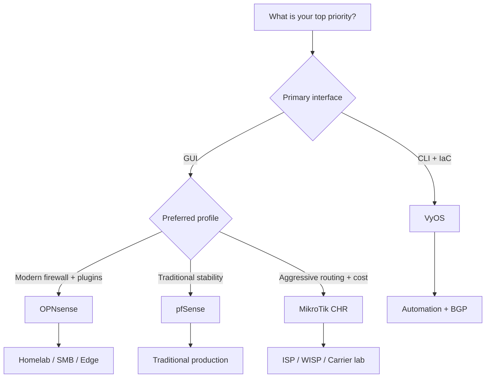

# vRouters and virtual firewalls

When you need advanced routing, firewalling and virtual network services, the most common choices are **OPNsense**, **pfSense**, **MikroTik CHR** and **VyOS**.

This document summarizes key differences and helps you choose based on your scenario.

## Platform guides

- [vRouter benchmark template](vrouter_benchmark_template.md)
- [OPNsense: quick guide for homelab and edge](vrouter_opnsense.md)
- [pfSense: quick guide for traditional production](vrouter_pfsense.md)
- [MikroTik CHR: quick guide for L3 routing](vrouter_mikrotik_chr.md)
- [VyOS: quick guide for automation and BGP/OSPF](vrouter_vyos.md)

## Quick comparison

| Solution | Tech base | Strengths | Limitations | Best fit |
| -------- | --------- | --------- | ----------- | -------- |
| **OPNsense** | FreeBSD + pf | Modern UI, rich plugin ecosystem, frequent updates | Less legacy documentation than pfSense | Homelab, SMB, secure edge |
| **pfSense** | FreeBSD + pf | Stable, mature and widely used | Licensing/ecosystem considerations by edition | Traditional production environments |
| **MikroTik CHR** | RouterOS | Excellent cost/performance, advanced routing features | RouterOS learning curve, throughput license tiers | ISP/WISP, heavy L3 routing labs |
| **VyOS** | Linux + FRR + nftables/iptables | Declarative CLI, strong IaC and advanced routing | Less friendly if your team needs full GUI workflows | Automation-driven BGP/OSPF environments |

## Advanced technical matrix

| Criteria | OPNsense | pfSense | MikroTik CHR | VyOS |
| -------- | -------- | ------- | ------------ | ---- |
| Management plane | Full web UI + limited CLI | Full web UI + shell | WinBox/WebFig + RouterOS CLI | Declarative CLI + automation tooling |
| Dynamic routing (BGP/OSPF) | Supported (plugins/FRR) | Supported (FRR package) | Very strong in RouterOS | Very strong with native FRR |
| Main focus | Modern firewall/UTM | Stable mature firewall | High-performance routing | Routing + infrastructure automation |
| Typical VPN stack | IPsec, OpenVPN, WireGuard | IPsec, OpenVPN, WireGuard | IPsec, WireGuard, L2TP/PPTP legacy | IPsec, OpenVPN, WireGuard |
| HA options | CARP/failover + config sync | CARP/failover + config sync | VRRP/failover by design | VRRP/HA by architecture |
| Learning curve | Low-medium | Low-medium | Medium-high | Medium-high |
| Automation fit | Medium (API/plugins) | Medium (API/config backup) | High (scripts/Ansible/API) | High (GitOps + templates) |
| Recommended profile | SMB, secure edge, homelab | Conservative production | ISP/WISP and carrier labs | DevOps/NetOps automated teams |

## Baseline benchmark targets (initial lab)

| KPI | Baseline target | How to measure | Acceptance criteria |
| --- | --------------- | -------------- | ------------------- |
| L3 throughput (no encryption) | >= 1 Gbps sustained | `iperf3` TCP/UDP across segments | < 15% variance across 3 runs |
| Site-to-site VPN throughput | >= 300 Mbps sustained | `iperf3` through tunnel path | Average CPU < 80% |
| Intra-site latency overhead | <= 5 ms additional | baseline `ping` vs with vRouter | Stable delta without abnormal spikes |
| Packet loss | <= 0.5% | `mtr` / controlled `ping -f` | No sustained loss > 1 minute |
| Failover convergence time | <= 30 s | controlled link/peer failure test | Recovery without manual intervention |
| Session stability | 0 unplanned restarts | 24-72 h monitoring window | No control plane crash |

Notes:

- Run tests in off-peak and peak periods to identify load-related degradation.
- Keep packet size and parallel streams consistent across platforms.
- Re-run the benchmark after upgrades, driver changes or hypervisor changes.
- For environment-specific targets (homelab, SMB, ISP/WISP), use the [vRouter benchmark template](vrouter_benchmark_template.md).

## Minimum baseline hardening (all platforms)

- Change default credentials and remove unnecessary users.
- Restrict management access to dedicated management networks.
- Enable MFA for administrative GUI/portal where supported.
- Disable unused management services (SSH, API, public GUI).
- Apply `deny by default` on WAN and explicit allow rules per service.
- Segment management, user and server networks (VLANs/zones).
- Enable security logging and forward logs to a central collector.
- Use reliable NTP for event correlation and auditability.
- Encrypt configuration backups and test restore periodically.
- Define patching windows with tested rollback procedures.
- Close each evaluation with a short executive summary (risks, 7/30-day actions and final recommendation).

## Decision flow

