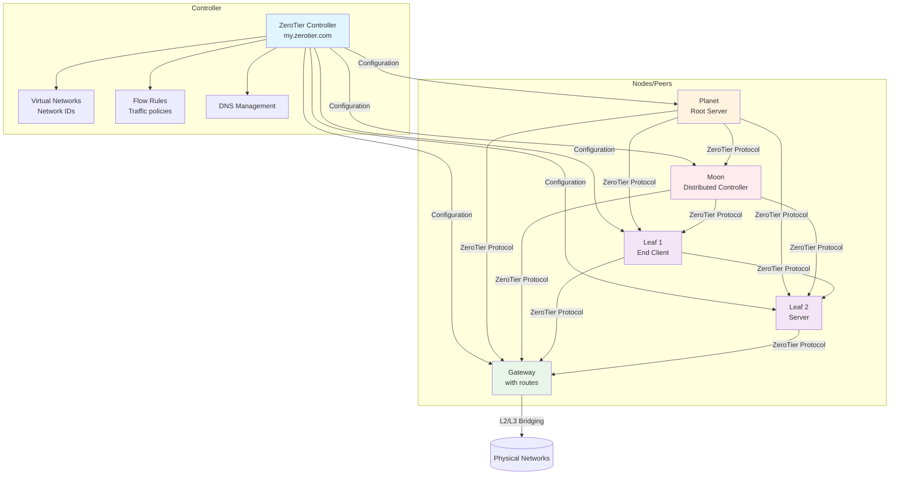
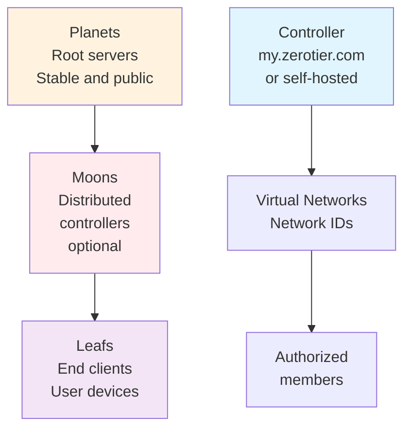

# ZeroTier: installation and basic configuration

> ZeroTier provides easy-to-deploy L2/L3 virtual networks between devices.

## ZeroTier architecture



## Node hierarchy



## Requirements

- Debian/Ubuntu or equivalent with `curl` and `sudo`
- Access to `https://my.zerotier.com` or your own controller

## Installation

```bash
curl -s https://install.zerotier.com | sudo bash
```

Check the service:

```bash
sudo zerotier-cli -v
sudo systemctl status zerotier-one
```

## Join a network

1. Create a network at `my.zerotier.com` (take note of the Network ID)
2. On the host, join the network using that ID:

```bash
sudo zerotier-cli join <NETWORK_ID>
```

3. Authorize the member from the web console (Members → Authorize)

4. Verify the interface and connectivity:

```bash
ip -br a | grep zt
ping <peer_ip>
```

## Autostart and logs

```bash
sudo systemctl enable --now zerotier-one
journalctl -u zerotier-one -f
```

## Hardening and useful config

- Managed routes: define subnets on the network so ZeroTier installs them automatically on authorized members.
- Basic flow rules to restrict traffic, minimal example (only ICMP and TCP 22 between members):

```text
accept icmp;
accept tcp dport 22;
drop;
```

- MTU: if you see fragmentation, try tuning the MTU of the `zt*` interface (e.g. 2800-9001 depending on the environment).

### systemd override

```bash
sudo systemctl edit zerotier-one
```
Content:

```ini
[Unit]
After=network-online.target
Wants=network-online.target
```

Apply:

```bash
sudo systemctl daemon-reload
sudo systemctl restart zerotier-one
```

## Notes

- Configure managed routes and IP assignment from the web console
- Avoid subnet overlap with the local network

## Containerized examples (Docker)

### Connect your containers to the VPN

- Option 1 (host networking): ZeroTier with `--network host` creates a `zt*` interface on the host.
- Option 2 (sidecar): share the network namespace with your app:

```bash
docker run -d --name zerotier \
  --cap-add NET_ADMIN --device /dev/net/tun \
  -v zt_state:/var/lib/zerotier-one \
  --network container:myapp \
  zerotier:latest
```

- Option 3 (router container): enable NAT inside the ZeroTier container so a Docker network can reach the VPN (iptables MASQUERADE).
