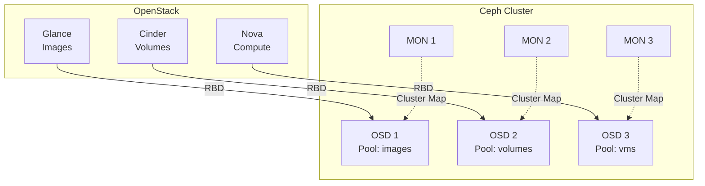

# OpenStack + Ceph Integration

## 🎯 Introduction

Ceph is the most widely used storage backend for OpenStack in production, and it delivers:

- ✅ **Unified storage**: Images, volumes and ephemeral instances on a single cluster
- ✅ **High availability**: Native replication, no single point of failure
- ✅ **Scalability**: Grows linearly as you add nodes
- ✅ **Performance**: Copy-on-write, thin provisioning, instant snapshots
- ✅ **Native integration**: RBD (RADOS Block Device) support built into OpenStack

### Integration Architecture



## 📋 Prerequisites

### A Working Ceph Cluster

- **Version**: Ceph Reef (18.x) or newer
- **Nodes**: At least 3 MON + 3 OSD
- **Health**: `ceph -s` must report `HEALTH_OK`
- **Network**: 10 Gbps or better is recommended for storage traffic

### OpenStack Already Deployed

- Kolla-Ansible with the core services up and running
- Controllers and computes able to reach the Ceph network

## 🔧 Step 1: Prepare Ceph

### 1.1 Create the Pools

Run this from a Ceph MON node:

```bash
# Calculate PGs (Placement Groups)
# Formula: (OSDs * 100) / replicas / pools
# Example: (30 OSDs * 100) / 3 replicas / 3 pools = ~333 PGs
# Round to a power of 2: 256

# Pool for Glance images
ceph osd pool create images 256
ceph osd pool application enable images rbd

# Pool for Cinder volumes
ceph osd pool create volumes 256
ceph osd pool application enable volumes rbd

# Pool for volume snapshots
ceph osd pool create backups 128
ceph osd pool application enable backups rbd

# Pool for Nova ephemeral instances
ceph osd pool create vms 256
ceph osd pool application enable vms rbd

# Set replication (size=3, min_size=2 by default)
ceph osd pool set images size 3
ceph osd pool set volumes size 3
ceph osd pool set vms size 3
ceph osd pool set backups size 3
```

### 1.2 Configure CRUSH Rules (Optional)

To get better performance out of SSD/NVMe devices:

```bash
# Create a rule for SSDs (if you have SSD-backed OSDs)
ceph osd crush rule create-replicated rule-ssd default host ssd

# Apply it to the critical pools
ceph osd pool set images crush_rule rule-ssd
ceph osd pool set volumes crush_rule rule-ssd
```

### 1.3 Create the Cephx Users

```bash
# User for Glance
ceph auth get-or-create client.glance \
  mon 'profile rbd' \
  osd 'profile rbd pool=images' \
  -o /etc/ceph/ceph.client.glance.keyring

# User for Cinder
ceph auth get-or-create client.cinder \
  mon 'profile rbd' \
  osd 'profile rbd pool=volumes, profile rbd pool=backups, profile rbd pool=vms' \
  -o /etc/ceph/ceph.client.cinder.keyring

# Note: Nova will reuse the Cinder user

# Check the permissions
ceph auth get client.glance
ceph auth get client.cinder
```

### 1.4 Generate ceph.conf

```bash
# Get a minimal ceph.conf
ceph config generate-minimal-conf

# Expected output:
# [global]
# fsid = a7f64266-0894-4f1e-a635-d0aeaca0e993
# mon_host = [v2:10.0.40.30:3300/0,v1:10.0.40.30:6789/0] [v2:10.0.40.31:3300/0,v1:10.0.40.31:6789/0] [v2:10.0.40.32:3300/0,v1:10.0.40.32:6789/0]

# Save it to a file
ceph config generate-minimal-conf > ceph.conf.minimal
```

## 🚀 Step 2: Configure OpenStack (Kolla-Ansible)

### 2.1 Copy the Ceph Files to Controllers and Computes

From the deployment node:

```bash
# Create the directories for the Ceph configs
sudo mkdir -p /etc/kolla/config/glance
sudo mkdir -p /etc/kolla/config/cinder
sudo mkdir -p /etc/kolla/config/nova

# Copy ceph.conf and the keyrings from the Ceph MON
# (assuming you have SSH access to storage01)

# ceph.conf
scp storage01:/etc/ceph/ceph.conf /tmp/ceph.conf
sudo cp /tmp/ceph.conf /etc/kolla/config/glance/
sudo cp /tmp/ceph.conf /etc/kolla/config/cinder/
sudo cp /tmp/ceph.conf /etc/kolla/config/nova/

# Keyrings
scp storage01:/etc/ceph/ceph.client.glance.keyring /tmp/
scp storage01:/etc/ceph/ceph.client.cinder.keyring /tmp/

sudo cp /tmp/ceph.client.glance.keyring /etc/kolla/config/glance/
sudo cp /tmp/ceph.client.cinder.keyring /etc/kolla/config/cinder/
sudo cp /tmp/ceph.client.cinder.keyring /etc/kolla/config/nova/ceph.client.cinder.keyring

# Fix the permissions
sudo chown -R kolla:kolla /etc/kolla/config/
```

### 2.2 Configure globals.yml

Edit `/etc/kolla/globals.yml`:

```yaml
# Enable Ceph
enable_ceph: "no"  # Leave it as "no" when Ceph is external

# Ceph backend per service
glance_backend_ceph: "yes"
glance_backend_file: "no"
cinder_backend_ceph: "yes"
nova_backend_ceph: "yes"

# Ceph settings
ceph_glance_user: "glance"
ceph_glance_keyring: "ceph.client.glance.keyring"
ceph_glance_pool_name: "images"

ceph_cinder_user: "cinder"
ceph_cinder_keyring: "ceph.client.cinder.keyring"
ceph_cinder_pool_name: "volumes"
ceph_cinder_backup_pool_name: "backups"

ceph_nova_user: "cinder"  # Nova reuses the Cinder user
ceph_nova_keyring: "ceph.client.cinder.keyring"
ceph_nova_pool_name: "vms"

# Ceph cluster FSID (get it with: ceph -s)
ceph_cluster_fsid: "a7f64266-0894-4f1e-a635-d0aeaca0e993"

# RBD settings
ceph_rbd_cache: "true"
ceph_rbd_cache_writethrough_until_flush: "true"
ceph_rbd_cache_size: "67108864"  # 64 MB
ceph_rbd_cache_max_dirty: "50331648"  # 48 MB
```

### 2.3 Configure Cinder with the Ceph Backend

Create `/etc/kolla/config/cinder/cinder-volume.conf`:

```ini
[DEFAULT]
enabled_backends = rbd-1

[rbd-1]
volume_driver = cinder.volume.drivers.rbd.RBDDriver
volume_backend_name = rbd-1
rbd_pool = volumes
rbd_ceph_conf = /etc/ceph/ceph.conf
rbd_flatten_volume_from_snapshot = false
rbd_max_clone_depth = 5
rbd_store_chunk_size = 4
rados_connect_timeout = -1
rbd_user = cinder
rbd_secret_uuid = {{ cinder_rbd_secret_uuid }}  # Kolla generates this automatically
```

### 2.4 Configure Glance with the Ceph Backend

Create `/etc/kolla/config/glance/glance-api.conf`:

```ini
[glance_store]
stores = rbd
default_store = rbd
rbd_store_pool = images
rbd_store_user = glance
rbd_store_ceph_conf = /etc/ceph/ceph.conf
rbd_store_chunk_size = 8
```

### 2.5 Configure Nova to Use Ceph

Create `/etc/kolla/config/nova/nova-compute.conf`:

```ini
[libvirt]
images_type = rbd
images_rbd_pool = vms
images_rbd_ceph_conf = /etc/ceph/ceph.conf
rbd_user = cinder
rbd_secret_uuid = {{ cinder_rbd_secret_uuid }}
disk_cachemodes = "network=writeback"
hw_disk_discard = unmap
```

## 🔄 Step 3: Deploy the Configuration

### 3.1 Reconfigure

```bash
# Activate the virtualenv
source ~/kolla-venv/bin/activate

# Validate the configuration
kolla-ansible -i /etc/kolla/multinode prechecks

# Reconfigure the services
kolla-ansible -i /etc/kolla/multinode reconfigure --tags glance,cinder,nova

# Wait for the containers to be recreated (~2-5 minutes)
watch docker ps
```

### 3.2 Verify the Integration

```bash
source /etc/kolla/admin-openrc.sh

# Check the Cinder services
openstack volume service list

# Expected output:
# +------------------+------------------+------+---------+-------+----------------------------+
# | Binary           | Host             | Zone | Status  | State | Updated At                 |
# +------------------+------------------+------+---------+-------+----------------------------+
# | cinder-scheduler | controller01     | nova | enabled | up    | 2026-01-25T10:30:45.000000 |
# | cinder-volume    | controller01@rbd-1 | nova | enabled | up    | 2026-01-25T10:30:42.000000 |
# +------------------+------------------+------+---------+-------+----------------------------+

# Check the Cinder backend
openstack volume type list

# Create a volume type for Ceph
openstack volume type create ceph-rbd
openstack volume type set ceph-rbd --property volume_backend_name=rbd-1

# Check Glance
openstack image list
```

## ✅ Step 4: Functional Testing

### 4.1 Test Glance (Images on Ceph)

```bash
# Download a test image
wget http://download.cirros-cloud.net/0.6.2/cirros-0.6.2-x86_64-disk.img

# Upload it to Glance
openstack image create "cirros-ceph" \
  --file cirros-0.6.2-x86_64-disk.img \
  --disk-format qcow2 \
  --container-format bare \
  --public

# Check it on Ceph
# From a Ceph node:
rbd ls images
rbd info images/<image-UUID>

# Expected output:
# rbd image 'a7f64266-0894-...':
#     size 117 MiB in 15 objects
#     order 23 (8 MiB objects)
#     snapshot_count: 0
#     block_name_prefix: rbd_data.123456789
#     format: 2
```

### 4.2 Test Cinder (Volumes on Ceph)

```bash
# Create a volume
openstack volume create --size 10 --type ceph-rbd test-volume

# Check its status
openstack volume list

# Check it on Ceph
# From a Ceph node:
rbd ls volumes
rbd info volumes/volume-<UUID>

# Expected output:
# rbd image 'volume-a7f64266...':
#     size 10 GiB in 2560 objects
#     order 22 (4 MiB objects)
```

### 4.3 Test Nova (Ephemeral Instances on Ceph)

```bash
# Boot an instance from the Ceph-backed image
openstack server create \
  --flavor m1.small \
  --image cirros-ceph \
  --network demo-net \
  test-instance-ceph

# Check it on Ceph (may take a few seconds)
# From a Ceph node:
rbd ls vms

# Expected output:
# <instance-UUID>_disk
```

### 4.4 Test Snapshots

```bash
# Create a volume snapshot
openstack volume snapshot create --volume test-volume test-snapshot

# Check it on Ceph
rbd snap ls volumes/volume-<UUID>

# Create a volume from the snapshot
openstack volume create --snapshot test-snapshot --size 10 test-volume-from-snap

# Confirm it uses CoW (copy-on-write)
rbd info volumes/volume-<new-UUID>
# It should show: parent: volumes/volume-<original-UUID>@snapshot-<UUID>
```

## 🔍 Common Operations

### Monitor Pool Usage

```bash
# From a Ceph node
ceph df

# Output:
# --- RAW STORAGE ---
# CLASS     SIZE    AVAIL     USED  RAW USED  %RAW USED
# ssd      30 TiB  25 TiB  5.0 TiB   5.0 TiB      16.67
# TOTAL    30 TiB  25 TiB  5.0 TiB   5.0 TiB      16.67
#
# --- POOLS ---
# POOL        ID  PGS  STORED  OBJECTS  USED    %USED  MAX AVAIL
# images       1  256  500 GiB    12.5k  1.5 TiB   6.00     8.3 TiB
# volumes      2  256  2.0 TiB      50k  6.0 TiB  24.00     8.3 TiB
# vms          3  256  1.5 TiB      37k  4.5 TiB  18.00     8.3 TiB
# backups      4  128  100 GiB     2.5k  300 GiB   1.20     8.3 TiB
```

### Adjust Pool Quotas

```bash
# Cap the maximum pool size
ceph osd pool set-quota volumes max_bytes $((10 * 1024**4))  # 10 TB

# Cap the object count
ceph osd pool set-quota images max_objects 100000
```

### Clean Up Orphaned Images

```bash
# Sometimes images are left behind in Ceph with no reference in Glance
# List the images in Glance
openstack image list -f value -c ID > /tmp/glance_images.txt

# List the images in Ceph
rbd ls images > /tmp/ceph_images.txt

# Compare and remove the orphans (BE CAREFUL!)
# Review them by hand before deleting anything
```

### Migrate a Volume Between Backends

```bash
# If you run multiple backends (e.g., LVM + Ceph)
openstack volume migrate <volume-id> --host controller01@rbd-1
```

## 🛡️ Best Practices

### 1. Performance Settings

```ini
# In cinder-volume.conf and nova-compute.conf
rbd_cache = true
rbd_cache_writethrough_until_flush = true
rbd_cache_max_dirty = 50331648  # 48 MB
rbd_cache_target_dirty = 33554432  # 32 MB
```

### 2. Networking

- **Split the networks**: Storage front-end (client) and back-end (OSD replication)
- **Jumbo frames MTU**: 9000 on storage networks
- **Bonding**: LACP or active-backup for redundancy

### 3. Pool Sizing

```bash
# Rule of thumb for PGs:
# Total PGs = (Total OSDs * 100) / Replicas
# Then divide by the number of pools

# Example with 30 OSDs, 3 replicas, 4 pools:
# (30 * 100) / 3 = 1000 PGs total
# 1000 / 4 pools = 250 PGs per pool
# Round to the nearest power of 2: 256
```

### 4. Backups

```bash
# Enable Cinder backups to Ceph
# In /etc/kolla/config/cinder/cinder-backup.conf
[DEFAULT]
backup_driver = cinder.backup.drivers.ceph.CephBackupDriver
backup_ceph_conf = /etc/ceph/ceph.conf
backup_ceph_user = cinder
backup_ceph_chunk_size = 134217728  # 128 MB
backup_ceph_pool = backups
backup_ceph_stripe_unit = 0
backup_ceph_stripe_count = 0
```

### 5. Monitoring

```bash
# Prometheus exporters
# Enable in globals.yml:
enable_prometheus_ceph_mgr_exporter: "yes"

# Preconfigured Grafana dashboards:
# - Ceph Cluster Overview
# - Ceph Pools
# - Ceph OSDs
```

## 🐛 Common Troubleshooting

### Problem: cinder-volume does not start

```bash
# Check the logs
docker logs cinder_volume

# Common error: "No secret with matching uuid"
# Fix: make sure cinder_rbd_secret_uuid is registered in libvirt
# On every compute node:
docker exec nova_libvirt virsh secret-list

# If it is missing, recreate it:
kolla-ansible -i /etc/kolla/multinode reconfigure --tags nova
```

### Problem: Glance cannot upload images

```bash
# Check the keyring permissions
docker exec glance_api ls -la /etc/ceph/
docker exec glance_api cat /etc/ceph/ceph.client.glance.keyring

# Check connectivity to Ceph
docker exec glance_api ceph -s --id glance
```

### Problem: Instances fail to boot

```bash
# Check the Nova logs
docker logs nova_compute

# Common error: "Permission denied on RBD"
# Make sure the cinder user has permissions on the vms pool
ceph auth get client.cinder

# It must include:
# osd 'profile rbd pool=vms'
```

### Problem: Poor performance

```bash
# Check Ceph latency
ceph osd perf

# Check that PGs are balanced
ceph pg dump pgs | awk '{print $1, $15}'

# Tune the RBD cache
# Show the current settings:
docker exec nova_compute cat /etc/nova/nova.conf | grep rbd_cache
```

## 📊 Reference Metrics

### Expected Performance (SSD)

- **IOPS (4K random read)**: 20,000+ per OSD
- **Throughput (sequential read)**: 500+ MB/s per OSD
- **Latency (avg)**: <1ms for reads, <5ms for writes

### Example Sizing

| Environment | VMs | Volumes | OSDs | Raw Capacity | Ceph RAM |
|-------------|-----|---------|------|--------------|----------|
| Small       | 50  | 100     | 6    | 12 TB        | 48 GB    |
| Medium      | 200 | 500     | 15   | 45 TB        | 120 GB   |
| Large       | 1000| 3000    | 30   | 120 TB       | 240 GB   |

## 📚 References

- [Ceph RBD OpenStack Integration](https://docs.ceph.com/en/latest/rbd/rbd-openstack/)
- [Kolla-Ansible Ceph Guide](https://docs.openstack.org/kolla-ansible/latest/reference/storage/external-ceph-guide.html)
- [OpenStack Cinder Drivers](https://docs.openstack.org/cinder/latest/configuration/block-storage/drivers/ceph-rbd-volume-driver.html)

## 🎓 Next Steps

1. **Optimization**: See [Ceph Tuning](../storage/ceph/ceph_tuning.md)
2. **Troubleshooting**: See [Common Ceph Problems](../storage/ceph/troubleshooting_ceph.md)
3. **Day-2 Operations**: See [Advanced Operations](day2.md)

---

!!! success "Integration Complete"
    If you made it this far, you have a fully working OpenStack + Ceph setup! 🎉

!!! tip "Performance Tuning"
    For heavy workloads, review the settings in [Ceph Tuning](../storage/ceph/ceph_tuning.md).
