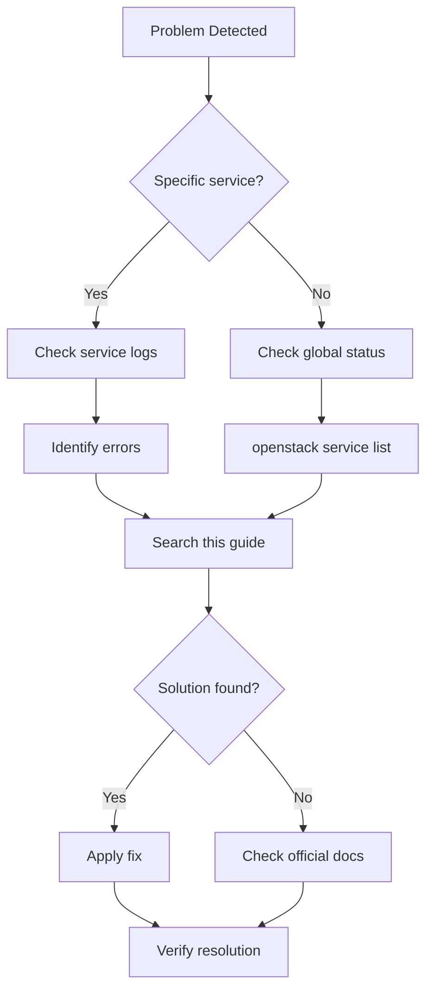

# Troubleshooting OpenStack

## 🎯 Diagnostic Methodology

### General Workflow



### Essential Diagnostic Commands

```bash
# Overall service status
openstack endpoint list
openstack service list
openstack compute service list
openstack network agent list
openstack volume service list

# Container logs
docker logs <servicio>
docker logs --tail 100 --follow nova_compute

# Container status
docker ps -a
docker stats

# System logs
journalctl -u docker -f
tail -f /var/log/kolla/*/
```

## 🔴 Keystone Issues (Authentication)

### Error: "Unable to establish connection"

**Symptom**:
```bash
$ openstack server list
Unable to establish connection to http://10.0.20.100:5000/v3
```

**Diagnosis**:

```bash
# Check whether Keystone is running
docker ps | grep keystone

# Check the logs
docker logs keystone

# Check the port
netstat -tulpn | grep 5000
```

**Solutions**:

```bash
# 1. Restart Keystone
docker restart keystone

# 2. If the container does not exist
kolla-ansible -i /etc/kolla/multinode deploy --tags keystone

# 3. Check the VIP (if running HA)
ip addr show | grep 10.0.20.100

# 4. Check haproxy
docker logs haproxy
```

### Error: "The request you have made requires authentication"

**Symptom**:
```bash
$ openstack server list
The request you have made requires authentication. (HTTP 401)
```

**Diagnosis**:

```bash
# Check credentials
cat /etc/kolla/admin-openrc.sh
echo $OS_AUTH_URL
echo $OS_PASSWORD

# Check the token
openstack token issue
```

**Solutions**:

```bash
# 1. Reload credentials
source /etc/kolla/admin-openrc.sh

# 2. Confirm the password is correct
grep keystone_admin_password /etc/kolla/passwords.yml

# 3. Create a new admin user if needed
docker exec -it keystone bash
keystone-manage bootstrap --bootstrap-password NewPassword123
```

### Error: "EndpointNotFound: publicURL endpoint not found"

**Symptom**:
Services cannot find other services' endpoints.

**Diagnosis**:

```bash
# List endpoints
openstack endpoint list

# Check the catalog
openstack catalog list
```

**Solutions**:

```bash
# Recreate the endpoints
kolla-ansible -i /etc/kolla/multinode deploy --tags keystone

# Check the VIP configuration
grep kolla_internal_vip_address /etc/kolla/globals.yml
```

## 🖥️ Nova Issues (Compute)

### Error: "No valid host was found"

**Symptom**:
```bash
$ openstack server create ...
No valid host was found. There are not enough hosts available.
```

**Diagnosis**:

```bash
# Check hypervisors
openstack hypervisor list
openstack hypervisor show <id>

# Check available resources
openstack hypervisor stats show

# Check compute service status
openstack compute service list

# Scheduler logs
docker logs nova_scheduler | grep -i "no valid host"
```

**Common causes**:

1. **Insufficient resources**:
```bash
# Review resources
openstack hypervisor stats show

# Output:
# +----------------------+-------+
# | Field                | Value |
# +----------------------+-------+
# | count                | 2     |
# | current_workload     | 0     |
# | disk_available_least | 50    |
# | free_disk_gb         | 100   |
# | free_ram_mb          | 32768 |
# | local_gb             | 500   |
# | local_gb_used        | 400   |  # ALMOST FULL!
# | memory_mb            | 65536 |
# | memory_mb_used       | 32768 |
# | running_vms          | 10    |
# | vcpus                | 32    |
# | vcpus_used           | 20    |
# +----------------------+-------+

# Fix: add more compute nodes or clean up instances
```

2. **Compute service DOWN**:
```bash
# Review services
openstack compute service list

# Output:
# +----+----------------+-------------+----------+---------+-------+
# | ID | Binary         | Host        | State    | Status  | Zone  |
# +----+----------------+-------------+----------+---------+-------+
# | 1  | nova-scheduler | controller  | up       | enabled | nova  |
# | 2  | nova-conductor | controller  | up       | enabled | nova  |
# | 3  | nova-compute   | compute01   | down     | enabled | nova  | # PROBLEM!
# | 4  | nova-compute   | compute02   | up       | enabled | nova  |
# +----+----------------+-------------+----------+---------+-------+

# Fix: restart the service
# On compute01:
docker restart nova_compute
```

3. **Placement filters too restrictive**:
```bash
# Review active filters
docker exec nova_scheduler grep scheduler_default_filters /etc/nova/nova.conf

# Temporarily disable filters (debugging only)
# Edit /etc/kolla/config/nova/nova-scheduler.conf:
[filter_scheduler]
enabled_filters = RetryFilter,AvailabilityZoneFilter,ComputeFilter

# Reconfigure
kolla-ansible -i /etc/kolla/multinode reconfigure --tags nova
```

### Error: Instance stuck in ERROR state

**Symptom**:
```bash
$ openstack server list
+--------------------------------------+------+--------+------------------+
| ID                                   | Name | Status | Networks         |
+--------------------------------------+------+--------+------------------+
| 123...                               | vm1  | ERROR  | N/A (Network...) |
+--------------------------------------+------+--------+------------------+
```

**Diagnosis**:

```bash
# Review the error details
openstack server show <server-id>

# Review nova-compute logs
docker logs nova_compute | grep <server-id>

# Review the fault message
openstack server show <server-id> -f value -c fault
```

**Solutions by error**:

1. **"No such file or directory: '/etc/nova/nova-cpu.conf'"**:
```bash
# Recreate the configuration
kolla-ansible -i /etc/kolla/multinode reconfigure --tags nova
```

2. **"Insufficient memory"**:
```bash
# Adjust overcommit in /etc/kolla/config/nova/nova-compute.conf
[DEFAULT]
ram_allocation_ratio = 2.0  # Allow 2x overcommit
cpu_allocation_ratio = 4.0

kolla-ansible -i /etc/kolla/multinode reconfigure --tags nova
```

3. **"Volume attachment failed"**:
```bash
# Check cinder
openstack volume list
docker logs cinder_volume
```

### Issue: VNC console not working

**Symptom**:
The instance console cannot be reached from Horizon.

**Diagnosis**:

```bash
# Get the console URL
openstack console url show <server-id>

# Check novncproxy
docker ps | grep novncproxy
docker logs nova_novncproxy

# Check the configuration
docker exec nova_compute grep -A5 "\[vnc\]" /etc/nova/nova.conf
```

**Solutions**:

```bash
# Make sure novncproxy_base_url is reachable
# In /etc/kolla/globals.yml:
nova_novncproxy_base_url: "http://192.168.100.100:6080/vnc_auto.html"

# Reconfigure
kolla-ansible -i /etc/kolla/multinode reconfigure --tags nova

# Check the firewall
sudo ufw allow 6080/tcp
```

## 🌐 Neutron Issues (Networking)

### Error: "Network is not available"

**Symptom**:
Instances cannot be created on a network.

**Diagnosis**:

```bash
# Review the network status
openstack network show <network-id>

# Review agents
openstack network agent list

# Check the DHCP agent
docker logs neutron_dhcp_agent

# Check the L3 agent
docker logs neutron_l3_agent
```

**Solutions**:

```bash
# 1. Restart the agents
docker restart neutron_dhcp_agent
docker restart neutron_l3_agent
docker restart neutron_openvswitch_agent

# 2. Recreate the DHCP ports
neutron dhcp-agent-network-remove <dhcp-agent-id> <network-id>
neutron dhcp-agent-network-add <dhcp-agent-id> <network-id>

# 3. Check the external network configuration
openstack network show public1 --fit-width
# It must have: router:external=True
```

### Issue: Instances without an IP (DHCP)

**Symptom**:
The instance is created but gets no IP address.

**Diagnosis**:

```bash
# Review ports
openstack port list --server <server-id>

# Review DHCP logs
docker logs neutron_dhcp_agent | grep <port-id>

# Check the network namespace
sudo ip netns
sudo ip netns exec qdhcp-<network-id> ip addr
```

**Solutions**:

```bash
# 1. Restart the DHCP agent
docker restart neutron_dhcp_agent

# 2. Recreate the port
openstack port delete <port-id>
openstack server reboot <server-id>

# 3. Check the subnet
openstack subnet show <subnet-id>
# enable_dhcp must be True
```

### Issue: No external connectivity (Floating IPs)

**Symptom**:
Floating IP assigned but no connectivity.

**Diagnosis**:

```bash
# Check the router
openstack router show <router-id>

# Check the gateway
openstack router show <router-id> -f value -c external_gateway_info

# Check NAT inside the namespace
sudo ip netns exec qrouter-<router-id> iptables -t nat -L

# Traceroute from the instance
```

**Solutions**:

```bash
# 1. Check the external gateway
openstack router set <router-id> --external-gateway public1

# 2. Check security groups
openstack security group rule list default

# Add an ICMP rule if missing:
openstack security group rule create \
  --protocol icmp \
  --ingress \
  default

# 3. Check the physical bridge
# On the network node:
sudo ovs-vsctl show
# br-ex must have the external interface
```

### Error: "External network <uuid> is not reachable from subnet <uuid>"

**Solution**:

```bash
# Configure the router correctly
openstack router set <router-id> \
  --external-gateway <external-network-id> \
  --fixed-ip subnet=<external-subnet-id>,ip-address=192.168.100.10
```

## 💾 Cinder Issues (Volumes)

### Error: "Volume backend unavailable"

**Symptom**:
```bash
$ openstack volume create --size 10 test
Volume backend unavailable (HTTP 500)
```

**Diagnosis**:

```bash
# Review Cinder services
openstack volume service list

# Review the logs
docker logs cinder_volume
docker logs cinder_scheduler

# Check the backend
docker exec cinder_volume cinder-manage service list
```

**Solutions by backend**:

#### Ceph RBD:

```bash
# Check connectivity to Ceph
docker exec cinder_volume ceph -s --id cinder

# Check the keyring
docker exec cinder_volume cat /etc/ceph/ceph.client.cinder.keyring

# Check the pool
docker exec cinder_volume rbd ls volumes

# Restart the service
docker restart cinder_volume
```

#### LVM:

```bash
# Check the volume group
sudo vgs
sudo lvs

# Check free space
sudo vgs cinder-volumes

# Extend the VG if needed
sudo vgextend cinder-volumes /dev/sdb
```

### Issue: Volume stuck in "attaching"

**Symptom**:
The volume never attaches to the instance.

**Diagnosis**:

```bash
# Review the state
openstack volume show <volume-id>

# Review the connections
docker exec cinder_volume cinder-manage volume list

# nova-compute logs
docker logs nova_compute | grep <volume-id>
```

**Solutions**:

```bash
# 1. Force a detach
openstack volume set --detached <volume-id>

# 2. Reset the state
openstack volume set --state available <volume-id>

# 3. Restart the services
docker restart cinder_volume nova_compute

# 4. If using Ceph, check rbd
rbd ls volumes
rbd status volumes/volume-<uuid>
```

## 🖼️ Glance Issues (Images)

### Error: "Image upload failed"

**Symptom**:
Images cannot be uploaded.

**Diagnosis**:

```bash
# Review the logs
docker logs glance_api

# Check disk space
df -h

# If using Ceph
docker exec glance_api rbd ls images
```

**Solutions**:

```bash
# 1. Check the backend
docker exec glance_api grep -A10 "\[glance_store\]" /etc/glance/glance-api.conf

# 2. Clean up old images
openstack image list --property status=deleted
# Delete any leftovers manually

# 3. If using Ceph, check the permissions
ceph auth get client.glance
```

### Issue: Corrupted image

**Symptom**:
Instances fail to boot from an image.

**Diagnosis**:

```bash
# Check the checksum
openstack image show <image-id> -c checksum

# Download and verify
openstack image save --file /tmp/test.img <image-id>
md5sum /tmp/test.img

# If using Ceph
rbd export images/<image-uuid> /tmp/test-from-ceph.img
md5sum /tmp/test-from-ceph.img
```

**Solutions**:

```bash
# Re-upload the image
openstack image delete <image-id>
openstack image create \
  --file /path/to/image.qcow2 \
  --disk-format qcow2 \
  --container-format bare \
  --public \
  --property hw_disk_bus=scsi \
  --property hw_scsi_model=virtio-scsi \
  new-image-name
```

## 🔥 Heat Issues (Orchestration)

### Error: "Resource CREATE failed"

**Diagnosis**:

```bash
# Review the stack details
openstack stack show <stack-name>

# Review the resources
openstack stack resource list <stack-name>

# Review the events
openstack stack event list <stack-name>

# Review the logs
docker logs heat_engine
```

**Solution**:

```bash
# Review the template
openstack stack template show <stack-name> > /tmp/template.yaml

# Validate the syntax
heat template-validate -f /tmp/template.yaml

# Recreate the stack
openstack stack delete <stack-name>
openstack stack create -t /tmp/template-fixed.yaml new-stack
```

## 🔧 Diagnostic Tools

### Health Check Script

```bash
#!/bin/bash
# openstack-health-check.sh

echo "=== OpenStack Health Check ==="
echo

echo "1. Keystone (Identity)"
openstack token issue &> /dev/null && echo "✅ OK" || echo "❌ FAIL"

echo "2. Nova (Compute)"
openstack hypervisor list &> /dev/null && echo "✅ OK" || echo "❌ FAIL"

echo "3. Neutron (Network)"
openstack network agent list &> /dev/null && echo "✅ OK" || echo "❌ FAIL"

echo "4. Cinder (Volume)"
openstack volume service list &> /dev/null && echo "✅ OK" || echo "❌ FAIL"

echo "5. Glance (Image)"
openstack image list &> /dev/null && echo "✅ OK" || echo "❌ FAIL"

echo
echo "=== Service Status ==="
openstack compute service list
echo
openstack network agent list
echo
openstack volume service list
```

### Cleanup Script

```bash
#!/bin/bash
# cleanup-stale-resources.sh

echo "Cleaning up orphaned resources..."

# Delete ports with no device
for port in $(openstack port list --device-owner none -f value -c ID); do
  echo "Deleting port $port"
  openstack port delete $port
done

# Delete routers with no gateway
for router in $(openstack router list -f value -c ID); do
  gw=$(openstack router show $router -f value -c external_gateway_info)
  if [ "$gw" == "None" ]; then
    echo "Router $router has no gateway"
  fi
done

# Delete old images stuck in 'queued' state
openstack image list --property status=queued --sort created_at:asc
```

## 📊 Important Logs

### Log Locations

```bash
# Kolla logs (on each node)
/var/log/kolla/<servicio>/

# Container logs
docker logs <contenedor>

# System logs
journalctl -u docker
/var/log/syslog
/var/log/messages
```

### Debug Levels

Edit `/etc/kolla/config/<servicio>/<servicio>.conf`:

```ini
[DEFAULT]
debug = True
verbose = True
log_date_format = %Y-%m-%d %H:%M:%S
```

Reconfigure:

```bash
kolla-ansible -i /etc/kolla/multinode reconfigure --tags <servicio>
```

## 📚 References

- [OpenStack Operations Guide](https://docs.openstack.org/operations-guide/)
- [Kolla-Ansible Troubleshooting](https://docs.openstack.org/kolla-ansible/latest/user/troubleshooting.html)
- [OpenStack Logging](https://docs.openstack.org/oslo.log/latest/)

## 🎓 Next Steps

1. **Proactive monitoring**: See [Day-2 Operations](day2.md)
2. **Ceph troubleshooting**: See [Troubleshooting Ceph](../storage/ceph/troubleshooting_ceph.md)

---

!!! tip "Golden Rule"
    Always check the logs with `docker logs <servicio>` before restarting services.

!!! warning "Production Data"
    Never run destructive commands (delete, reset-state) without a backup first.
