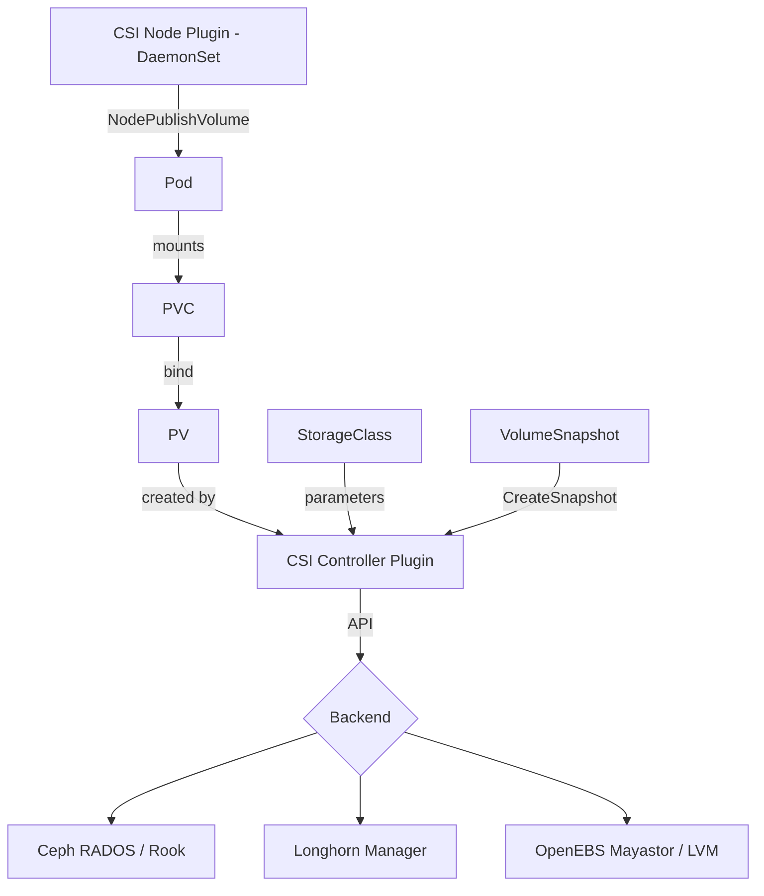
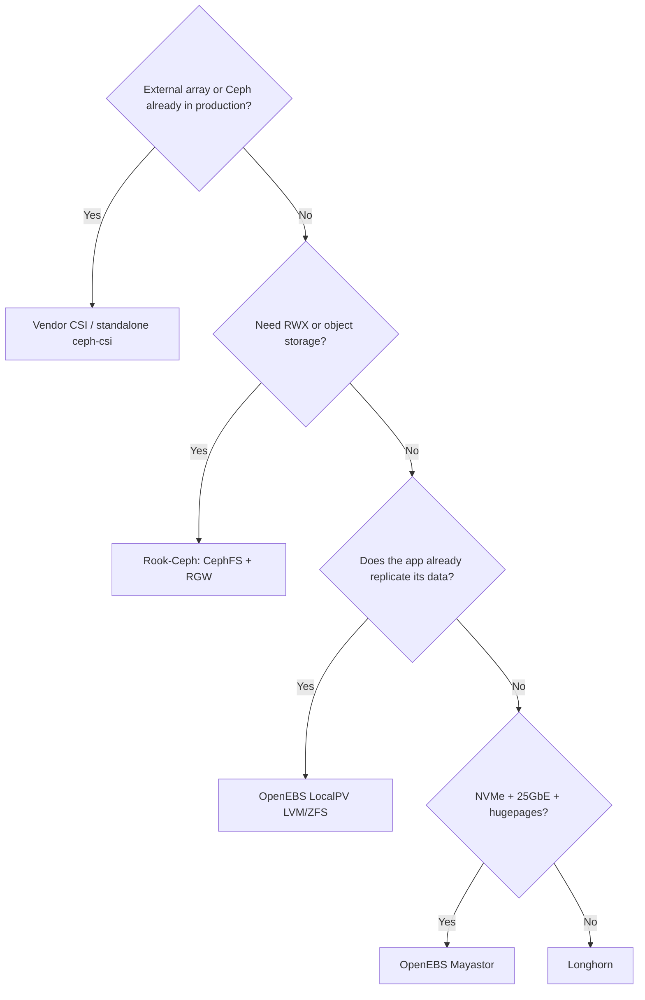

# Kubernetes Storage: Ceph RBD vs Longhorn vs OpenEBS

A pod dies and gets rescheduled onto another node. If its volume doesn't follow, you just lost the database. That is the entire reason CSI exists: decoupling the data lifecycle from the pod lifecycle, without Kubernetes needing to know anything about the specific backend.

This guide compares the three backends you actually see in production and in serious homelabs: **Ceph RBD/CephFS via Rook**, **Longhorn** and **OpenEBS**. We do not repeat the base Ceph installation here — that lives in [Ceph Base](ceph/ceph_base.md) and [Ceph Tuning](ceph/ceph_tuning.md). The angle here is strictly Kubernetes.

## 🧩 What CSI is and why it matters

**CSI (Container Storage Interface)** is the standard API that lets any storage provider integrate with Kubernetes without code in the Kubernetes tree (the old *in-tree volume plugins*, now removed).

A CSI driver has two pieces:

- **Controller plugin** (Deployment/StatefulSet): talks to the backend API to create, delete, snapshot and expand volumes.
- **Node plugin** (DaemonSet): mounts the volume on the node where the pod lives (`NodeStageVolume` / `NodePublishVolume`).

### Objects you need to know

| Object | Role |
|--------|------|
| **StorageClass** | Template: which driver, which parameters, which reclaim policy and whether expansion is allowed |
| **PersistentVolumeClaim (PVC)** | The user's request: size, access mode, class |
| **PersistentVolume (PV)** | The real volume, dynamically created by the provisioner |
| **VolumeSnapshotClass / VolumeSnapshot** | Driver-managed snapshots |
| **CSIDriver / CSINode** | Driver registration and capabilities in the cluster |

### Access modes

- **RWO** (`ReadWriteOnce`): a single node mounts read/write. Normal for block storage (RBD, Longhorn, OpenEBS).
- **RWX** (`ReadWriteMany`): several nodes at once. Requires a shared filesystem (CephFS, NFS).
- **RWOP** (`ReadWriteOncePod`): a single **pod**, not a node. Useful for databases where two replicas mounting the same volume would be catastrophic.

!!! warning "RWO does not mean 'one pod'"
    `ReadWriteOnce` allows **several pods on the same node** to mount the volume simultaneously. If you need true exclusivity, use `ReadWriteOncePod` (GA since Kubernetes 1.29).



## 🏗️ The three backends

### Ceph RBD / CephFS with Rook

**Architecture.** Rook is an operator that deploys and manages Ceph **inside** Kubernetes (MON, OSD, MGR, MDS as pods). The `ceph-csi` driver exposes two provisioners: `rook-ceph.rbd.csi.ceph.com` (block, RWO) and `rook-ceph.cephfs.csi.ceph.com` (file, RWX). You can also run `ceph-csi` **standalone** against an external Ceph cluster managed with `cephadm` — the typical case when you already have Ceph running (see [Ceph Base](ceph/ceph_base.md)).

**Replication.** CRUSH, at pool level: 3x replication or erasure coding. Placement is decided by Ceph according to the *failure domain* (host, rack, datacenter), not by Kubernetes.

```bash
helm repo add rook-release https://charts.rook.io/release
helm install --create-namespace --namespace rook-ceph \
  rook-ceph rook-release/rook-ceph
helm install --namespace rook-ceph \
  rook-ceph-cluster rook-release/rook-ceph-cluster \
  --set operatorNamespace=rook-ceph
```

For an **external** cluster (recommended if you already run Ceph):

```bash
# On the Ceph cluster: export credentials
python3 create-external-cluster-resources.py \
  --rbd-data-pool-name kubernetes \
  --cephfs-filesystem-name cephfs \
  --namespace rook-ceph-external --format bash
```

### Longhorn

**Architecture.** Each volume has an **engine** (a user-space process, one per volume, on the workload's node) and N **replicas** (processes writing to disks on different nodes). The engine performs synchronous replication toward its replicas. Everything runs in user space, no kernel modules — hence its ease of deployment and its performance ceiling.

**Replication.** At volume level: `numberOfReplicas: 3` in the StorageClass. Node/zone anti-affinity is configurable.

```bash
helm repo add longhorn https://charts.longhorn.io
helm install longhorn longhorn/longhorn \
  --namespace longhorn-system --create-namespace \
  --set defaultSettings.defaultDataPath=/var/lib/longhorn \
  --set defaultSettings.replicaSoftAntiAffinity=false
```

!!! note "The forgotten requirement"
    Longhorn needs `open-iscsi` and `nfs-common` (for RWX) installed **on every node**. Without them the PVC sits in `Pending` with a cryptic `iscsiadm` error.

### OpenEBS

OpenEBS is not one engine, it is a family. The ones that matter today:

- **Mayastor** (`io.openebs.csi-mayastor`): NVMe-oF + SPDK, hugepages, synchronous replicas. The highest performer of the three by a wide margin, and the most demanding in requirements.
- **LocalPV LVM / ZFS** (`local.csi.openebs.io`, `zfs.csi.openebs.io`): **local** storage without replication. Minimal latency, zero HA — replication is the application's job (Cassandra, Kafka, etcd).
- **Jiva / cStor**: legacy, in maintenance mode. Do not use them for new deployments.

```bash
helm repo add openebs https://openebs.github.io/openebs
helm install openebs openebs/openebs \
  --namespace openebs --create-namespace \
  --set engines.replicated.mayastor.enabled=true \
  --set engines.local.lvm.enabled=true
```

!!! danger "Mayastor demands hugepages"
    Every node needs at least 2 GiB of hugepages (`vm.nr_hugepages=1024`) and the `nvme_tcp` module loaded. If they are missing, the DaemonSet starts in `CrashLoopBackOff` with no clear message. Check with `grep HugePages_Total /proc/meminfo` before installing.

## 📊 Detailed comparison

| Aspect | Ceph RBD/CephFS (Rook) | Longhorn | OpenEBS (Mayastor / LocalPV) |
|--------|------------------------|----------|------------------------------|
| **License** | LGPL / Apache 2.0 | Apache 2.0 (CNCF graduated) | Apache 2.0 (CNCF sandbox) |
| **Operational complexity** | ⭐⭐⭐⭐⭐ (high) | ⭐⭐ (low) | ⭐⭐⭐ / ⭐ |
| **RWO** | ✅ RBD | ✅ | ✅ |
| **RWX** | ✅ CephFS (native) | ⚠️ via NFS share-manager | ❌ Mayastor / ❌ LocalPV |
| **CSI snapshots** | ✅ RBD + CephFS | ✅ | ✅ Mayastor / ✅ LVM+ZFS |
| **Clones** | ✅ native CoW | ✅ | ✅ |
| **Online expansion** | ✅ | ✅ | ✅ Mayastor, ⚠️ LVM |
| **Native backup** | ✅ RBD mirror / export | ✅ built-in to S3/NFS | ⚠️ engine-dependent |
| **Erasure coding** | ✅ | ❌ | ❌ |
| **Object storage (S3)** | ✅ RGW | ❌ | ❌ |
| **Node requirements** | Raw disks, 10G+ network | `open-iscsi`, `nfs-common` | Hugepages, `nvme_tcp` (Mayastor) |
| **CPU/RAM overhead** | High (OSD ≈ 4 GiB each) | Medium | High (SPDK reserves cores) |
| **Relative performance** | ⭐⭐⭐⭐ | ⭐⭐⭐ | ⭐⭐⭐⭐⭐ |
| **Proven scale** | Petabytes | Tens of TB | Tens of TB |
| **External cluster** | ✅ ceph-csi standalone | ❌ | ❌ |

## 🔧 Reference YAML

### StorageClass — Ceph RBD

```yaml
apiVersion: storage.k8s.io/v1
kind: StorageClass
metadata:
  name: ceph-rbd
provisioner: rook-ceph.rbd.csi.ceph.com
parameters:
  clusterID: rook-ceph
  pool: kubernetes
  imageFormat: "2"
  imageFeatures: layering
  csi.storage.k8s.io/provisioner-secret-name: rook-csi-rbd-provisioner
  csi.storage.k8s.io/provisioner-secret-namespace: rook-ceph
  csi.storage.k8s.io/controller-expand-secret-name: rook-csi-rbd-provisioner
  csi.storage.k8s.io/controller-expand-secret-namespace: rook-ceph
  csi.storage.k8s.io/node-stage-secret-name: rook-csi-rbd-node
  csi.storage.k8s.io/node-stage-secret-namespace: rook-ceph
  csi.storage.k8s.io/fstype: ext4
reclaimPolicy: Delete
allowVolumeExpansion: true
volumeBindingMode: Immediate
```

### StorageClass — CephFS (RWX)

```yaml
apiVersion: storage.k8s.io/v1
kind: StorageClass
metadata:
  name: ceph-fs
provisioner: rook-ceph.cephfs.csi.ceph.com
parameters:
  clusterID: rook-ceph
  fsName: cephfs
  pool: cephfs-replicated
  csi.storage.k8s.io/provisioner-secret-name: rook-csi-cephfs-provisioner
  csi.storage.k8s.io/provisioner-secret-namespace: rook-ceph
  csi.storage.k8s.io/node-stage-secret-name: rook-csi-cephfs-node
  csi.storage.k8s.io/node-stage-secret-namespace: rook-ceph
reclaimPolicy: Delete
allowVolumeExpansion: true
```

### StorageClass — Longhorn

```yaml
apiVersion: storage.k8s.io/v1
kind: StorageClass
metadata:
  name: longhorn-r3
provisioner: driver.longhorn.io
parameters:
  numberOfReplicas: "3"
  staleReplicaTimeout: "30"
  fsType: ext4
  dataLocality: best-effort
  # Automatic snapshots and retention
  recurringJobSelector: '[{"name":"snap-daily","isGroup":false}]'
reclaimPolicy: Delete
allowVolumeExpansion: true
volumeBindingMode: Immediate
```

### StorageClass — OpenEBS Mayastor and LocalPV LVM

```yaml
---
apiVersion: storage.k8s.io/v1
kind: StorageClass
metadata:
  name: mayastor-r3
provisioner: io.openebs.csi-mayastor
parameters:
  repl: "3"
  protocol: nvmf
  fsType: xfs
reclaimPolicy: Delete
allowVolumeExpansion: true
---
apiVersion: storage.k8s.io/v1
kind: StorageClass
metadata:
  name: openebs-lvm-local
provisioner: local.csi.openebs.io
parameters:
  volgroup: vg-data
  fsType: ext4
reclaimPolicy: Delete
allowVolumeExpansion: true
# Mandatory for local storage: the scheduler must pick the node first
volumeBindingMode: WaitForFirstConsumer
```

!!! tip "`WaitForFirstConsumer` is not optional with LocalPV"
    With `Immediate`, the PV is created on an arbitrary node and the pod may land on another: `Pending` forever. With local storage **always** use `WaitForFirstConsumer`.

### PVC and expansion

```yaml
apiVersion: v1
kind: PersistentVolumeClaim
metadata:
  name: data-postgres
spec:
  accessModes: ["ReadWriteOnce"]
  storageClassName: ceph-rbd
  resources:
    requests:
      storage: 50Gi
```

Expanding means editing `spec.resources.requests.storage` (never shrink):

```bash
kubectl patch pvc data-postgres -p '{"spec":{"resources":{"requests":{"storage":"100Gi"}}}}'
kubectl get pvc data-postgres -w   # wait for status.capacity to update
```

### Snapshots

```yaml
---
apiVersion: snapshot.storage.k8s.io/v1
kind: VolumeSnapshotClass
metadata:
  name: ceph-rbd-snap
driver: rook-ceph.rbd.csi.ceph.com
parameters:
  clusterID: rook-ceph
  csi.storage.k8s.io/snapshotter-secret-name: rook-csi-rbd-provisioner
  csi.storage.k8s.io/snapshotter-secret-namespace: rook-ceph
deletionPolicy: Delete
---
apiVersion: snapshot.storage.k8s.io/v1
kind: VolumeSnapshot
metadata:
  name: postgres-2026-07-18
spec:
  volumeSnapshotClassName: ceph-rbd-snap
  source:
    persistentVolumeClaimName: data-postgres
---
# Restore: new PVC from the snapshot
apiVersion: v1
kind: PersistentVolumeClaim
metadata:
  name: data-postgres-restored
spec:
  accessModes: ["ReadWriteOnce"]
  storageClassName: ceph-rbd
  dataSource:
    name: postgres-2026-07-18
    kind: VolumeSnapshot
    apiGroup: snapshot.storage.k8s.io
  resources:
    requests:
      storage: 50Gi
```

!!! warning "Snapshot CRDs do not ship with Kubernetes"
    `VolumeSnapshot` requires installing the CRDs and the `snapshot-controller` from the `external-snapshotter` project separately. If `kubectl get volumesnapshotclass` returns `error: the server doesn't have a resource type`, this is why.

    ```bash
    kubectl apply -k "https://github.com/kubernetes-csi/external-snapshotter//client/config/crd?ref=v8.2.0"
    kubectl apply -k "https://github.com/kubernetes-csi/external-snapshotter//deploy/kubernetes/snapshot-controller?ref=v8.2.0"
    ```

!!! danger "A snapshot is not a backup"
    The snapshot lives in the same backend as the volume. Lose the pool and you lose both. Snapshots are for *fast rollback*; external/S3 backups are for *disaster*.

## 📈 Benchmarks: reproducible methodology

!!! warning "About the numbers"
    **Any published distributed-storage figure is valid only for the exact hardware that produced it.** Disks, network, CPU, block size, queue depth and even the kernel change the result by an order of magnitude. What we give here is the **method** to measure your own cluster, not a table of numbers to copy and quote. Measure yours.

### Reference hardware to declare

Before publishing any result, document at minimum:

| Variable | Example to fill in |
|----------|--------------------|
| Nodes | 3 × (CPU, RAM) |
| Disks | NVMe/SSD model, capacity, PLP? |
| Network | 10 GbE / 25 GbE, MTU, dedicated storage network? |
| Kubernetes | Version, CNI |
| Backend | Rook/Ceph, Longhorn or OpenEBS version |
| Replication | 3x, EC 4+2, etc. |
| StorageClass | fsType, parameters |

### Benchmark pod

Reuse the jobs from [fio Example](../../../doc/storage/protocols/examples/fio_example.md), but run them **inside** a pod on top of the PVC under test:

```yaml
apiVersion: v1
kind: PersistentVolumeClaim
metadata:
  name: fio-target
spec:
  accessModes: ["ReadWriteOnce"]
  storageClassName: ceph-rbd     # swap for longhorn-r3 / mayastor-r3
  resources:
    requests:
      storage: 50Gi
---
apiVersion: v1
kind: Pod
metadata:
  name: fio-bench
spec:
  restartPolicy: Never
  containers:
    - name: fio
      image: ghcr.io/xridge/fio:latest
      command: ["sleep", "infinity"]
      volumeMounts:
        - name: data
          mountPath: /data
      resources:
        requests: { cpu: "4", memory: "4Gi" }
        limits:   { cpu: "4", memory: "4Gi" }
  volumes:
    - name: data
      persistentVolumeClaim:
        claimName: fio-target
```

### The four profiles that matter

```bash
kubectl exec -it fio-bench -- sh

# 1) 4k random read IOPS — read cache and network latency
fio --name=randread --filename=/data/test --ioengine=libaio --direct=1 \
    --rw=randread --bs=4k --iodepth=32 --numjobs=4 --size=10G \
    --runtime=120 --time_based --group_reporting

# 2) 4k random write IOPS — the hard case: synchronous replication
fio --name=randwrite --filename=/data/test --ioengine=libaio --direct=1 \
    --rw=randwrite --bs=4k --iodepth=32 --numjobs=4 --size=10G \
    --runtime=120 --time_based --group_reporting

# 3) Pure latency (QD=1) — what a database feels on fsync
fio --name=lat --filename=/data/test --ioengine=libaio --direct=1 \
    --rw=randwrite --bs=4k --iodepth=1 --numjobs=1 --size=10G \
    --runtime=120 --time_based --group_reporting --lat_percentiles=1

# 4) 1M sequential throughput — restores, backups, analytics
fio --name=seqwrite --filename=/data/test --ioengine=libaio --direct=1 \
    --rw=write --bs=1M --iodepth=16 --numjobs=1 --size=20G \
    --runtime=120 --time_based --group_reporting
```

### Rules that make the measurement mean something

1. **Always `--direct=1`.** Without it you measure the node's page cache, not the backend.
2. **`--size` larger than the node's RAM** (or at least than the backend cache). A 1 GiB dataset on a 64 GiB node measures RAM.
3. **`--time_based` with `--runtime` ≥ 120s.** The first seconds are *burst*; steady state comes later.
4. **Preconditioning.** On NVMe, fill the device once before measuring writes, otherwise you are measuring fresh cells.
5. **Compare p99, not the mean.** The mean hides Ceph recovery stalls or Longhorn rebuilds.
6. **Same pod, same node, same time of day.** Change exactly one variable: the StorageClass.

!!! tip "What to expect qualitatively"
    Without giving figures: **LocalPV** approaches raw disk (no network, no replication). **Mayastor** pays an NVMe-oF network hop but keeps most of the performance. **Ceph RBD** scales in aggregate far better than it performs on a single volume. **Longhorn** takes the biggest penalty on 4k QD=1 writes due to its user-space stack. The ordering can flip on your hardware — that is why you measure.

To squeeze Ceph before comparing, apply [Ceph Tuning](ceph/ceph_tuning.md) first, and for the specific database case see [PostgreSQL on Ceph](postgresql_ceph.md).

## 🎯 When to choose each one

### Homelab (3-5 nodes, consumer disks, 1-2.5 GbE)

**Longhorn.** Installs in five minutes, has a UI, built-in S3/NFS backups and does not force you to dedicate raw disks. Performance will not be brilliant, but in a homelab your bottleneck is the network, not the storage engine.

**OpenEBS LocalPV LVM** if what you run already replicates at application level (a PostgreSQL cluster with Patroni, Kafka, Elasticsearch). Replicating twice — in the app and in storage — means paying three times to write the same thing.

### Hyperconverged production (compute and storage on the same nodes)

**Rook-Ceph** if you need real RWX, S3 object storage, erasure coding, or you will exceed a few hundred TB. Price: high operational complexity and an on-call rotation that must know Ceph.

**OpenEBS Mayastor** if the requirement is latency and you have NVMe + 25 GbE + hugepages. It is the fastest, but you give up RWX and Ceph's operational maturity.

### Existing external array (NetApp, Pure, SAN)

Do not stack a software backend on top. Use the **vendor's CSI driver** ([NetApp](netapp/netapp_base.md), [Pure Storage](pure_storage/pure_storage_base.md)) and let the array do what it already does: snapshots, replication, dedup. If you have an external Ceph managed with `cephadm`, the equivalent answer is standalone `ceph-csi`, **not** Rook.

### Quick rule



## 🛠️ Day-2 operations

### Backup with Velero

Velero backs up Kubernetes objects **and** volumes. For the latter, the modern path is *CSI snapshot data movement*, which copies the snapshot to object storage and works the same across all three backends.

```bash
velero install \
  --provider aws \
  --plugins velero/velero-plugin-for-aws:v1.11.0,velero/velero-plugin-for-csi:v0.7.0 \
  --bucket velero-backups \
  --secret-file ./credentials-velero \
  --backup-location-config region=eu-west-1,s3Url=https://s3.example.com,s3ForcePathStyle=true \
  --features=EnableCSI \
  --use-node-agent

# Backup with data movement to the bucket (backend-independent)
velero backup create postgres-daily \
  --include-namespaces databases \
  --snapshot-move-data \
  --wait

velero restore create --from-backup postgres-daily --wait
```

!!! tip "Application consistency"
    A volume snapshot is *crash-consistent*, not *application-consistent*. For databases, add Velero hooks that run `CHECKPOINT` / `FLUSH TABLES WITH READ LOCK` before the snapshot:

    ```yaml
    annotations:
      pre.hook.backup.velero.io/container: postgres
      pre.hook.backup.velero.io/command: '["/bin/sh","-c","psql -c CHECKPOINT"]'
    ```

Longhorn also ships native S3/NFS backups via `RecurringJob`, useful as a second layer independent of Velero:

```yaml
apiVersion: longhorn.io/v1beta2
kind: RecurringJob
metadata:
  name: backup-daily
  namespace: longhorn-system
spec:
  cron: "0 3 * * *"
  task: backup
  retain: 14
  concurrency: 2
```

### Node failure: what actually happens

| Backend | Behaviour when a node goes down |
|---------|--------------------------------|
| **Ceph RBD** | The node's OSDs are marked `down`; after `mon_osd_down_out_interval` (600s by default) they go `out` and backfill starts. Volumes stay accessible if enough replicas remain. |
| **Longhorn** | The engine is rescheduled on another node with a healthy replica; the volume goes `Degraded` and a new replica is rebuilt. |
| **Mayastor** | The nexus is rebuilt from a surviving replica; the volume stays online if `repl >= 2`. |
| **LocalPV** | The volume does **not** recover. The pod stays `Pending` until the node returns. By design. |

The classic deadlock: pods stuck in `Terminating` with volumes never released, because Kubernetes cannot tell whether the node is dead or just partitioned.

```bash
# See which volumes are still attached to the failed node
kubectl get volumeattachment | grep <failed-node>

# Confirm the node is truly dead and force eviction
kubectl delete node <failed-node>
```

!!! danger "Never force without confirming"
    `kubectl delete pod --force --grace-period=0` on a StatefulSet with RWO can lead to two pods mounting the same volume if the original node is still alive (split-brain, filesystem corruption). Confirm the node is powered off — physical or hypervisor fencing — before forcing anything. `ReadWriteOncePod` mitigates this at the API level.

### Planned maintenance

```bash
kubectl drain <node> --ignore-daemonsets --delete-emptydir-data
# Ceph: avoid unnecessary rebalancing during maintenance
kubectl -n rook-ceph exec deploy/rook-ceph-tools -- ceph osd set noout
# ... maintenance ...
kubectl -n rook-ceph exec deploy/rook-ceph-tools -- ceph osd unset noout
kubectl uncordon <node>
```

## 🔍 Common troubleshooting

### PVC stuck in `Pending` forever

```bash
kubectl describe pvc <pvc>                    # provisioner events
kubectl get storageclass                      # does the class exist? is there a default?
kubectl logs -n rook-ceph deploy/csi-rbdplugin-provisioner -c csi-provisioner
```

Usual causes, by frequency: misspelled StorageClass name; `volumeBindingMode: WaitForFirstConsumer` with no pod yet (this is **normal**, not an error); backend out of capacity; missing provisioner secret or one in the wrong namespace.

### Pod in `ContainerCreating` with a mount error

```bash
kubectl describe pod <pod> | tail -30
kubectl logs -n rook-ceph ds/csi-rbdplugin -c csi-rbdplugin --tail=100
journalctl -u kubelet -f    # on the affected node
```

- `rbd: map failed ... RBD image feature set mismatch`: the node kernel does not support the RBD features. Keep only `imageFeatures: layering` in the StorageClass.
- `iscsiadm: not found` (Longhorn): `open-iscsi` missing on the node.
- `Multi-Attach error for volume`: the volume is still attached to the previous node → see `volumeattachment` above.

### The PVC does not grow after editing the size

```bash
kubectl get sc <class> -o jsonpath='{.allowVolumeExpansion}'   # must be true
kubectl describe pvc <pvc> | grep -A5 Conditions
```

If you see `FileSystemResizePending`, the block device already grew but the filesystem is waiting for a remount: restart the pod. `allowVolumeExpansion` is not retroactive — enabling it now does not expand volumes from a class that previously had it `false`; the StorageClass must be recreated.

### The PV will not delete

```bash
kubectl get pv <pv> -o jsonpath='{.spec.persistentVolumeReclaimPolicy}'
kubectl patch pv <pv> -p '{"metadata":{"finalizers":null}}'   # last resort
```

!!! warning "Removing finalizers orphans the real volume"
    It deletes the PV in Kubernetes but **not** in the backend. You will have to clean up by hand (`rbd rm`, Longhorn UI) or silently lose the space.

### Quick Ceph diagnostics from Kubernetes

```bash
kubectl -n rook-ceph exec -it deploy/rook-ceph-tools -- ceph -s
kubectl -n rook-ceph exec -it deploy/rook-ceph-tools -- ceph osd df tree
kubectl -n rook-ceph exec -it deploy/rook-ceph-tools -- rbd -p kubernetes ls
```

For Ceph error detail (inactive PGs, `HEALTH_WARN`, full OSDs) see [Ceph Troubleshooting](../../../doc/storage/ceph/troubleshooting_ceph.md).

## 📚 Related links

- [Ceph Base](ceph/ceph_base.md) — architecture and installation with `cephadm`
- [Ceph Tuning](ceph/ceph_tuning.md) — cluster performance tuning
- [Ceph Troubleshooting](../../../doc/storage/ceph/troubleshooting_ceph.md) — error diagnostics
- [PostgreSQL on Ceph](postgresql_ceph.md) — databases on RBD
- [fio Example](../../../doc/storage/protocols/examples/fio_example.md) — baseline measurement jobs
- [Protocols & Metrics](protocols/protocols.md) — iSCSI, NFS, NVMe-oF
- [NetApp](netapp/netapp_base.md) and [Pure Storage](pure_storage/pure_storage_base.md) — external arrays with their own CSI
