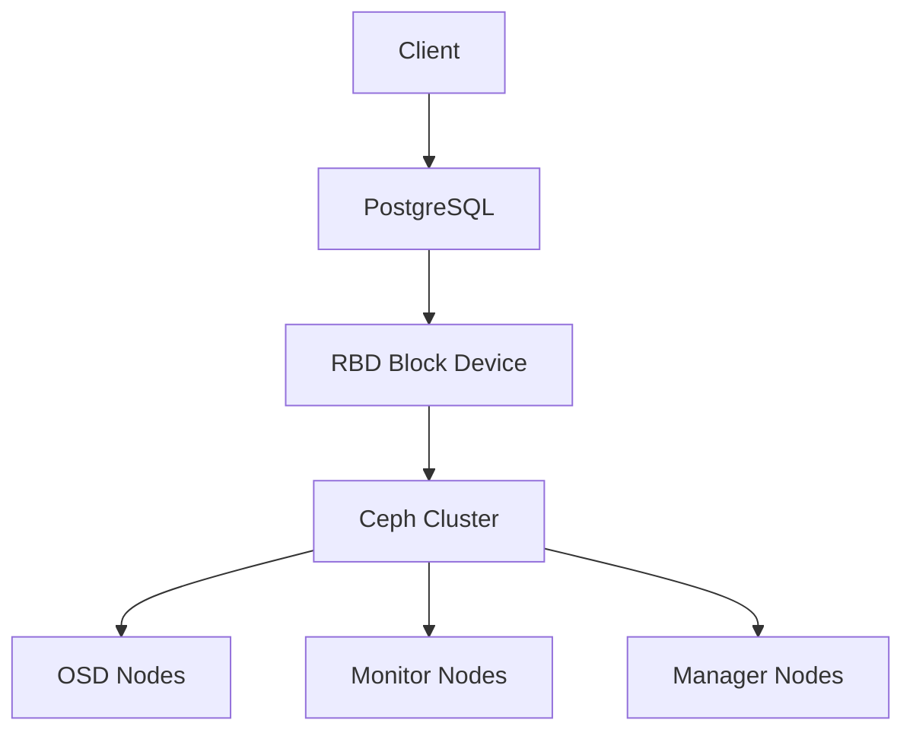

# Storage for Databases: PostgreSQL + Ceph

This guide explains how to configure PostgreSQL with Ceph as storage backend, optimizing performance and high availability for critical databases.

## 🏗️ Architecture

### Main Components



**Benefits of this combination:**
- ✅ **Scalability**: Virtually unlimited storage
- ✅ **HA**: Automatic data replication
- ✅ **Performance**: RBD optimized for databases
- ✅ **Backup**: Consistent snapshots
- ✅ **Recovery**: Minimal RTO/RPO

## 📋 Prerequisites

### Ceph Cluster
```bash
# Check cluster status
ceph status
ceph health

# Check available pools
ceph osd pool ls
```

### PostgreSQL Node
```bash
# Install Ceph tools
sudo apt update
sudo apt install ceph-common

# Copy Ceph configuration
sudo scp ceph-admin:/etc/ceph/ceph.conf /etc/ceph/
sudo scp ceph-admin:/etc/ceph/ceph.client.admin.keyring /etc/ceph/
```

## 🚀 Step-by-step Configuration

### 1. Create RBD-optimized pool
```bash
# Pool for PostgreSQL data
ceph osd pool create pg_data 128 128
ceph osd pool set pg_data size 3
ceph osd pool set pg_data min_size 2

# Pool for WAL (Write-Ahead Log)
ceph osd pool create pg_wal 64 64
ceph osd pool set pg_wal size 3
ceph osd pool set pg_wal min_size 2

# Pool for backups
ceph osd pool create pg_backup 128 128
```

### 2. Create RBD images
```bash
# Image for main data (100GB)
rbd create pg_data/postgres_data --size 100G --pool pg_data

# Image for WAL (20GB)
rbd create pg_wal/postgres_wal --size 20G --pool pg_wal

# Image for backups (200GB)
rbd create pg_backup/postgres_backup --size 200G --pool pg_backup

# Verify creation
rbd ls pg_data
rbd info pg_data/postgres_data
```

### 3. Map and format RBD
```bash
# Map devices
sudo rbd map pg_data/postgres_data
sudo rbd map pg_wal/postgres_wal

# Verify mapping
rbd showmapped

# Format with XFS (recommended for PostgreSQL)
sudo mkfs.xfs /dev/rbd/pg_data/postgres_data
sudo mkfs.xfs /dev/rbd/pg_wal/postgres_wal

# Create mount points
sudo mkdir -p /var/lib/postgresql/data
sudo mkdir -p /var/lib/postgresql/wal

# Mount
sudo mount /dev/rbd/pg_data/postgres_data /var/lib/postgresql/data
sudo mount /dev/rbd/pg_wal/postgres_wal /var/lib/postgresql/wal
```

### 4. Install and configure PostgreSQL
```bash
# Install PostgreSQL
sudo apt install postgresql postgresql-contrib

# Stop service
sudo systemctl stop postgresql

# Configure permissions
sudo chown postgres:postgres /var/lib/postgresql/data
sudo chown postgres:postgres /var/lib/postgresql/wal
```

### 5. PostgreSQL Configuration for Ceph
```bash
# File: /etc/postgresql/14/main/postgresql.conf
sudo tee /etc/postgresql/14/main/postgresql.conf > /dev/null <<EOF
# Configuration optimized for Ceph RBD
data_directory = '/var/lib/postgresql/data'
hba_file = '/etc/postgresql/14/main/pg_hba.conf'
ident_file = '/etc/postgresql/14/main/pg_ident.conf'

# Memory
shared_buffers = 256MB
effective_cache_size = 1GB
work_mem = 4MB
maintenance_work_mem = 64MB

# WAL
wal_level = replica
wal_buffers = 16MB
wal_writer_delay = 200ms
wal_writer_flush_after = 1MB

# Checkpointing
checkpoint_completion_target = 0.9
checkpoint_timeout = 15min
max_wal_size = 2GB
min_wal_size = 80MB

# Logging
log_line_prefix = '%t [%p]: [%l-1] user=%u,db=%d,app=%a,client=%h '
log_statement = 'ddl'
log_duration = on
log_lock_waits = on

# Replication (if applicable)
max_replication_slots = 10
max_wal_senders = 10

# Connections
listen_addresses = '*'
max_connections = 100
EOF
```

### 6. pg_hba.conf Configuration
```bash
# File: /etc/postgresql/14/main/pg_hba.conf
sudo tee /etc/postgresql/14/main/pg_hba.conf > /dev/null <<EOF
# TYPE  DATABASE        USER            ADDRESS                 METHOD
local   all             postgres                                peer
local   all             all                                     peer
host    all             all             127.0.0.1/32            md5
host    all             all             ::1/128                 md5
host    all             all             10.0.0.0/8              md5
host    all             all             192.168.0.0/16          md5
EOF
```

## 🔧 Performance Optimizations

### RBD Configuration
```bash
# Increase queue depth for better IOPS
rbd config global set rbd rbd_default_queue_depth 256

# Configure QoS per pool
ceph osd pool set pg_data qos_iops_limit 10000
ceph osd pool set pg_wal qos_iops_limit 5000

# Enable RBD caching
rbd config image set pg_data/postgres_data rbd_cache true
rbd config image set pg_data/postgres_data rbd_cache_max_dirty 100
```

### PostgreSQL Optimizations
```sql
-- Database configuration
ALTER SYSTEM SET shared_preload_libraries = 'pg_stat_statements';
ALTER SYSTEM SET track_io_timing = on;
ALTER SYSTEM SET track_functions = all;

-- Create user for monitoring
CREATE USER ceph_monitor WITH PASSWORD 'secure_password';
GRANT pg_monitor TO ceph_monitor;

-- Configure tablespaces if necessary
CREATE TABLESPACE ceph_data OWNER postgres LOCATION '/var/lib/postgresql/data';
CREATE TABLESPACE ceph_wal OWNER postgres LOCATION '/var/lib/postgresql/wal';
```

### Performance Monitoring
```bash
# RBD IOPS
rbd perf image iostat pg_data/postgres_data

# Ceph latency
ceph tell osd.* perf dump | jq '.osd.osd_op_lat'

# PostgreSQL statistics
psql -c "SELECT * FROM pg_stat_bgwriter;"
psql -c "SELECT * FROM pg_stat_database;"
```

## 🛡️ High Availability

### Replica Configuration
```bash
# Create snapshot for backup
rbd snap create pg_data/postgres_data@snapshot_$(date +%Y%m%d_%H%M%S)

# Clone for replica
rbd snap protect pg_data/postgres_data@snapshot_20231201_120000
rbd clone pg_data/postgres_data@snapshot_20231201_120000 pg_data/postgres_data_replica

# Configure PostgreSQL streaming replication
# In slave postgresql.conf:
# hot_standby = on
# primary_conninfo = 'host=master_ip port=5432 user=replicator'
```

### Backup Strategy
```bash
#!/bin/bash
# backup_postgres_ceph.sh

DATE=$(date +%Y%m%d_%H%M%S)
SNAP_NAME="backup_$DATE"

# Create consistent snapshot
psql -c "SELECT pg_start_backup('$SNAP_NAME');"
rbd snap create pg_data/postgres_data@$SNAP_NAME
psql -c "SELECT pg_stop_backup();"

# Export snapshot
rbd export pg_data/postgres_data@$SNAP_NAME /backup/postgres_$DATE.img

# Clean old snapshots (keep 7 days)
rbd snap ls pg_data/postgres_data | grep backup | head -n -7 | awk '{print $2}' | xargs -I {} rbd snap rm pg_data/postgres_data@{}
```

## 📊 Monitoring and Troubleshooting

### Key Metrics
```bash
# Storage usage
ceph df
rbd du pg_data/postgres_data

# PostgreSQL performance
psql -c "SELECT * FROM pg_stat_bgwriter;"
psql -c "SELECT * FROM pg_stat_database WHERE datname = 'postgres';"

# Error logs
tail -f /var/log/postgresql/postgresql-14-main.log
```

### Common Issues

#### Slow Performance
```bash
# Check RBD latency
rbd perf image iostat pg_data/postgres_data --period 10

# Adjust PostgreSQL parameters
# Increase shared_buffers if memory available
# Adjust work_mem based on complex queries
```

#### Ceph Connectivity
```bash
# Check connectivity
ceph ping mon.a
ceph ping osd.0

# Check RBD logs
dmesg | grep rbd
journalctl -u ceph-rbd-mirror
```

#### Disaster Recovery
```bash
# Simulate failure
sudo umount /var/lib/postgresql/data
sudo rbd unmap /dev/rbd/pg_data/postgres_data

# Recover
sudo rbd map pg_data/postgres_data
sudo mount /dev/rbd/pg_data/postgres_data /var/lib/postgresql/data
sudo systemctl start postgresql
```

## 🔄 Migration from Traditional Storage

### Migration Strategy
```bash
# 1. Create full backup
pg_dumpall > full_backup.sql

# 2. Stop application
sudo systemctl stop myapp

# 3. Migrate data
rsync -av /var/lib/postgresql/data/ /tmp/postgres_backup/
cp -r /tmp/postgres_backup/* /var/lib/postgresql/data/

# 4. Verify integrity
psql -c "SELECT count(*) FROM pg_database;"

# 5. Restart services
sudo systemctl start postgresql
sudo systemctl start myapp
```

## 📈 Scaling and Growth

### Adding More OSDs
```bash
# Add new OSD
ceph-deploy osd create node-03:sdb

# Rebalance data
ceph balancer on
ceph balancer mode upmap
```

### Expanding Pools
```bash
# Add more PGs if necessary
ceph osd pool set pg_data pg_num 256
ceph osd pool set pg_data pgp_num 256

# Monitor rebalancing
ceph status
watch ceph -s
```

## 📚 Additional Resources

- [Ceph Documentation - RBD](https://docs.ceph.com/en/latest/rbd/)
- [PostgreSQL + Ceph Best Practices](https://ceph.io/community/postgresql-and-ceph/)
- [Ceph Performance Tuning](https://docs.ceph.com/en/latest/rados/configuration/bluestore-config-ref/)
- [PostgreSQL Tuning](https://www.postgresql.org/docs/current/runtime-config.html)