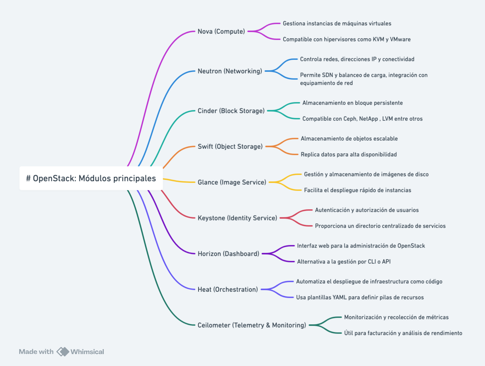

# OpenStack
{width=35%}

OpenStack is an open-source software platform for cloud computing, enabling the creation and management of public and private cloud infrastructures. It is designed to be scalable and flexible, providing a robust solution for managing computing, storage, and networking resources. OpenStack is used by a wide variety of organizations, from small businesses to large corporations and cloud service providers. 🌐

## OpenStack Modules 🚀

OpenStack is composed of a series of modules that integrate to offer a complete cloud solution. Some of the most important modules are:

- **Nova**: Provides computing services, allowing the management of virtual machines. It is the central component for managing compute instances.
- **Neutron**: Offers networking services, managing networks and IP addresses. It allows the creation of complex networks and the assignment of IPs to instances.
- **Cinder**: Provides block storage services, allowing the management of storage volumes. It is ideal for databases and applications that require persistent storage.
- **Swift**: Offers object storage, allowing the storage and retrieval of unstructured data. It is highly scalable and suitable for storing large amounts of data.
- **Glance**: Provides image management services, allowing the management of disk images. It facilitates the creation and maintenance of operating system images.
- **Keystone**: Offers identity services, managing user authentication and authorization. It is the central security component of OpenStack.
- **Horizon**: Provides a graphical user interface for managing OpenStack. It allows users to interact with OpenStack through a web browser.
- **Heat**: Offers orchestration services, allowing the management of infrastructure as code. It facilitates the automation of resource deployment.
- **Ceilometer**: Provides telemetry services, allowing the monitoring and measurement of resources. It is useful for billing and performance monitoring.

## Environments where OpenStack is Deployed 🌍

OpenStack is deployed in a variety of environments, including:

- **Public Clouds**: Cloud service providers like Rackspace and OVH use OpenStack to offer public cloud services to their customers.
- **Private Clouds**: Many companies deploy OpenStack in their own data centers to create private clouds, providing their employees and departments with a flexible and scalable infrastructure.
- **Hybrid Clouds**: OpenStack can integrate with other public cloud solutions like AWS, Azure, and Google Cloud, allowing the creation of hybrid clouds that combine the best of both worlds.
- **Research Data Centers**: Academic and research institutions use OpenStack to manage their computing and storage resources, facilitating collaboration and access to large volumes of data.
- **Telecommunications**: Telecommunications companies deploy OpenStack to manage their network infrastructures and offer advanced services to their customers.

## Distributions and Deployment Methods 🛠️

OpenStack is a powerful and flexible solution for managing cloud infrastructures, used by many organizations worldwide to build and manage their cloud environments. Its open-source nature and large community of developers and users ensure that OpenStack continues to evolve and improve over time. 🚀

There are several distributions and deployment methods for OpenStack, each with its own features and advantages. Some of the most popular are:

- **Red Hat OpenStack Platform**: A commercial distribution of OpenStack offered by Red Hat, which includes additional support and services. It is known for its stability and enterprise support.
- **Mirantis OpenStack**: Offered by Mirantis, this distribution focuses on ease of use and flexibility, providing advanced tools for managing and deploying OpenStack.
- **Canonical OpenStack**: Distributed by Canonical, the company behind Ubuntu. This version of OpenStack is optimized to work with Ubuntu and offers integration with other Canonical tools.
- **SUSE OpenStack Cloud**: A distribution of OpenStack offered by SUSE, which focuses on ease of use and integration with other SUSE solutions.
- **OpenStack-Ansible**: A deployment method that uses Ansible to automate the installation and configuration of OpenStack. It is ideal for those who prefer an Ansible-based solution.
- **Kolla-Ansible**: Uses Docker containers and Ansible to deploy OpenStack. It is known for its flexibility and ability to manage complex deployments.
- **DevStack**: A quick and easy deployment tool for developers who want to test and develop on OpenStack. It is not intended for production environments but is excellent for testing and development.

Each of these distributions and deployment methods offers different advantages and may be suitable for different use cases, depending on the specific needs of the organization and the environment in which OpenStack will be deployed.

## Use Cases and Infrastructures Using OpenStack 🏢

OpenStack is used in a variety of use cases and infrastructures, including:

- **Cloud Service Providers**: Companies like Rackspace and OVH use OpenStack to offer public cloud services to their customers, providing a scalable and flexible infrastructure.
- **Technology Companies**: Large technology corporations like Yahoo! and PayPal have implemented OpenStack to manage their private cloud infrastructures, improving efficiency and reducing costs.
- **Academic Institutions**: Universities and research centers use OpenStack to manage computing and storage resources, facilitating collaboration and access to large volumes of data.
- **Public Sector**: Governments and public agencies deploy OpenStack to create private clouds and manage their IT infrastructures more efficiently and securely.
- **Telecommunications**: Telecommunications companies like AT&T and Verizon use OpenStack to manage their network infrastructures and offer advanced services to their customers. A local example is OASIX, from Grupo Aire, one of the few Spanish clouds based on OpenStack with its own development 🇪🇸.
- **Scientific Research**: CERN, the European Organization for Nuclear Research, uses OpenStack to manage its cloud computing infrastructure, enabling the processing of large volumes of data generated by its scientific experiments.

These use cases demonstrate the versatility and capability of OpenStack to adapt to different needs and environments, providing a robust and scalable solution for managing cloud infrastructures.

**Additionally, as a collaborative open-source project**, OpenStack benefits from a global community of developers and users who continuously contribute to its improvement and evolution. This ensures that the platform remains up-to-date with the latest technological innovations and that emerging issues and needs can be quickly addressed. The open nature of OpenStack also allows organizations to customize and adapt the platform to their specific needs, fostering innovation and flexibility in cloud infrastructure management.

## Additional resources

### Official documentation
- **Official website:** [openstack.org](https://www.openstack.org/)
- **Documentation:** [docs.openstack.org](https://docs.openstack.org/)
- **GitHub:** [github.com/openstack](https://github.com/openstack)
- **Community:** [openstack.org/community](https://www.openstack.org/community/)
- **Official blog:** [openstack.org/blog](https://www.openstack.org/blog/)

### Deployment tools
- **Kolla-Ansible:** [github.com/openstack/kolla-ansible](https://github.com/openstack/kolla-ansible)
- **Kolla-Ansible Documentation:** [docs.openstack.org/kolla-ansible](https://docs.openstack.org/kolla-ansible/latest/)
- **OpenStack-Ansible:** [github.com/openstack/openstack-ansible](https://github.com/openstack/openstack-ansible)
- **DevStack:** [github.com/openstack/devstack](https://github.com/openstack/devstack)

### Commercial distributions
- **Red Hat OpenStack Platform:** [redhat.com/en/technologies/linux-platforms/openstack-platform](https://www.redhat.com/en/technologies/linux-platforms/openstack-platform)
- **Mirantis OpenStack:** [mirantis.com/software/openstack](https://www.mirantis.com/software/openstack/)
- **Canonical OpenStack:** [ubuntu.com/openstack](https://ubuntu.com/openstack)
- **SUSE OpenStack Cloud:** [suse.com/products/openstack-cloud](https://www.suse.com/products/openstack-cloud/)

### Community and support
- **Reddit:** [r/openstack](https://www.reddit.com/r/openstack/)
- **Stack Overflow:** [stackoverflow.com/questions/tagged/openstack](https://stackoverflow.com/questions/tagged/openstack)
- **IRC:** #openstack on freenode
- **Official forums:** [ask.openstack.org](https://ask.openstack.org/)

### Notable use cases
- **OASIX Cloud (Grupo Aire):** [oasixcloud.es](https://oasixcloud.es) - One of the few Spanish clouds based on OpenStack with its own development 🇪🇸