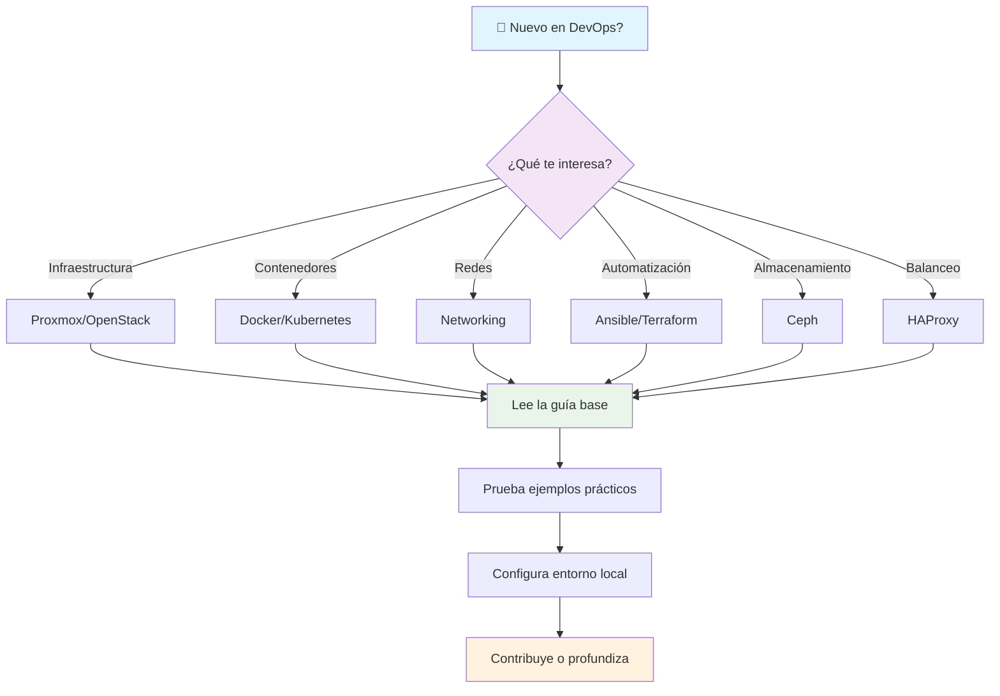

# Empezando — Primeros pasos en Frikiteam

¡Bienvenido a Frikiteam! Esta guía te ayudará a orientarte y dar tus primeros pasos en el mundo de DevOps e infraestructura. Tanto si eres principiante como si vienes de otro campo, aquí encontrarás un roadmap visual y ejemplos prácticos para comenzar.

## Roadmap visual: Tu camino en Frikiteam



### Orden recomendado de lectura

1. **Principiantes absolutos**: Comienza con Docker → Kubernetes → Networking
2. **De desarrollo**: Terraform → Ansible → Docker
3. **De sistemas**: Proxmox → Ceph → OpenStack
4. **De redes**: Networking → HAProxy → Kubernetes

## Guía rápida: Primeros pasos reales

### 1. Instala Docker (base de todo)

```bash
# Verifica instalación
docker --version

# Si no tienes Docker, instala:
# macOS: brew install docker
# Ubuntu: sudo apt install docker.io
# Windows: Descarga de docker.com

# Ejecuta tu primer contenedor
docker run hello-world
```

### 2. Crea tu primera aplicación contenerizada

```bash
# Crea un directorio para tu proyecto
mkdir mi-primera-app && cd mi-primera-app

# Crea un Dockerfile simple
echo 'FROM nginx:alpine
COPY index.html /usr/share/nginx/html/
EXPOSE 80' > Dockerfile

# Crea una página HTML básica
echo '<h1>¡Hola desde Docker!</h1><p>Mi primera app contenerizada</p>' > index.html

# Construye y ejecuta
docker build -t mi-app .
docker run -p 8080:80 mi-app
```

Abre <http://localhost:8080> en tu navegador. ¡Felicidades! Has creado tu primera aplicación contenerizada.

### 3. Explora Kubernetes localmente

```bash
# Instala minikube o kind para probar localmente
# macOS: brew install minikube
# Linux: curl -LO https://storage.googleapis.com/minikube/releases/latest/minikube-linux-amd64 && sudo install minikube-linux-amd64 /usr/local/bin/minikube

# Inicia cluster local
minikube start

# Despliega una app simple
kubectl create deployment hello-minikube --image=k8s.gcr.io/echoserver:1.4
kubectl expose deployment hello-minikube --type=NodePort --port=8080

# Obtén la URL
minikube service hello-minikube --url
```

### 4. Automatiza con Ansible

```bash
# Instala Ansible
pip install ansible

# Crea un inventario simple
echo '[webservers]
localhost ansible_connection=local' > inventory.ini

# Crea un playbook básico
cat > playbook.yml << EOF
---
- hosts: webservers
  tasks:
    - name: Instalar nginx
      apt:
        name: nginx
        state: present
      become: yes
EOF

# Ejecuta el playbook
ansible-playbook -i inventory.ini playbook.yml
```

## Próximos pasos

Una vez completados estos primeros pasos:

- **Profundiza** en la tecnología que más te interese leyendo las guías específicas
- **Únete a la comunidad** en nuestro [Discord/GitHub]
- **Contribuye** con mejoras o correcciones siguiendo `CONTRIBUTING.md`
- **Practica más** con los ejemplos en las secciones de documentación

## Recursos adicionales

- 📚 [Documentación completa](doc/index.md)
- 🛠️ [Recetas rápidas](doc/recipes.md)
- 🔍 [Glosario](glossary.md)
- 💬 [Foro de comunidad](https://github.com/rasty94/Frikiteam-docs/discussions)

---

¿Necesitas ayuda con algún paso? Abre un issue en nuestro [repositorio](https://github.com/rasty94/Frikiteam-docs) o únete a nuestras discusiones.
