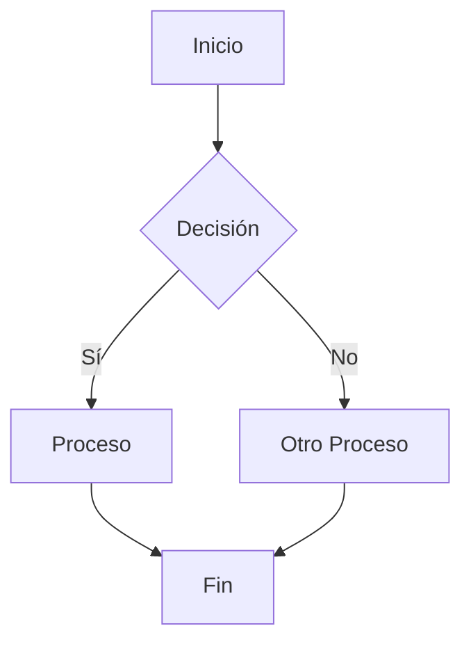
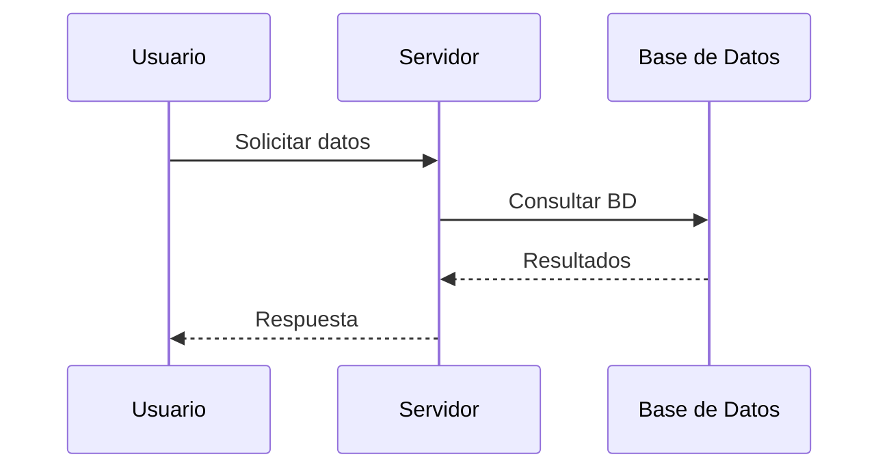
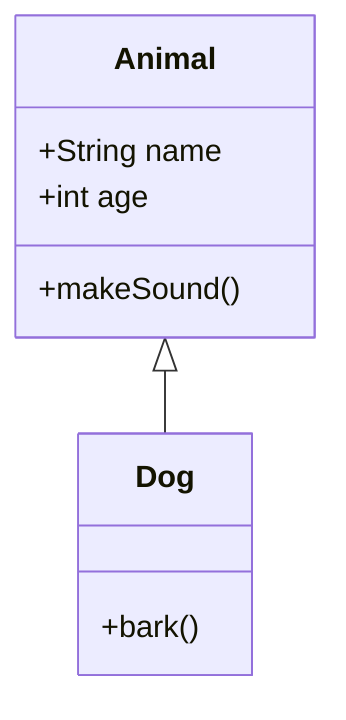
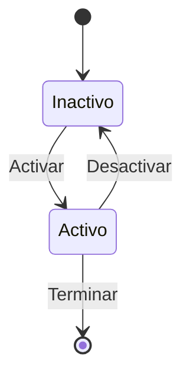
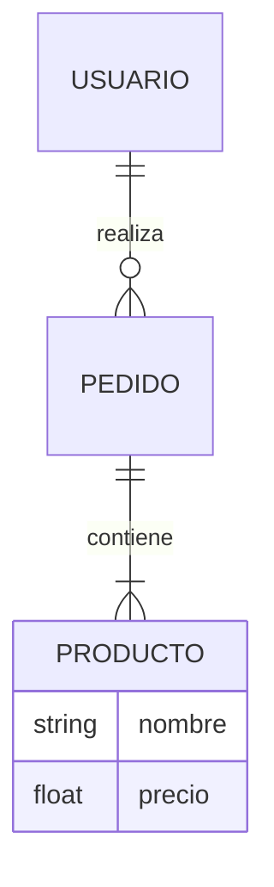
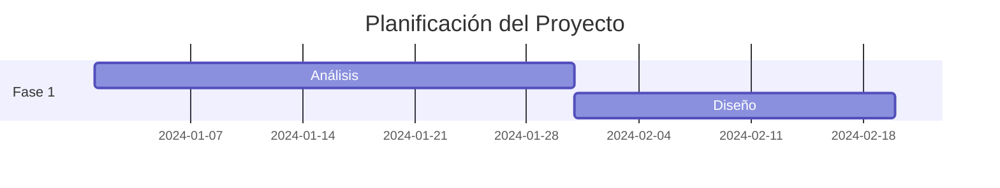
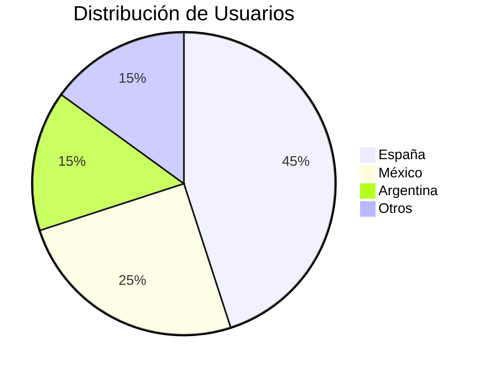
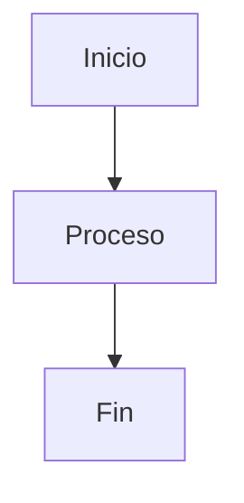
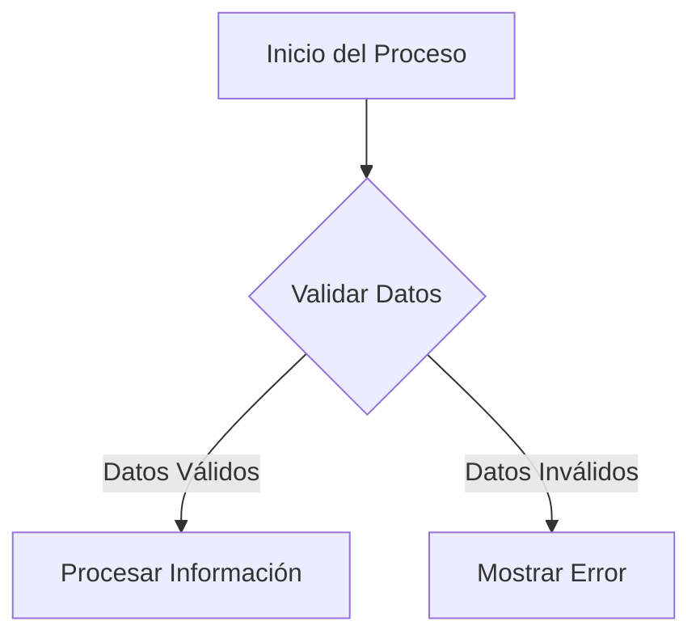
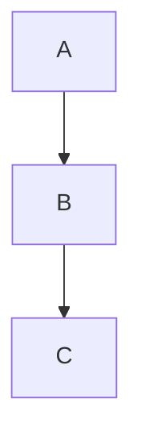

# Guía de Diagramas Mermaid

Esta guía explica cómo crear y usar diagramas Mermaid en la documentación de Frikiteam.

## ¿Qué es Mermaid?

Mermaid es una herramienta de diagramación basada en JavaScript que permite crear diagramas y gráficos a partir de texto descriptivo. Es perfecta para documentación técnica ya que los diagramas se mantienen como código y pueden versionarse junto con el resto de la documentación.

## Tipos de Diagramas Soportados

### 1. Diagramas de Flujo (Flowchart)



### 2. Diagramas de Secuencia



### 3. Diagramas de Clases



### 4. Diagramas de Estado



### 5. Diagramas Entidad-Relación



### 6. Diagramas de Git

```mermaid
gitgraph
    commit
    branch develop
    checkout develop
    commit
    checkout main
    merge develop
```

### 7. Diagramas de Gantt



### 8. Gráficos de Tarta



## Sintaxis Básica

### Estructura General

```markdown

```

### Elementos Comunes

#### Nodos
- `A[Texto]` - Nodo rectangular
- `B{Texto}` - Nodo de decisión (diamante)
- `C(Texto)` - Nodo redondeado
- `D>Texto]` - Nodo de forma especial

#### Conexiones
- `A --> B` - Flecha sólida
- `A --- B` - Línea sólida
- `A -.-> B` - Flecha punteada
- `A ==> B` - Flecha gruesa

#### Texto en Conexiones
- `A -->|Texto| B` - Texto en la flecha

## Mejores Prácticas

### 1. Nombres Descriptivos


### 2. Organización Lógica
- Mantén el flujo de izquierda a derecha o de arriba hacia abajo
- Agrupa elementos relacionados
- Usa colores y estilos para destacar elementos importantes

### 3. Comentarios


## Personalización

### Temas
Los diagramas se adaptan automáticamente al tema de la documentación (claro/oscuro).

### Estilos CSS
Puedes personalizar la apariencia agregando estilos CSS en `docs/stylesheets/extra.css`:

```css
.mermaid {
  text-align: center;
  margin: 1rem 0;
  padding: 1rem;
  border-radius: 0.5rem;
}
```

## Verificación de Diagramas

### Script de Verificación
Usa el script incluido para verificar la sintaxis de todos los diagramas:

```bash
python3 scripts/check_diagrams.py
```

### Verificación Manual
1. Ejecuta `mkdocs serve`
2. Navega a la página con el diagrama
3. Verifica que se renderice correctamente
4. Prueba en diferentes navegadores

## Solución de Problemas

### Diagrama No Se Renderiza
1. Verifica la sintaxis del diagrama
2. Asegúrate de que el tipo de diagrama sea soportado
3. Revisa la consola del navegador para errores JavaScript

### Problemas de Estilo
1. Verifica que los estilos CSS estén cargados
2. Asegúrate de que el tema sea compatible
3. Revisa la configuración de Mermaid en `mkdocs.yml`

### Errores de Sintaxis
1. Usa el script de verificación
2. Revisa la documentación oficial de Mermaid
3. Prueba el diagrama en el editor online de Mermaid

## Recursos Adicionales

### Documentación Oficial
- [Mermaid Live Editor](https://mermaid.live/)
- [Documentación de Mermaid](https://mermaid.js.org/)
- [Sintaxis de Diagramas](https://mermaid.js.org/syntax/flowchart.html)

### Herramientas Útiles
- [Mermaid Live Editor](https://mermaid.live/) - Para probar diagramas
- [Mermaid CLI](https://github.com/mermaid-js/mermaid-cli) - Para generar imágenes
- [VSCode Extension](https://marketplace.visualstudio.com/items?itemName=bierner.markdown-mermaid) - Para editar en VSCode

## Ejemplos en la Documentación

Puedes encontrar ejemplos de diagramas Mermaid en:

- `docs/test_diagrams.md` - Ejemplos de todos los tipos de diagramas
- `docs/doc/haproxy/haproxy_base.md` - Diagramas de arquitectura de HAProxy

## Contribución

Al agregar diagramas a la documentación:
1. Sigue las mejores prácticas
2. Verifica la sintaxis con el script
3. Prueba la renderización en el servidor de desarrollo
4. Documenta el propósito del diagrama
5. Mantén los diagramas actualizados con el contenido
