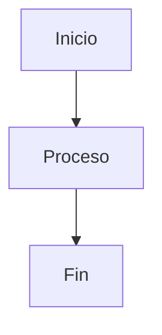
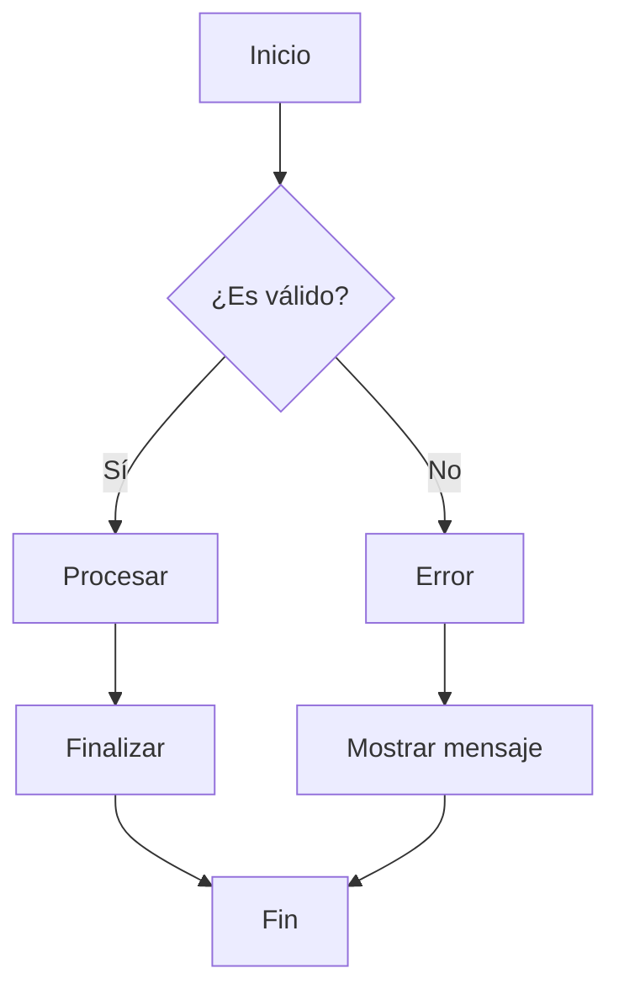

# Solución de Problemas con Diagramas Mermaid

Esta guía te ayudará a resolver problemas comunes con los diagramas Mermaid en la documentación.

## Error: "Syntax error in text"

Este es el error más común. Aquí están las soluciones:

### 1. Verificar la Sintaxis del Diagrama

Asegúrate de que tu diagrama tenga la sintaxis correcta:



**Errores comunes:**
- ❌ Falta de espacios después de `flowchart TD`
- ❌ Uso de caracteres especiales sin comillas
- ❌ Líneas vacías en el medio del diagrama

### 2. Verificar la Versión de Mermaid

La documentación usa Mermaid versión 9.4.3. Algunas sintaxis pueden variar entre versiones.

### 3. Probar el Diagrama en el Editor Online

1. Ve a [Mermaid Live Editor](https://mermaid.live/)
2. Copia y pega tu diagrama
3. Verifica que se renderice correctamente
4. Si funciona allí, el problema está en la configuración local

### 4. Verificar la Configuración de MkDocs

Asegúrate de que `mkdocs.yml` tenga la configuración correcta:

```yaml
markdown_extensions:
  - pymdownx.superfences:
      custom_fences:
        - name: mermaid
          class: mermaid

extra_javascript:
  - https://cdn.jsdelivr.net/npm/mermaid@9.4.3/dist/mermaid.min.js
  - javascripts/extra.js
```

### 5. Verificar el JavaScript

El archivo `docs/javascripts/extra.js` debe contener:

```javascript
window.mermaid.initialize({ 
  startOnLoad: false,
  securityLevel: 'loose',
  theme: 'default'
});
```

## Pasos de Diagnóstico

### Paso 1: Verificar la Configuración

Ejecuta el script de diagnóstico:

```bash
python3 scripts/debug_mermaid.py
```

### Paso 2: Probar el Archivo HTML

1. Abre `test_mermaid.html` en tu navegador
2. Verifica que los diagramas se rendericen
3. Si no funcionan, el problema está en Mermaid

### Paso 3: Verificar la Consola del Navegador

1. Abre las herramientas de desarrollador (F12)
2. Ve a la pestaña "Console"
3. Busca errores relacionados con Mermaid
4. Los errores te darán pistas sobre el problema

### Paso 4: Verificar el Servidor

1. Detén el servidor de desarrollo
2. Ejecuta `mkdocs build --strict`
3. Si hay errores, corrígelos
4. Reinicia el servidor: `mkdocs serve`

## Problemas Específicos

### Problema: Diagramas no se renderizan

**Solución:**
1. Verifica que Mermaid se cargue correctamente
2. Revisa la consola del navegador
3. Asegúrate de que el JavaScript esté funcionando

### Problema: Diagramas se renderizan pero no se ven

**Solución:**
1. Verifica los estilos CSS
2. Asegúrate de que el tema sea compatible
3. Revisa si hay conflictos de CSS

### Problema: Diagramas se ven mal en modo oscuro

**Solución:**
1. Verifica los estilos en `docs/stylesheets/extra.css`
2. Asegúrate de que el tema se adapte correctamente

### Problema: Diagramas no se actualizan al cambiar

**Solución:**
1. Limpia la caché del navegador
2. Recarga la página (Ctrl+F5)
3. Verifica que el servidor esté detectando cambios

## Comandos Útiles

### Verificar Sintaxis de Diagramas

```bash
python3 scripts/check_diagrams.py
```

### Diagnóstico Completo

```bash
python3 scripts/debug_mermaid.py
```

### Reconstruir la Documentación

```bash
mkdocs build --strict
```

### Servir en Modo Desarrollo

```bash
mkdocs serve
```

## Recursos Adicionales

- [Documentación Oficial de Mermaid](https://mermaid.js.org/)
- [Mermaid Live Editor](https://mermaid.live/)
- [Sintaxis de Diagramas](https://mermaid.js.org/syntax/flowchart.html)
- [Issues de Mermaid en GitHub](https://github.com/mermaid-js/mermaid/issues)

## Contacto

Si los problemas persisten:

1. Revisa los logs del servidor
2. Verifica la consola del navegador
3. Prueba con diagramas simples
4. Consulta la documentación oficial
5. Busca en los issues de Mermaid

## Ejemplo de Diagrama Funcional



Este diagrama debería funcionar correctamente. Si no funciona, sigue los pasos de diagnóstico anteriores.
